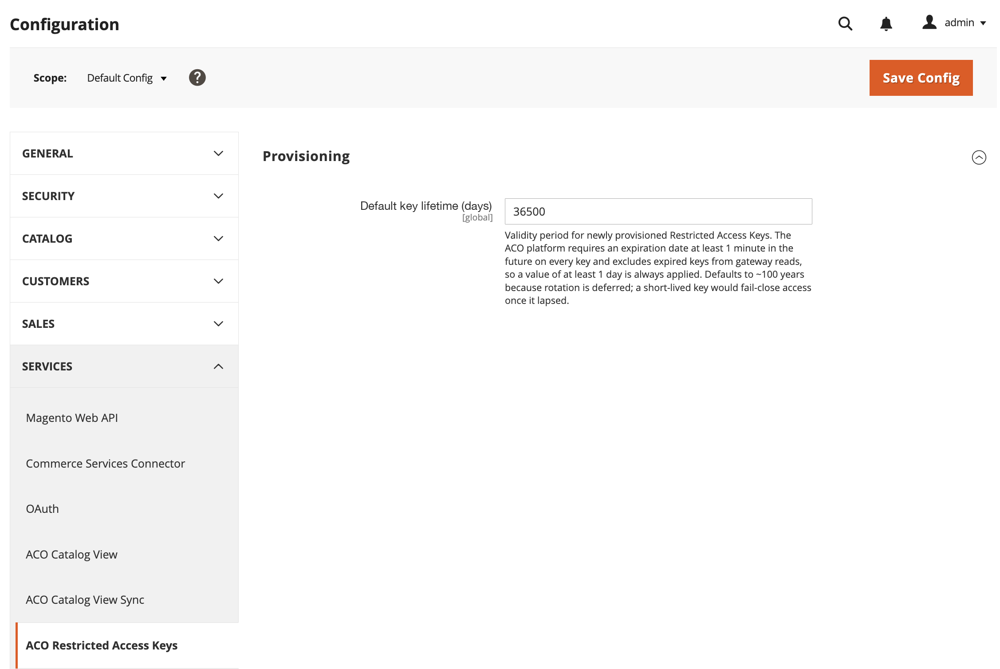

# [!UICONTROL Services] > [!UICONTROL ACO Restricted Access Keys]

Utilizzare questa impostazione per controllare il periodo di scadenza predefinito applicato da [!DNL Adobe Commerce Optimizer Connector for B2B] alle chiavi ad accesso limitato per le visualizzazioni di catalogo condivise B2B. Per creare, assegnare ed eliminare queste chiavi, vedere [Gestione chiavi di accesso con restrizioni](../../systems/restricted-access-keys.md).

{{config}}

## [!UICONTROL Provisioning]

<!-- zoom -->

| Campo | [Ambito](../../getting-started/websites-stores-views.md#scope-settings) | Descrizione |
| --- | --- | --- |
| [!UICONTROL Default key expiry (days)] | Globale | Periodo di validità per le chiavi di accesso con restrizioni di cui è stato appena eseguito il provisioning. [!DNL Adobe Commerce Optimizer] richiede una data di scadenza di almeno un minuto nel futuro per ogni chiave ed esclude le chiavi scadute dalle letture del gateway, pertanto viene sempre applicato un valore di almeno un giorno. Valore predefinito: `36500` |

{style="table-layout:auto"}

>[!NOTE]
>
>La scadenza predefinita è impostata su un periodo di scadenza lungo perché la rotazione automatica dei tasti non è ancora disponibile. Vedi [Selezione chiave e rotazione](../../systems/restricted-access-keys.md#key-selection-and-rotation).

>[!MORELIKETHIS]
>
> - [Visualizzazione catalogo ACO](./aco-catalog-view.md) — Configura i token di accesso della vetrina per le visualizzazioni catalogo
> - [Gestione chiavi di accesso con restrizioni](../../systems/restricted-access-keys.md): creazione, assegnazione ed eliminazione di chiavi di accesso con restrizioni
> - [Monitoraggio dello stato di sincronizzazione della visualizzazione del catalogo](../../systems/catalog-view-sync-status.md) — Monitoraggio delle chiavi in scadenza
