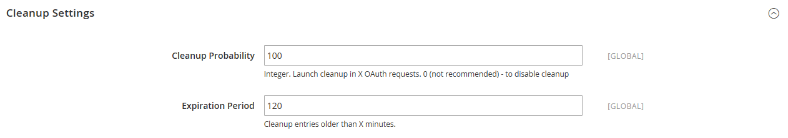
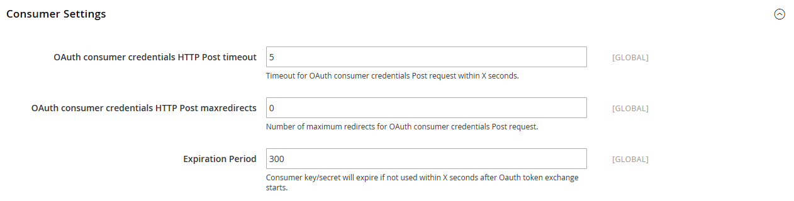

# [!UICONTROL Services] > [!UICONTROL OAuth]

{{config}}

## [!UICONTROL Access Token Expiration]

<!-- zoom -->

| Campo | [Ambito](../../getting-started/websites-stores-views.md#scope-settings) | Descrizione |
|--- |--- |--- |
| [!UICONTROL Customer Token Lifetime (hours]) | Globale | Determina il periodo di tempo, in ore, prima della scadenza di un token API del cliente. Il token cliente non scade mai se il campo è vuoto. Valore predefinito: `1` |
| [!UICONTROL Admin Token Lifetime (hours)] | Globale | Determina il periodo di tempo, in ore, prima della scadenza di un token API amministratore. Il token di amministrazione non scade mai se il campo è vuoto. Valore predefinito: `4` |

{style="table-layout:auto"}

>[!NOTE]
>
>Gli algoritmi di crittografia e durata del token API Bearer e dell&#39;amministratore sono controllati dalle impostazioni di configurazione [JWT Authentication](magento-web-api.md#jwt-authentication).

## [!UICONTROL Cleanup Settings]

<!-- zoom -->

| Campo | [Ambito](../../getting-started/websites-stores-views.md#scope-settings) | Descrizione |
|--- |--- |--- |
| [!UICONTROL Cleanup Probability] | Globale | Specifica il numero di richieste OAuth prima dell&#39;avvio della pulizia. Non immettere `0` per disabilitare la pulizia. |
| [!UICONTROL Enable WSDL Cache] | Globale | Determina la durata delle voci in minuti, prima che vengano pulite. |

{style="table-layout:auto"}

## [!UICONTROL Consumer Settings]

<!-- zoom -->

| Campo | [Ambito](../../getting-started/websites-stores-views.md#scope-settings) | Descrizione |
|--- |--- |--- |
| [!UICONTROL OAuth consumer credentials HTTP Post timeout] | Globale | Specifica il numero di secondi richiesti per il timeout del sistema quando i clienti pubblicano le proprie credenziali. |
| [!UICONTROL OAuth consumer credentials HTTP Post maxredirects] | Globale | Specifica il numero massimo di reindirizzamenti correlati a una pubblicazione di credenziali consumer. |
| [!UICONTROL Expiration Period] | Globale | Determina quanti secondi prima della scadenza di una chiave/segreto inutilizzata dopo l’inizio dello scambio di token OAuth. |

{style="table-layout:auto"}

## [!UICONTROL Authentication Locks]

<!-- zoom -->

| Campo | [Ambito](../../getting-started/websites-stores-views.md#scope-settings) | Descrizione |
|--- |--- |--- |
| [!UICONTROL Maximum Login Failures to Lock Out Account] | Globale | Specifica il numero massimo di errori di autenticazione per bloccare l&#39;account. |
| [!UICONTROL Lockout Time (seconds)] | Globale | Specifica il periodo di tempo in secondi dopo il quale l&#39;account viene sbloccato. |

{style="table-layout:auto"}
