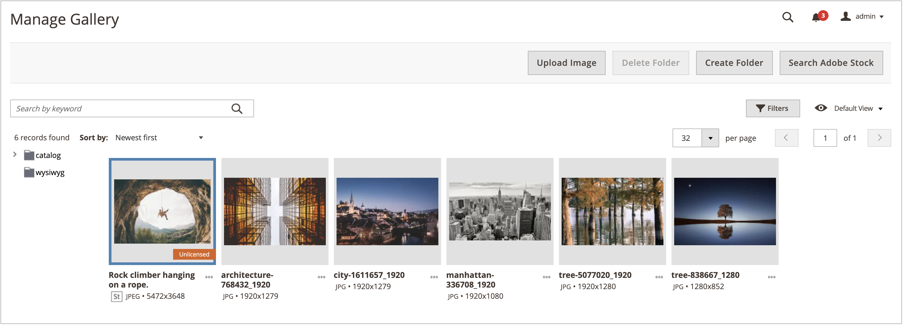

# Ottenere la licenza di un’immagine Adobe Stock

Le risorse Adobe Stock che desideri utilizzare per gli store Adobe Commerce e Magento Open Source di produzione devono essere concesse in licenza. Questa licenza ti garantisce l&#39;accesso legale all&#39;immagine e l&#39;eliminazione della filigrana di Adobe Stock presente in tutte le [anteprime di immagini](./adobe-stock-save-preview.md). Per concedere in licenza immagini o salvare immagini già concesse in licenza, devi aver effettuato l’accesso al tuo account Adobe.

Il nuovo [[!DNL Media Gallery]](media-gallery.md) offre un&#39;integrazione diretta con Adobe Stock, semplificando la concessione di licenze per le immagini direttamente dalla pagina della galleria.

>[!BEGINSHADEBOX]

**Prerequisiti**

La funzionalità di gestione licenze di Adobe Stock è disponibile solo se è installata e configurata l&#39;[integrazione Adobe Stock](./adobe-stock.md). Per concedere in licenza [immagini Adobe Stock](https://stock.adobe.com) è necessario un piano Adobe Stock a pagamento e un account [Adobe](https://helpx.adobe.com/it/manage-account/using/access-adobe-id-account.html).

>[!ENDSHADEBOX]

## Ottieni licenza per un&#39;immagine dal nuovo [!DNL Media Gallery]

1. Nella barra laterale _Admin_, passa a **[!UICONTROL Content]** > _[!UICONTROL Media]_>**[!UICONTROL Media Gallery]**.

1. Segui i passaggi su [Utilizzo di immagini Adobe Stock](./adobe-stock-manage.md) per accedere e salvare le immagini di anteprima nell&#39;[archivio multimediale](./media-storage.md).

   {width="600" zoomable="yes"}

1. Fare clic sui tre punti sotto l&#39;immagine ({width="10" zoomable="no"}), quindi fare clic su **[!UICONTROL License]**.

   {width="600" zoomable="yes"}

   >[!NOTE]
   >
   >Se non hai effettuato l’accesso, viene visualizzato il modulo di accesso. Per ulteriori informazioni sull&#39;accesso, vedere [Utilizzo di immagini Adobe Stock](./adobe-stock-manage.md).

1. Nella finestra di dialogo di conferma della licenza, fare clic su **[!UICONTROL Confirm]** per concedere la licenza all&#39;immagine.

   {width="350" zoomable="yes"}

   >[!NOTE]
   >
   >Devi disporre di [crediti Adobe Stock](https://helpx.adobe.com/it/stock/help/credit-packs.html) nel tuo account per concedere in licenza l&#39;immagine.

## Ottenere la licenza di un&#39;immagine dal supporto di archiviazione standard

1. [Accedere alla griglia di ricerca di Adobe Stock][adobe-stock-manage.md].

1. Per [visualizzare i dettagli dell&#39;immagine][adobe-stock-manage.md#view-image-details], fare clic su un&#39;immagine nella griglia di ricerca nell&#39;ordine desiderato.

1. A seconda dello stato di licenza corrente dell&#39;immagine, effettuare una delle seguenti operazioni:

   - Se l&#39;immagine è già concessa in licenza, fare clic su **[!UICONTROL Save]**.

   - Se l&#39;immagine è _not_ concessa in licenza, fare clic su **[!UICONTROL License and Save]**.

     >[!NOTE]
     >
     >Devi disporre di [crediti Adobe Stock](https://helpx.adobe.com/it/stock/help/credit-packs.html) nel tuo account per concedere in licenza l&#39;immagine.

   Questa azione richiede di specificare un nome di file utilizzato per salvare l&#39;immagine nell&#39;[archivio multimediale](./media-storage.md). Viene fornito un nome di file predefinito, ma puoi personalizzarlo in base alle tue preferenze.

   {width="550" zoomable="yes"}

1. Fare clic su **[!UICONTROL Confirm]**.

   La pagina viene reindirizzata all&#39;archivio multimediale e viene visualizzata l&#39;anteprima salvata.
