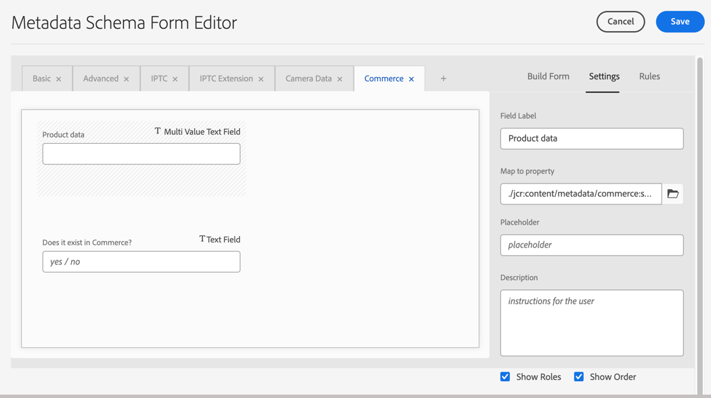

# Configurare Experience Manager Assets

Prepara l’ambiente AEM as a Cloud Service per la gestione delle risorse Commerce aggiornando la configurazione dell’ambiente e configurando i metadati Assets per identificare e gestire le risorse Commerce.

L&#39;integrazione richiede l&#39;aggiunta di uno spazio dei nomi `Commerce` personalizzato e metadati [di profilo](https://experienceleague.adobe.com/en/docs/experience-manager-cloud-service/content/assets/manage/metadata-profiles) e [di schema](https://experienceleague.adobe.com/en/docs/experience-manager-cloud-service/content/assets/manage/metadata-schemas) aggiuntivi.

Adobe fornisce un modello di progetto AEM per aggiungere lo spazio dei nomi e le risorse dello schema dei metadati alla configurazione dell’ambiente AEM Assets as a Cloud Service. Il modello aggiunge:

- Uno [spazio dei nomi personalizzato](https://github.com/ankumalh/assets-commerce/blob/main/ui.config/jcr_root/apps/commerce/config/org.apache.sling.jcr.repoinit.RepositoryInitializer~commerce-namespaces.cfg.json), `Commerce` per identificare le proprietà relative a Commerce.

- Tipo di metadati personalizzato `commerce:isCommerce` con etichetta `Does it exist in Commerce?` per assegnare tag alle risorse Commerce associate a un progetto Adobe Commerce.

- Un tipo di metadati personalizzato `commerce:productmetadata` e un componente dell&#39;interfaccia utente corrispondente per aggiungere una proprietà *[!UICONTROL Product Data]*. I dati prodotto includono le proprietà dei metadati per associare una risorsa Commerce agli SKU del prodotto e per specificare gli attributi immagine `role` e `position` della risorsa.

  {width="600" zoomable="yes"}

- Modulo schema metadati con scheda Commerce che include i campi `Does it exist in Adobe Commerce?` e `Product Data` per l&#39;assegnazione di tag alle risorse Commerce. Il modulo fornisce inoltre opzioni per mostrare o nascondere i campi `roles` e `order` (posizione) dall&#39;interfaccia utente di AEM Assets.

  {width="600" zoomable="yes"}

- [Esempio di risorsa con tag e approvata da Commerce](https://github.com/ankumalh/assets-commerce/blob/main/ui.content/src/main/content/jcr_root/content/dam/wknd/en/activities/hiking/equipment_6.jpg/.content.xml) `equipment_6.jpg` per supportare la sincronizzazione iniziale delle risorse. Solo le risorse Commerce approvate possono essere sincronizzate da AEM Assets ad Adobe Commerce.

Per ulteriori informazioni sul progetto AEM Commerce-Assets, vedi il [File Leggimi](https://github.com/ankumalh/assets-commerce).

## Personalizzare la configurazione dell’ambiente AEM Assets

>[!BEGINSHADEBOX]

**Prerequisiti**

- [Accesso al programma e agli ambienti AEM Assets Cloud Manager](https://experienceleague.adobe.com/en/docs/experience-manager-cloud-service/content/onboarding/journey/cloud-manager#access-sysadmin-bo) con i ruoli Responsabile del programma e Responsabile della distribuzione.

- [ambiente di sviluppo AEM locale](https://experienceleague.adobe.com/en/docs/experience-manager-learn/cloud-service/local-development-environment-set-up/overview) e familiarità con il processo di sviluppo locale AEM.

- Comprendere la struttura del progetto [AEM](https://experienceleague.adobe.com/it/docs/experience-manager-cloud-service/content/implementing/developing/aem-project-content-package-structure) e come distribuire pacchetti di contenuti personalizzati con Cloud Manager.

>[!ENDSHADEBOX]

### Distribuire il progetto AEM Commerce-Assets nell’ambiente di authoring AEM Assets

1. Se necessario, crea ambienti di produzione e staging per il progetto AEM Assets da Cloud Manager.

1. Se necessario, configura una pipeline di distribuzione.

1. Da GitHub, scarica il codice standard dal [progetto AEM Commerce-Assets](https://github.com/ankumalh/assets-commerce).

1. Dall&#39;[ambiente di sviluppo AEM locale](https://experienceleague.adobe.com/en/docs/experience-manager-learn/cloud-service/local-development-environment-set-up/overview), installa il codice personalizzato nella configurazione dell&#39;ambiente AEM Assets come pacchetto Maven oppure copiandolo manualmente nella configurazione del progetto esistente.

1. Apporta le modifiche e invia il ramo di sviluppo locale all’archivio Git di Cloud Manager.

1. Da Cloud Manager, [distribuisci il codice per aggiornare l&#39;ambiente AEM](https://experienceleague.adobe.com/en/docs/experience-manager-cloud-service/content/implementing/using-cloud-manager/deploy-code#deploying-code-with-cloud-manager).

## Configurare un profilo di metadati

Imposta i valori predefiniti per i metadati delle risorse Commerce creando un profilo di metadati. Una volta configurato, applica questo profilo alle cartelle di risorse AEM per utilizzare automaticamente queste impostazioni predefinite. Questa configurazione opzionale semplifica l’elaborazione delle risorse riducendo i passaggi manuali.

1. Dall’area di lavoro di Adobe Experience Manager, vai all’area di lavoro di amministrazione del contenuto di Author per AEM Assets facendo clic sull’icona Adobe Experience Manager.

   {width="600" zoomable="yes"}

1. Apri gli strumenti di amministrazione selezionando l’icona a forma di martello.

   {width="600" zoomable="yes"}

1. Aprire la pagina di configurazione del profilo facendo clic su **[!UICONTROL Metadata Profiles]**.

1. **[!UICONTROL Create]** un profilo di metadati per l&#39;integrazione Commerce.

   {width="600" zoomable="yes"}

1. Aggiungi una scheda per i metadati di Commerce.

   1. A sinistra, fare clic su **[!UICONTROL Settings]**.

   1. Fare clic su **[!UICONTROL +]** nella sezione scheda e quindi specificare **[!UICONTROL Tab Name]**, `Commerce`.

1. Aggiungere il campo `Does it exist in Commerce?` al modulo e impostare il valore predefinito su `yes`.

   {width="600" zoomable="yes"}

1. Salva l’aggiornamento.

1. Applica il profilo di metadati `Commerce integration` alla cartella in cui sono memorizzate le risorse Commerce.

   1. Dalla pagina [!UICONTROL  Metadata Profiles], seleziona il profilo di integrazione di Commerce.

   1. Dal menu Azioni, selezionare **[!UICONTROL Apply Metadata Profiles to Folder(s)]**.

   1. Seleziona la cartella contenente le risorse Commerce.

      Crea una cartella Commerce se non esiste.

   1. Fare clic su **[!UICONTROL Apply]**.

>[!TIP]
>
>È possibile sincronizzare automaticamente le risorse Commerce caricate nell&#39;ambiente AEM Assets aggiornando il profilo metadati per impostare il valore predefinito per il campo _[!UICONTROL Review Status]_su `Approved`. Il tipo di proprietà per il campo `Review Status` è `./jcr:content/metadata/dam:status`.

## Passaggi successivi

Dopo aver aggiornato l’ambiente AEM, configura Adobe Commerce:

1. [Installare e configurare l’integrazione di AEM Assets per Commerce](aem-assets-configure-commerce.md)
2. [Abilita la sincronizzazione delle risorse per trasferire le risorse tra l’ambiente del progetto Adobe Commerce e l’ambiente del progetto AEM Assets](aem-assets-setup-synchronization.md)
