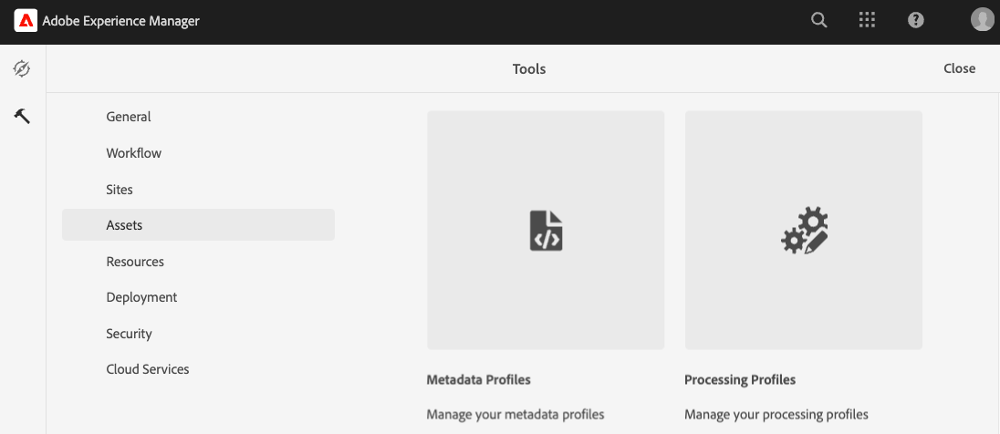

# Installare il pacchetto AEM Assets

Adobe fornisce un modello di progetto, `commerce-assets`, per aggiungere risorse dello spazio dei nomi e dello schema dei metadati di Commerce alla configurazione dell&#39;ambiente Experience Manager Assets as a Cloud Service. Distribuisci questo modello nell’ambiente come pacchetto Maven. Quindi, configura i metadati Commerce nell’ambiente di authoring AEM Assets per completare la configurazione.

Il modello aggiunge le seguenti risorse all’ambiente di authoring AEM Assets.

- Uno [spazio dei nomi personalizzato](https://github.com/ankumalh/assets-commerce/blob/main/ui.config/jcr_root/apps/commerce/config/org.apache.sling.jcr.repoinit.RepositoryInitializer~commerce-namespaces.cfg.json), `Commerce` per identificare le proprietà relative a Commerce.

- Tipo di metadati personalizzato `commerce:isCommerce` con etichetta `Eligible for Commerce` per assegnare tag alle risorse Commerce associate a un progetto Adobe Commerce.

- Un tipo di metadati personalizzato `commerce:productmetadata` e un componente dell&#39;interfaccia utente corrispondente per aggiungere una proprietà *[!UICONTROL Product Data]*. I dati prodotto includono le proprietà dei metadati per associare una risorsa Commerce agli SKU del prodotto e per specificare gli attributi immagine `role` e `position` della risorsa.

  {width="600" zoomable="yes"}

- Modulo schema metadati con scheda Commerce che include i campi `Does it exist in Adobe Commerce?` e `Product Data` per l&#39;assegnazione di tag alle risorse Commerce. Il modulo fornisce inoltre opzioni per mostrare o nascondere i campi `roles` e `order` (posizione) dall&#39;interfaccia utente di AEM Assets.

  {width="600" zoomable="yes"}

- [Esempio di risorsa con tag e approvata da Commerce](https://github.com/ankumalh/assets-commerce/blob/main/ui.content/src/main/content/jcr_root/content/dam/wknd/en/activities/hiking/equipment_6.jpg/.content.xml) `equipment_6.jpg` per supportare la sincronizzazione iniziale delle risorse. Solo le risorse Commerce approvate possono essere sincronizzate da AEM Assets ad Adobe Commerce.

>[!NOTE]
>Per ulteriori informazioni sul modello di progetto AEM `commerce-assets`, vedere il file Leggimi [2}.](https://github.com/ankumalh/assets-commerce)

Per utilizzare questo progetto AEM per aggiornare la configurazione dell’ambiente sono necessarie le risorse e le autorizzazioni seguenti:

- [Accesso al programma e agli ambienti AEM Assets Cloud Manager](https://experienceleague.adobe.com/en/docs/experience-manager-cloud-service/content/onboarding/journey/cloud-manager#access-sysadmin-bo) con i ruoli Responsabile del programma e Responsabile della distribuzione.

- [ambiente di sviluppo AEM locale](https://experienceleague.adobe.com/en/docs/experience-manager-learn/cloud-service/local-development-environment-set-up/overview) e familiarità con il processo di sviluppo locale AEM.

- Comprendere la struttura del progetto [AEM](https://experienceleague.adobe.com/it/docs/experience-manager-cloud-service/content/implementing/developing/aem-project-content-package-structure) e come distribuire pacchetti di contenuti personalizzati con Cloud Manager.

## Installa il pacchetto `commerce-assets`

1. Se necessario, crea ambienti di produzione e staging per il progetto AEM Assets da Cloud Manager.

1. Se necessario, configura una pipeline di distribuzione.

1. Da GitHub, scarica il codice standard dal [progetto Commerce-Assets AEM](https://github.com/ankumalh/assets-commerce).

1. Dal [ambiente di sviluppo AEM locale](https://experienceleague.adobe.com/en/docs/experience-manager-learn/cloud-service/local-development-environment-set-up/overview), installa il codice personalizzato nella configurazione dell&#39;ambiente AEM Assets come pacchetto Maven oppure copiando manualmente il codice nella configurazione del progetto esistente.

1. Apporta le modifiche e invia il ramo di sviluppo locale all’archivio Git di Cloud Manager.

1. Da Cloud Manager, [distribuisci il codice per aggiornare l&#39;ambiente AEM](https://experienceleague.adobe.com/en/docs/experience-manager-cloud-service/content/implementing/using-cloud-manager/deploy-code#deploying-code-with-cloud-manager).

## Configurare un profilo di metadati

Nell’ambiente di authoring di AEM Assets, imposta i valori predefiniti per i metadati delle risorse Commerce creando un profilo di metadati. Quindi, applica il nuovo profilo alle cartelle di AEM Assets per utilizzare automaticamente queste impostazioni predefinite. Questa configurazione semplifica l’elaborazione delle risorse riducendo i passaggi manuali.

1. Dall’area di lavoro di Adobe Experience Manager, vai all’area di lavoro Amministrazione contenuto authoring per AEM Assets facendo clic sull’icona Adobe Experience Manager.

   {width="600" zoomable="yes"}

1. Apri gli strumenti di amministrazione selezionando l’icona a forma di martello.

   {width="600" zoomable="yes"}

1. Aprire la pagina di configurazione del profilo facendo clic su **[!UICONTROL Metadata Profiles]**.

1. **[!UICONTROL Create]** un profilo di metadati per l&#39;integrazione Commerce.

   {width="600" zoomable="yes"}

1. Aggiungi una scheda per i metadati di Commerce.

   1. A sinistra, fare clic su **[!UICONTROL Settings]**.

   1. Fare clic su **[!UICONTROL +]** nella sezione scheda e quindi specificare **[!UICONTROL Tab Name]**, `Commerce`.

1. Aggiungere il campo `Does it exist in Commerce?` al modulo e impostare il valore predefinito su `yes`.

   {width="600" zoomable="yes"}

1. Salva l’aggiornamento.

1. Applica il profilo di metadati `Commerce integration` alla cartella in cui sono memorizzate le risorse Commerce.

   1. Dalla pagina [!UICONTROL  Metadata Profiles], seleziona il profilo di integrazione di Commerce.

   1. Dal menu Azioni, selezionare **[!UICONTROL Apply Metadata Profiles to Folders]**.

   1. Seleziona la cartella contenente le risorse Commerce.

      Crea una cartella Commerce se non esiste.

   1. Fare clic su **[!UICONTROL Apply]**.

>[!TIP]
>
>È possibile sincronizzare automaticamente le risorse Commerce caricate nell&#39;ambiente AEM Assets aggiornando il profilo metadati per impostare il valore predefinito per il campo _[!UICONTROL Review Status]_su `Approved`. Il tipo di proprietà per il campo `Review Status` è `./jcr:content/metadata/dam:status`.

## Passaggio successivo

[Installare pacchetti Adobe Commerce](aem-assets-configure-commerce.md)
