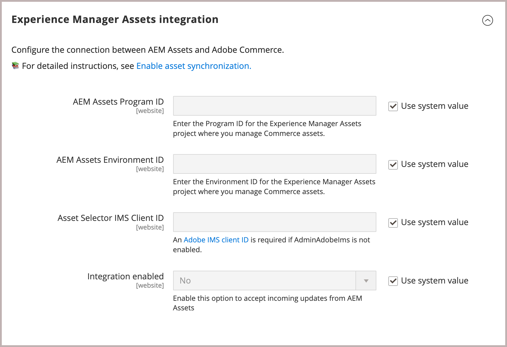

# Configurare l’integrazione

Configura l’integrazione connettendo Commerce all’istanza di AEM Assets e selezionando la strategia di corrispondenza per la sincronizzazione delle risorse.

Dopo aver identificato il progetto AEM Assets, seleziona la regola corrispondente per la sincronizzazione delle risorse tra Adobe Commerce e AEM Assets.

- **[!UICONTROL Match by product SKU]**—Regola predefinita che corrisponde allo SKU nei metadati della risorsa con [SKU prodotto Commerce](https://experienceleague.adobe.com/en/docs/commerce-operations/implementation-playbook/glossary#sku) per garantire che le risorse siano associate ai prodotti corretti.

- **[!UICONTROL Custom match]** - Regola di corrispondenza per scenari più complessi o requisiti aziendali specifici che richiedono una logica di corrispondenza personalizzata. L’implementazione della corrispondenza personalizzata richiede lo sviluppo di codice personalizzato in Adobe Developer App Builder per definire il modo in cui le risorse vengono associate ai prodotti. Ulteriori dettagli disponibili a breve...

Per la configurazione iniziale, utilizza la regola predefinita *Corrispondenza per SKU prodotto*.

## Prerequisiti

- [Installare il pacchetto AEM Assets](aem-assets-configure-aem.md)

- [Installa i pacchetti Adobe Commerce](aem-assets-configure-commerce.md) per aggiungere l&#39;estensione e generare le credenziali e le connessioni necessarie per utilizzare l&#39;estensione.

- Crea un ticket di supporto per richiedere l’abilitazione per l’integrazione di AEM Assets for Commerce. Nel ticket, includi **[!UICONTROL Program ID]**, **[!UICONTROL Environment ID]** e **[!UICONTROL IMS Org ID]** per l’ambiente di authoring AEM Assets che desideri connettere a Commerce.

- Fornisci **[!UICONTROL Asset Selector IMS Client ID]**. Vedi [ImsAuthProps](https://experienceleague.adobe.com/en/docs/experience-manager-cloud-service/content/assets/manage/asset-selector/asset-selector-integration/integrate-asset-selector-adobe-app) nella *documentazione di AEM Assets Selector*.

## Configurare la connessione

1. Ottieni l&#39;ID del progetto e dell&#39;ambiente [AEM Assets Authoring Environment](https://experienceleague.adobe.com/en/docs/experience-manager-cloud-service/content/sites/authoring/quick-start).

   1. Apri la console AEM Sites e seleziona **[!UICONTROL Assets]**.

   1. Copia e salva gli ID di progetto e ambiente dall&#39;URL: `https://author-p[Program ID]-e[EnvironmentID].adobeaemcloud.com/`
1. Dall’amministratore di Commerce, apri la configurazione dell’integrazione di AEM Assets.

   1. Vai a **[!UICONTROL Store]** > Configurazione > **[!UICONTROL ADOBE SERVICES]** > **[!UICONTROL AEM Assets Integration]**.

      {width="600" zoomable="yes"}

1. Immettere l&#39;ambiente AEM Assets **[!UICONTROL Program ID]** e **[!UICONTROL Environment ID]**.

   Modificare i valori di configurazione rimuovendo la selezione da *[!UICONTROL Use system value]*.

1. Immettere **[!UICONTROL Asset Selector IMS Client ID]**.

   L&#39;ID client IMS ](https://experienceleague.adobe.com/en/docs/experience-manager-cloud-service/content/assets/manage/asset-selector/asset-selector-integration/integrate-asset-selector-adobe-app#ims-auth-props) di [Asset Selector è richiesto da [!UICONTROL Assets Selector], una funzionalità di AEM Assets che consente agli utenti di incorporare risorse visive direttamente nelle pagine dei prodotti Commerce.

1. Selezionare [[!UICONTROL Commerce integration]](aem-assets-configure-commerce.md#add-the-integration-to-the-commerce-environment) per autenticare le richieste tra Commerce e il servizio di corrispondenza risorse.

1. Impostare **[!UICONTROL Integration enabled]** su `Yes` per consentire a Commerce di accettare gli aggiornamenti in arrivo da AEM Assets.

   Dopo aver abilitato l’integrazione, sono disponibili opzioni di configurazione aggiuntive per specificare i criteri di corrispondenza delle risorse.

1. Definisci la regola di corrispondenza per la sincronizzazione delle risorse.

   1. Selezionare **[!UICONTROL Match by product SKU]** o **[!UICONTROL Custom match (Requires App Builder)]**.

   1. Aggiungi il nome del campo di metadati [AEM Assets](aem-assets-configure-aem.md#configure-metadata) definito per gli SKU dei prodotti Commerce nel campo **[!UICONTROL Match by product SKU attribute name]**, ad esempio `commerce:skus`.

1. Selezionare **[!UICONTROL Save Config]** per applicare gli aggiornamenti e avviare la sincronizzazione delle risorse.

   L’aggiornamento della configurazione attiva il processo di sincronizzazione iniziale, consentendo a Commerce di accettare gli aggiornamenti in arrivo da AEM Assets. Il tempo necessario per la sincronizzazione dipende dal volume delle risorse e da configurazioni specifiche. L’integrazione sfrutta i processi automatizzati per ridurre al minimo il tempo necessario per la sincronizzazione.

### Configurare l’URL del dominio personalizzato

Se un esercente imposta un [Nome di dominio personalizzato](https://experienceleague.adobe.com/it/docs/experience-manager-cloud-service/content/implementing/using-cloud-manager/custom-domain-names/add-custom-domain-name){target=_blank} nel dashboard di AEM, è necessario aggiungere questo **URL di dominio personalizzato** in Commerce, in modo che l&#39;integrazione AEM Assets possa utilizzarlo.

1. Passa a **[!UICONTROL Store]** > Configurazione > **[!UICONTROL ADOBE SERVICES]** > **[!UICONTROL AEM Assets Integration]**.

   {width="600" zoomable="yes"}

1. Aggiungi l&#39;**URL dominio personalizzato** al campo **[!UICONTROL Asset Custom Domain]**.

1. Fare clic su **[!UICONTROL Save Config]** per applicare gli aggiornamenti e avviare la sincronizzazione delle risorse.

## Passaggio successivo

[Utilizzare AEM Assets con Commerce](aem-assets-manage.md)

