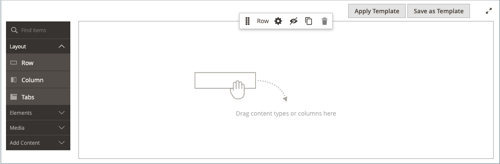

# Aggiungere blocchi di contenuto

È possibile creare blocchi di contenuto personalizzati e quindi aggiungerli a qualsiasi pagina, gruppo di pagine o persino a un altro blocco. Ad esempio, è possibile inserire un cursore immagine in un blocco e quindi posizionare il blocco nella home page. L&#39;area di lavoro Blocchi utilizza gli stessi [controlli di base](pages-workspace.md) dell&#39;area di lavoro _Pagine_ per facilitare la ricerca dei blocchi disponibili ed eseguire la manutenzione ordinaria. Una volta completato il blocco, puoi utilizzare lo strumento [Widget](widget-static-block.md) per inserirlo in pagine specifiche dell&#39;archivio.

{width="700" zoomable="yes"}

## Creare un blocco

1. Nella barra laterale _Admin_, passa a **[!UICONTROL Content]** > _[!UICONTROL Elements]_>**[!UICONTROL Blocks]**.

1. Nell&#39;angolo superiore destro fare clic su **Aggiungi nuovo blocco**.

   {width="500" zoomable="yes"}

1. Se si desidera modificare lo stato abilitato predefinito del nuovo blocco, impostare **Abilita blocco** su `No`.

1. Assegna un **Titolo blocco** per riferimento interno.

1. Assegna un **identificatore** univoco al blocco.

   Utilizza tutti i caratteri minuscoli con il carattere di sottolineatura anziché gli spazi.

1. Selezionare ogni **[!UICONTROL Store View]** in cui si desidera rendere disponibile il blocco.

1. Aggiungi il contenuto per il blocco utilizzando il set di strumenti di contenuto visualizzato:

   - Se [Page Builder](../page-builder/introduction.md) è abilitato, selezionare **[!UICONTROL Edit with Page Builder]** per utilizzare gli strumenti di Page Builder nel contenuto [area di lavoro](../page-builder/workspace.md).

     {width="500" zoomable="yes"}

     >[!NOTE]
     >
     >Per informazioni sull&#39;aggiunta di blocchi con Page Builder, vedere [Esercitazione 2: blocchi](../page-builder/2-blocks.md).

   - Utilizza l&#39;[editor](editor.md) per formattare il testo, creare collegamenti e aggiungere tabelle, immagini, video e audio.

     Se preferisci lavorare con il codice HTML, fai clic su **Mostra/Nascondi editor**.

     {width="500" zoomable="yes"}

1. Al termine, fare clic sulla freccia **[!UICONTROL Save]** e scegliere **[!UICONTROL Save & Close]**.

   Il nuovo blocco viene visualizzato nella parte inferiore dell&#39;elenco nella griglia Blocchi.

1. Utilizza lo strumento [Widget](widget-static-block.md) per inserire il blocco completato in una pagina specifica dell&#39;archivio.

## Eliminare un blocco

Esistono due modi per rimuovere un blocco personalizzato. Puoi rimuoverlo dalla griglia _Blocchi_ o dalla pagina del blocco di modifica.

### Metodo 1: rimuovere un blocco dalla griglia Blocchi

1. Nella barra laterale _Admin_, passa a **[!UICONTROL Content]** > _[!UICONTROL Elements]_>**[!UICONTROL Blocks]**.
1. Individua i blocchi utilizzando i filtri sopra la griglia e seleziona la casella di controllo per uno o più blocchi da eliminare.
1. Nell&#39;angolo superiore sinistro dell&#39;elenco, impostare **[!UICONTROL Actions]** su `Delete`.
1. Per confermare l&#39;azione, fare clic su **[!UICONTROL OK]**.

### Metodo 2: rimuovere un blocco dalla pagina di modifica

1. Nella barra laterale _Admin_, passa a **[!UICONTROL Content]** > _[!UICONTROL Elements]_>**[!UICONTROL Blocks]**.
1. Trova il blocco da eliminare.
1. Nella colonna _Azioni_ per il blocco, fare clic su **[!UICONTROL Select]** e scegliere **[!UICONTROL Edit]**.
1. Nella barra dei menu fare clic su **[!UICONTROL Delete Block]**.
1. Per confermare l&#39;azione, fare clic su **[!UICONTROL OK]**.

## Menu Salva

| Comando | Descrizione |
|----------|----------- |
| [!UICONTROL Save] | Salva il blocco corrente e continua a lavorare. |
| [!UICONTROL Save & Duplicate] | Salva e chiudi il blocco corrente e apri una nuova copia duplicata. |
| [!UICONTROL Save & Close] | Salvare e chiudere il blocco corrente e tornare alla griglia Blocchi. |

{style="table-layout:auto"}

## Aggiungere un lightbox o un cursore

- È facile aggiungere un [cursore](../page-builder/slider.md) al tuo store con [[!DNL Page Builder]](../page-builder/introduction.md). Il dispositivo di scorrimento può essere impostato per la riproduzione automatica o controllato manualmente con i pulsanti di navigazione.

  {width="600" zoomable="yes"}

  Su [[!DNL Commerce Marketplace]](https://marketplace.magento.com/extensions.html?q=lightbox) è inoltre disponibile un ampio assortimento di lightbox per immagini basate su jQuery e alcune sono gratuite.

- È inoltre possibile scaricare un&#39;estensione da [!DNL Commerce Marketplace]. Per ulteriori informazioni, consulta la documentazione fornita dallo sviluppatore dell’estensione.
