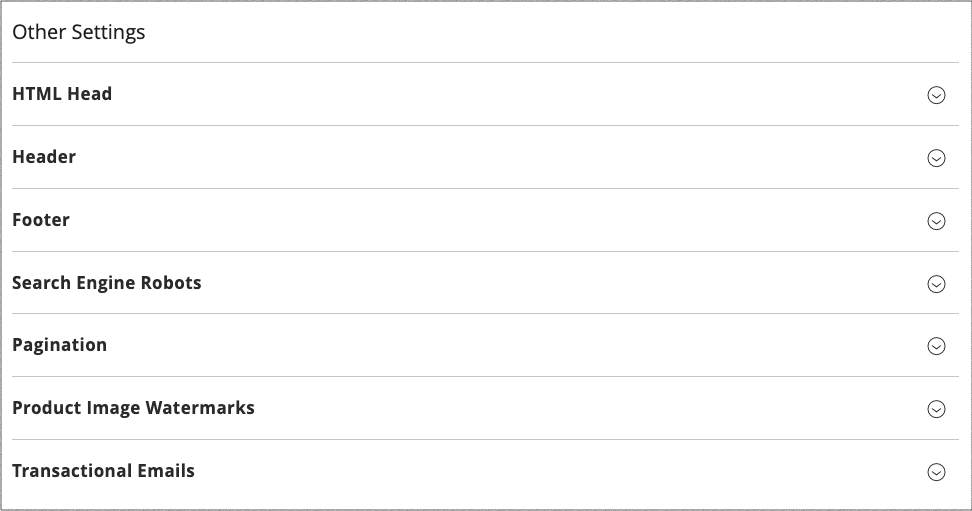

# Configurazione del progetto

La configurazione Progettazione consente di modificare facilmente le regole e le impostazioni di configurazione relative alla progettazione visualizzandole in una singola pagina.

{width="700" zoomable="yes"}

## Modificare la configurazione del progetto

1. Il giorno _Amministratore_ barra laterale, vai a **[!UICONTROL Content]** > _[!UICONTROL Design]_>**[!UICONTROL Configuration]**.

1. Individuare la visualizzazione dello store che si desidera configurare e fare clic su **[!UICONTROL Edit]** nel _[!UICONTROL Action]_colonna.

   Nella pagina vengono visualizzate le impostazioni di progettazione correnti per la visualizzazione Store.

1. Per modificare il tema predefinito, impostare **[!UICONTROL Applied Theme]** al tema che si desidera applicare alla visualizzazione.

   Se non viene specificato alcun tema, viene utilizzato il tema predefinito del sistema. Alcune estensioni di terze parti modificano il tema predefinito del sistema.

1. Se il tema deve essere utilizzato solo per un dispositivo specifico, impostare **[!UICONTROL User Agent Rules]**.

   {width="400" zoomable="yes"}

   Per ogni tipo di dispositivo in cui si desidera specificare un tema:

   - Clic **[!UICONTROL Add New User Agent Rule]**.

   - Per **[!UICONTROL Search String]**, immetti l’ID del browser per il dispositivo specifico.

     Una stringa di ricerca può essere un&#39;espressione normale o un&#39;espressione regolare compatibile con Perl (PCRE) (vedere [Agente utente](https://en.wikipedia.org/wiki/User_agent) per ulteriori informazioni). La seguente stringa di ricerca identifica Firefox:

         /^mozilla/i
     
   - Per **[!UICONTROL Theme Name]**, scegliere il tema da utilizzare per il dispositivo specificato.

   >[!NOTE]
   >
   >Puoi aggiungere tutte le regole per i dispositivi che desideri designare. Le stringhe di ricerca vengono confrontate nell&#39;ordine in cui vengono immesse.

1. Sotto _[!UICONTROL Other Settings]_, espandi ogni sezione e segui le istruzioni riportate negli argomenti collegati per modificare le impostazioni in base alle esigenze.

   - [[!UICONTROL Pagination]](../catalog/navigation-product-listings.md#pagination-controls)
   - [[!UICONTROL HTML Head]](page-setup.md#html-head)
   - [[!UICONTROL Header]](page-setup.md#header)
   - [[!UICONTROL Footer]](page-setup.md#footer)
   - [[!UICONTROL Search Engine Robots]](../merchandising-promotions/seo-overview.md#search-engine-robots)
   - [[!UICONTROL Product Image Watermarks]](../catalog/product-image.md#watermarks)
   - [[!UICONTROL Transactional Emails]](../systems/email-templates.md#configure-email-templates)

   {width="500" zoomable="yes"}

1. Al termine, fai clic su **[!UICONTROL Save Configuration]**.
