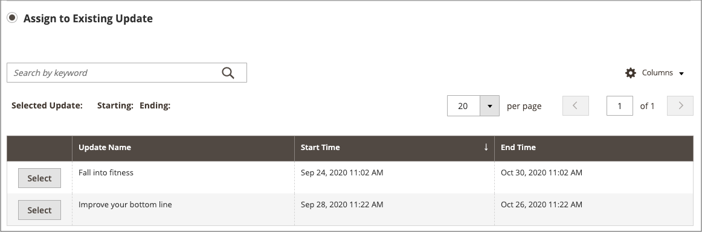

# Aggiungere un elemento a una campagna

{{ee-feature}}

L’esempio seguente aggiunge un’immagine promozionale alla pagina della categoria durante la campagna. Puoi fare lo stesso per una pagina di prodotto o una pagina CMS.

## Aggiungere l’elemento della campagna per una categoria

1. Nella barra laterale _Admin_, passa a **[!UICONTROL Catalog]** > **[!UICONTROL Categories]**.

1. Individua la categoria che desideri utilizzare nella campagna e aprila in modalità di modifica.

1. Fare clic su **[!UICONTROL Schedule New Update]**.

1. Selezionare **[!UICONTROL Assign to Existing Campaign]**.

1. Nell’elenco, seleziona la campagna da modificare.

   {width="600" zoomable="yes"}

1. Espandere  **[!UICONTROL Content]**.

1. Per **[!UICONTROL Category Image]**, fare clic su **[!UICONTROL Upload]** e selezionare l&#39;immagine da visualizzare nella pagina della categoria durante la campagna.

   {width="600" zoomable="yes"}

1. Al termine, fare clic su **[!UICONTROL Save]**.

## Convalida l&#39;elemento

1. Nella barra laterale _Admin_, passa a **[!UICONTROL Content]** > _[!UICONTROL Content Staging]_>**[!UICONTROL Dashboard]**.

1. Trova la campagna nell’elenco o nella timeline visualizzata e aprila per accedere ai dettagli:

   - Per visualizzare un elenco, fare clic su **[!UICONTROL Select]** e quindi su **[!UICONTROL View/Edit]** nella colonna _[!UICONTROL Action]_.
   - Per visualizzare la sequenza temporale, fare clic una volta per visualizzare il riepilogo, quindi fare clic su **[!UICONTROL View/Edit]**.

   {width="600" zoomable="yes"}

1. Espandere  **[!UICONTROL Categories]** per visualizzare l&#39;elenco delle categorie assegnate.

1. Per rivedere le pagine della categoria quando la campagna è attiva, tornare al dashboard, fare di nuovo clic sulla campagna e quindi fare clic su **[!UICONTROL Preview]**.
