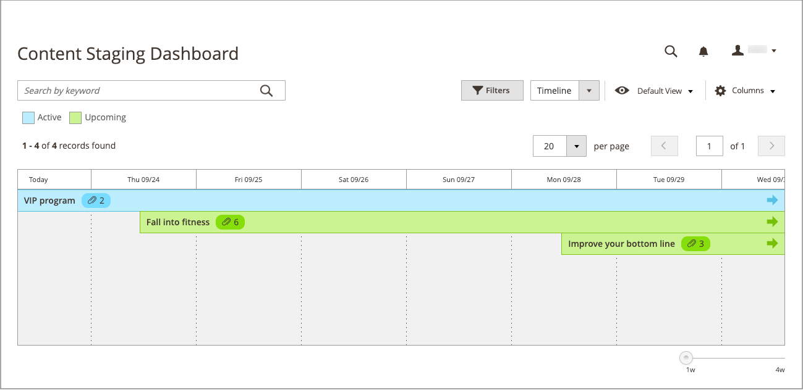

# Dashboard di staging del contenuto

{{ee-feature}}

Il dashboard [!UICONTROL Content Staging] fornisce una panoramica di tutte le campagne attive e future. Il formato del dashboard può essere modificato da una griglia a una timeline. Puoi inoltre utilizzare i filtri per trovare le campagne, personalizzare il layout delle colonne e salvare diverse visualizzazioni della griglia. Per ulteriori informazioni sui controlli dell&#39;area di lavoro, vedere [Area di lavoro di amministrazione](../getting-started/admin-workspace.md).

{width="600" zoomable="yes"}

## Visualizzare il dashboard di staging

1. Nella barra laterale _Admin_, passa a **[!UICONTROL Content]** > _[!UICONTROL Content Staging]_>**[!UICONTROL Dashboard]**.

1. Per modificare il formato del dashboard, impostare il controllo **[!UICONTROL View As]** su `list`, `Grid` o `Timeline`.

   {width="600" zoomable="yes"}

   Quando viene visualizzata la timeline, il cursore nell’angolo in basso a destra può essere utilizzato per regolare la visualizzazione da una a quattro settimane. Ogni colonna rappresenta un giorno.

1. Se viene visualizzata la timeline, trascinare il dispositivo di scorrimento nella posizione `4w` all&#39;estrema destra per visualizzare un intervallo di tempo più lungo.

   {width="600" zoomable="yes"}

1. Per visualizzare informazioni generali sulla campagna, fai clic su qualsiasi elemento nella pagina.

   - Per aprire la campagna, fare clic su **[!UICONTROL View/Edit]**.

   - Per visualizzare l&#39;aspetto della campagna per i clienti nello store di quel giorno, fare clic su **[!UICONTROL Preview]**.

   {width="600" zoomable="yes"}

## Descrizioni delle colonne del dashboard di staging

| Colonna | Descrizione |
|--- |--- |
| [!UICONTROL Status] | Stato della campagna. `Active` o `Upcoming`. |
| [!UICONTROL Update Name] | Nome della campagna. |
| [!UICONTROL Includes] | Definisce il numero di oggetti inclusi nella campagna. |
| [!UICONTROL Start Time] | La data di inizio della campagna. |
| [!UICONTROL End Time] | La data di fine della campagna. |
| [!UICONTROL Description] | Descrizione aggiuntiva di ciascuna campagna. |
| [!UICONTROL Action] | Le azioni che possono essere applicate a un singolo record includono: **[!UICONTROL View/Edit]**- Apre la campagna in modalità di modifica. **[!UICONTROL Preview]** - Visualizza la campagna in modalità anteprima. |

{style="table-layout:auto"}

## Modificare una campagna

Gli oggetti campagna esistenti possono essere modificati dal dashboard di staging, ad eccezione delle campagne per le regole di prezzo che non hanno date di fine.

>[!NOTE]
>
>Se inizialmente viene creata una campagna attiva senza una data di fine, non è possibile modificarla in un secondo momento in modo da includere una data di fine. In tal caso, è necessario creare una campagna duplicata e immettere la data di fine necessaria.

{width="600" zoomable="yes"}

La campagna in questo esempio include due categorie e tre singoli prodotti.

Segui i passaggi seguenti per modificare uno qualsiasi degli oggetti di questa campagna.

1. Nella barra laterale _Admin_, passa a **[!UICONTROL Content]** > _[!UICONTROL Content Staging]_>**[!UICONTROL Dashboard]**.

1. Trova la campagna nell’elenco o nella timeline visualizzata e aprila per accedere ai dettagli:

   - Per visualizzare un elenco, fare clic su **[!UICONTROL Select]** e quindi su **[!UICONTROL View/Edit]** nella colonna _[!UICONTROL Action]_.
   - Per visualizzare la sequenza temporale, fare clic una volta per visualizzare il riepilogo, quindi fare clic su **[!UICONTROL View/Edit]**.

1. Aggiornare le impostazioni nella sezione _[!UICONTROL General]_in base alle esigenze.

1. Espandere  in qualsiasi sezione contenente un elemento da modificare.

   {width="600" zoomable="yes"}

1. Fare clic su **[!UICONTROL Save]**.
