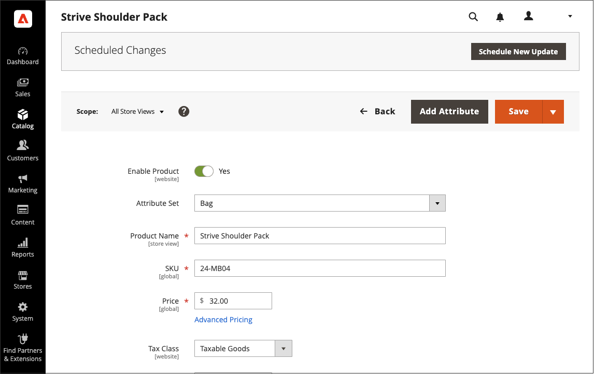
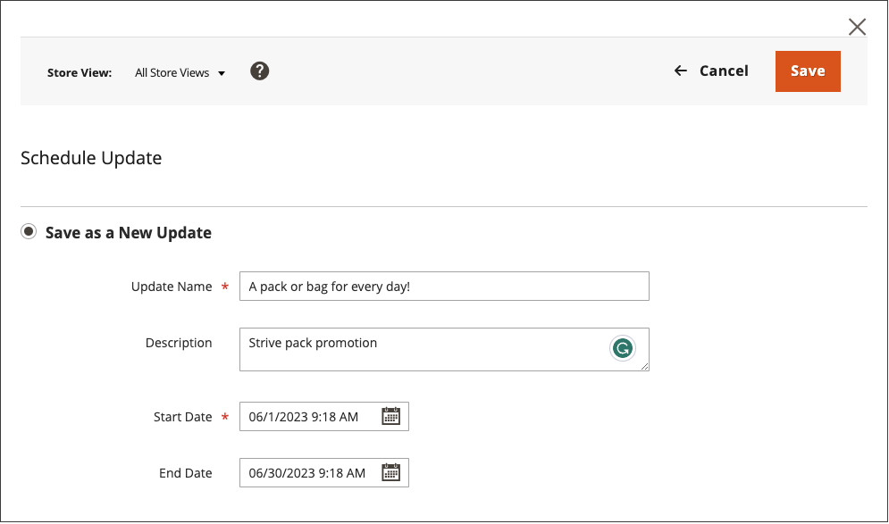

# Pianificare un aggiornamento del contenuto

{{ee-feature}}

Nell&#39;esempio seguente viene illustrato come pianificare una modifica di prezzo temporanea per un prodotto. Include la pianificazione e l&#39;anteprima delle modifiche e la visualizzazione degli aggiornamenti pianificati nel calendario. Anche se questo esempio include solo una singola modifica, una campagna potrebbe includere più modifiche a prodotti, regole di prezzo, pagine CMS e altre entità pianificate per avere luogo contemporaneamente. Seguire un metodo simile per specificare le date di inizio/fine per l&#39;attributo [!UICONTROL Set Product As New].

>[!NOTE]
>È necessario creare un aggiornamento pianificato per specificare una data di inizio (e di fine) per [!UICONTROL Set Product As New]. Per [!UICONTROL Special Price] e [!UICONTROL Design Change], i campi di data Da/A sono rimossi da Adobe Commerce e sono disponibili solo in Magento Open Source.
>
>Tutti gli aggiornamenti pianificati vengono applicati consecutivamente, il che significa che qualsiasi entità può avere un solo aggiornamento pianificato alla volta. Qualsiasi aggiornamento pianificato viene applicato a tutte le visualizzazioni dello store entro il relativo intervallo di tempo. Di conseguenza, un’entità non può avere un aggiornamento pianificato diverso per diverse visualizzazioni dello store contemporaneamente. Tutti i valori degli attributi di entità all’interno di tutte le visualizzazioni archivio, che non sono influenzati dall’aggiornamento pianificato corrente, vengono presi dai valori predefiniti e non dal precedente aggiornamento pianificato.

## Pianificare un aggiornamento per un prodotto

1. Dalla griglia _[!UICONTROL Products]_, apri un prodotto in modalità di modifica.

1. Nella casella _[!UICONTROL Scheduled Changes]_nella parte superiore della pagina, fare clic su **[!UICONTROL Schedule New Update]**.

   {width="600" zoomable="yes"}

1. Con l&#39;opzione **[!UICONTROL Save as a New Update]** selezionata, impostare i parametri di base per l&#39;aggiornamento:

   - Per **[!UICONTROL Update Name]**, immettere un nome per la nuova campagna di gestione temporanea del contenuto.

   - Immetti una breve **[!UICONTROL Description]** dell&#39;aggiornamento e come deve essere utilizzato.

   - Utilizza lo strumento Calendario () per scegliere la **Data inizio** e la **Data fine** per la campagna.

     Per creare una campagna aperta, non specificare una data di fine (lasciare vuoto). Per questo esempio, l’inizio della campagna è pianificato per mezzanotte per il nuovo anno, il 1° gennaio 2021 alle 12:00 PST.

     Per una campagna di regole di prezzo creata senza una data di fine, non è possibile aggiungere una data di fine in un secondo momento. In tal caso, è necessario creare una campagna e impostare la data di inizio sulla data in cui si desidera che termini la campagna precedente e inizi quella nuova. In tale data di inizio, la vecchia campagna termina e la nuova campagna inizia come definito.

     {width="600" zoomable="yes"}

     >[!NOTE]
     >
     >La data di inizio e la data di fine della campagna devono essere definite utilizzando il fuso orario di amministrazione **_predefinito_**, convertito dal fuso orario locale di ciascun sito Web. Ad esempio, se hai più siti web in fusi orari diversi, ma desideri avviare una campagna basata su un fuso orario USA (predefinito), devi pianificare un aggiornamento separato per ogni fuso orario locale. In questo caso, impostare **[!UICONTROL Start Date]** e **[!UICONTROL End Date]** come convertiti da ogni fuso orario del sito Web locale al fuso orario predefinito dell&#39;amministratore.

1. Scorri verso il basso fino a _[!UICONTROL Price]_e fai clic su **[!UICONTROL Advanced Pricing]**.

1. Immettere **[!UICONTROL Special Price]** per il prodotto durante la campagna pianificata e fare clic su **[!UICONTROL Done]**.

1. Al termine, fare clic su **[!UICONTROL Save]**.

   La modifica pianificata viene visualizzata nella parte superiore della pagina del prodotto, con le date di inizio e di fine della campagna.

   {width="600" zoomable="yes"}

## Modifica la modifica pianificata

1. Nella casella _Modifiche pianificate_ nella parte superiore della pagina, fare clic su **[!UICONTROL View/Edit]**.

1. Apporta le modifiche necessarie all’aggiornamento pianificato.

1. Fare clic su **[!UICONTROL Save]**.

## Visualizza l&#39;anteprima della modifica pianificata

Nella casella _Modifiche pianificate_ nella parte superiore della pagina, fare clic su **[!UICONTROL Preview]**.

L’anteprima apre una nuova scheda del browser e mostra come appare il prodotto durante la campagna pianificata.

>[!NOTE]
>
>Un&#39;anteprima di gestione temporanea per un aggiornamento pianificato inizia sempre dalla visualizzazione **predefinita** dell&#39;archivio, che emula l&#39;esperienza del cliente di navigare attraverso la campagna di aggiornamento di gestione temporanea.

Per ulteriori informazioni sull&#39;utilizzo degli strumenti di anteprima per modificare la data e l&#39;ambito dell&#39;anteprima, vedere [Anteprima di una campagna](content-staging-preview.md). Puoi anche condividere con i tuoi colleghi un collegamento per l’anteprima del negozio.
