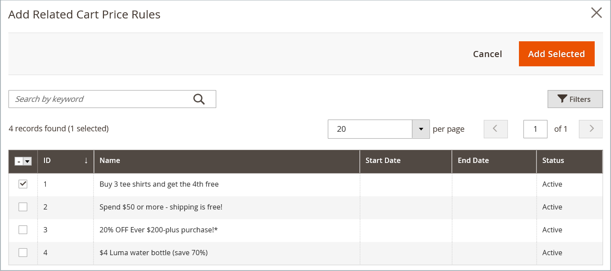

# Blocchi dinamici nelle regole di prezzo

{{ee-feature}}

Qualsiasi [blocco dinamico](dynamic-blocks.md) creato può essere associato a una promozione. Per creare l&#39;associazione, è necessario innanzitutto creare sia il blocco dinamico che la [regola prezzo catalogo](../merchandising-promotions/price-rules-catalog.md) o la [regola prezzo carrello](../merchandising-promotions/price-rules-cart.md). L’associazione può essere effettuata mentre si lavora su una regola di prezzo o su un blocco dinamico.

>[!IMPORTANT]
>
>Dopo aver creato questa associazione, il blocco dinamico viene visualizzato **solo** quando la regola viene attivata. Se la promozione è indirizzata al segmento A, il blocco viene visualizzato al segmento A. Se la promozione non è attiva, il blocco non viene visualizzato.

## Associare un blocco dinamico a una regola di prezzo

1. Nella barra laterale _Admin_, vai a **[!UICONTROL Marketing]** > _[!UICONTROL Promotions]_&#x200B;e scegli una delle seguenti opzioni:

   - **[!UICONTROL Catalog Price Rules]**
   - **[!UICONTROL Cart Price Rules]**

1. Nella griglia, individua la regola da associare al blocco dinamico e aprila in modalità di modifica.

1. Scorri verso il basso ed espandi il  **[!UICONTROL Related Dynamic Blocks]**.

1. Nella prima colonna impostare il filtro su `Any` e fare clic su **[!UICONTROL Reset Filter]**.

   Nella griglia sono ora elencati tutti i blocchi dinamici disponibili.

1. Selezionare la casella di controllo di ogni blocco dinamico che si desidera associare alla regola.

   {width="600" zoomable="yes"}

1. Al termine, fare clic su **[!UICONTROL Save]**.

## Associare una regola di prezzo a un blocco dinamico

1. Nella barra laterale _Admin_, passa a **[!UICONTROL Content]** > _[!UICONTROL Elements]_>**[!UICONTROL Dynamic Blocks]**.

1. Trova il blocco dinamico nella griglia e aprilo in modalità di modifica.

1. Scorri verso il basso ed espandi **[!UICONTROL Related Promotions]**.

   Tutte le regole di prezzo attualmente associate vengono visualizzate nella griglia.

1. Aggiungi una nuova regola associata o rimuovi un&#39;associazione corrente.

   - Per associare una promozione carrello, fare clic su **[!UICONTROL Add Cart Price Rules]**.

   - Per associare una promozione relativa al prodotto, fare clic su **[!UICONTROL Add Catalog Price Rules]**.

1. Nella griglia selezionare la casella di controllo di ogni regola che si desidera associare al blocco dinamico.

1. Fare clic su **[!UICONTROL Add Selected]**.

   {width="600" zoomable="yes"}

1. Al termine, fare clic su **[!UICONTROL Save]**.
