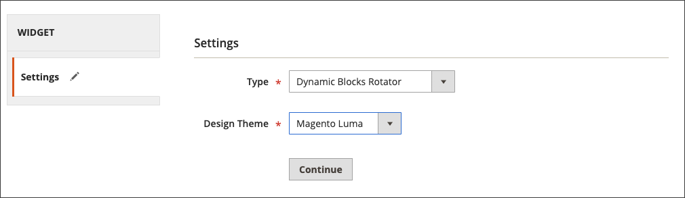

# Aggiungere un blocco dinamico rotante

{{ee-feature}}

Per presentare una presentazione di contenuti interattivi, puoi aggiungere più [blocchi dinamici](dynamic-blocks.md) su un rotatore. Il [widget](widgets.md) Questo strumento viene utilizzato per posizionare il rotatore in un punto specifico di una singola pagina o di più pagine in tutto il negozio.

{width="700" zoomable="yes"}

## Passaggio 1: creare singoli blocchi dinamici

A [creare i blocchi dinamici](dynamic-blocks.md) che si desidera posizionare nel rotatore, attenersi alle seguenti istruzioni:

## Passaggio 2: aggiungere un widget di rotazione a blocchi dinamici

1. Il giorno _Amministratore_ barra laterale, vai a **[!UICONTROL Content]** > _[!UICONTROL Elements]_>**[!UICONTROL Widgets]**.

1. Nell’angolo superiore destro, fai clic su **[!UICONTROL Add Widget]**.

1. Sotto _Impostazioni_, impostato **[!UICONTROL Type]** a `Dynamic Blocks Rotator`.

1. Scegli la corrente **[!UICONTROL Design Theme]** del negozio.

   Questa impostazione identifica il pacchetto corrente o [tema](themes.md) che determina il layout di pagina del negozio.

1. Clic **[!UICONTROL Continue]**.

   {width="600" zoomable="yes"}

## Passaggio 3: completare le opzioni

1. Sotto _Proprietà vetrina_, imposta le opzioni:

   - Immetti un **[!UICONTROL Title]** per il rotatore.

   - In **[!UICONTROL Assign to Store Views]** , seleziona la [visualizzazioni store](../getting-started/websites-stores-views.md) dove è disponibile il rotatore.

   - (Facoltativo) Inserisci un **[!UICONTROL Sort Order]** numero per determinare la posizione del rotatore nel contenitore di destinazione. È relativo ad altri widget che potrebbero essere assegnati allo stesso contenitore.

   {width="600" zoomable="yes"}

1. Sotto _Opzioni di layout_, fai clic su **[!UICONTROL Add Layout Update]** ed effettuare le seguenti operazioni:

   - Imposta **[!UICONTROL Display on]** alla pagina, o al tipo di pagina, in cui deve essere visualizzato il rotatore.

      - `Categories` - Visualizza il rotatore su [ancoraggio](../catalog/navigation-layered.md) o pagine di categorie non di ancoraggio. Opzioni: Categorie di ancoraggio / Categorie non di ancoraggio
      - `Products` : visualizza il rotatore su una pagina di prodotto specifica o su tutte le pagine di prodotto. Opzioni: Tutti i tipi di prodotto / [Prodotto semplice](../catalog/product-create-simple.md) /  [Prodotto virtuale](../catalog/product-create-virtual.md) / [Prodotto bundle](../catalog/product-create-bundle.md) / [Prodotto scaricabile](../catalog/product-create-downloadable.md) / [Biglietto regalo](../catalog/product-gift-card-create.md) / [Prodotto configurabile](../catalog/product-create-configurable.md) / [Prodotto Raggruppato](../catalog/product-create-grouped.md)
      - `Generic Pages` : visualizza il rotatore su tutte le pagine, su una pagina specifica o solo sulle pagine con un determinato layout. Opzioni: `All Pages` / `Specified Page` / `Page Layouts`

     Nell&#39;esempio, il rotatore deve essere posizionato su un `Specified Page`.

   - Seleziona la specifica **[!UICONTROL Page]** dove deve apparire il rotatore.

   - Imposta **[!UICONTROL Container]** nella parte del [layout di pagina](page-layout.md#standard-page-layouts) dove deve apparire il rotatore.

     Se altri widget sono assegnati allo stesso contenitore, vengono visualizzati in sequenza in base all&#39;ordinamento.

   - Accetta `Dynamic Block Template` come impostazione predefinita **[!UICONTROL Template]**.

     Questa impostazione determina il modello utilizzato per formattare il rotatore, a seconda che il rotatore debba essere posizionato da solo o all&#39;interno del testo esistente.

     {width="600" zoomable="yes"}

   - Clic **[!UICONTROL Save and Continue Edit]**.

1. Nel pannello a sinistra, scegli **[!UICONTROL Widget Options]**.

1. Per **[!UICONTROL Dynamic Blocks to Display]**, accetta `Specified Dynamic Blocks`.

   Questa impostazione determina il tipo di blocchi dinamici inclusi nel rotatore.

   - `Specified Dynamic Blocks` - Include solo blocchi dinamici specifici.
   - `Cart Price Rule Related` - Include solo blocchi dinamici associati a una regola del prezzo del carrello.
   - `Catalog Price Rule Related` - Include solo blocchi dinamici associati a una regola del prezzo di catalogo.

1. A **[!UICONTROL Restrict the Dynamic Block Types]** che può essere utilizzato con il widget, seleziona `Content Area`.

   Questa impostazione limita il banner a una parte specifica del layout di pagina.

   - `Content Area` : inserisce il blocco dinamico nell’area del contenuto principale della pagina.
   - `Footer` - Inserisce il blocco dinamico nel piè di pagina della pagina.
   - `Header` - Inserisce il blocco dinamico nell&#39;intestazione della pagina.
   - `Left Column` - Se disponibile, inserisce il blocco dinamico nella colonna sinistra del layout di pagina.
   - `Right Column` - Se disponibile, posiziona il blocco dinamico nella colonna destra del layout di pagina.

1. Imposta **[!UICONTROL Rotation Mode]** a uno dei seguenti elementi:

   - `Display all instead of rotating` - Visualizza una pila di blocchi dinamici, dove sono tutti visibili.
   - `One at a time, Random` - Visualizza i blocchi dinamici specificati in ordine casuale. Quando la pagina viene aggiornata, viene visualizzato un blocco dinamico diverso (e casuale).
   - `One at the time, Series` - Visualizza i blocchi dinamici specificati nella sequenza in cui sono stati aggiunti. Quando la pagina viene aggiornata, viene visualizzato il blocco dinamico successivo nella sequenza.
   - `One at the time, Shuffle` - Visualizza un blocco dinamico alla volta in ordine casuale. Questa opzione è simile alla `One at a time, Random` , ad eccezione del fatto che lo stesso blocco dinamico non viene ripetuto.

     {width="600" zoomable="yes"}

1. In **[!UICONTROL Specify Dynamic Blocks]** griglia, selezionare la casella di controllo di ogni blocco dinamico che si desidera includere nel rotatore.

1. Al termine, fai clic su **[!UICONTROL Save]**.
