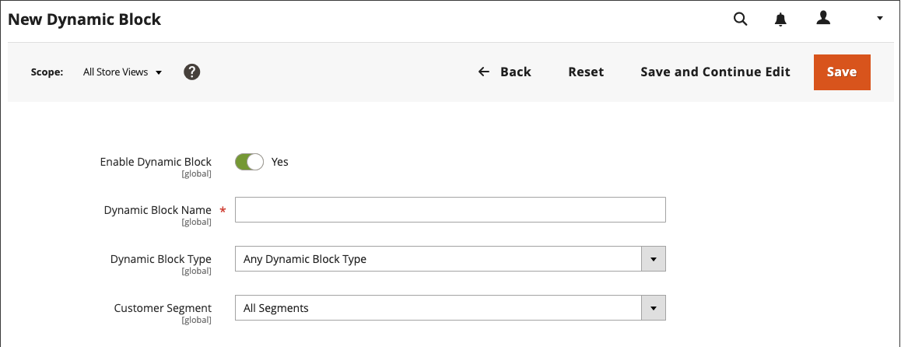

# Blocchi dinamici

{{ee-feature}}

Crea contenuti avanzati e interattivi basati sulla logica da [regole di prezzo](../merchandising-promotions/introduction.md#price-rules) e [segmenti cliente](../customers/customer-segments.md). I [blocchi dinamici](../page-builder/dynamic-block.md) esistenti possono essere aggiunti direttamente al [!DNL Page Builder] [stage](../page-builder/workspace.md). Per un esempio dettagliato sull&#39;utilizzo dei blocchi dinamici, vedere [Esercitazione 2: Blocchi](../page-builder/2-blocks.md).

>[!NOTE]
>
>L&#39;opzione _[!UICONTROL Banner]_&#x200B;nel menu [[!UICONTROL Content]](content-menu.md) è stata rimossa nella versione 2.3.1 e rimossa nella versione 2.4.0. La sua funzionalità è sostituita da Blocchi dinamici.

![[!DNL Page Builder] - blocco dinamico con regola di prezzo e segmento cliente](../page-builder/assets/pb-tutorial2-dynamic-block-storefront.png){width="600" zoomable="yes"}

## Passaggio 1: creare un blocco dinamico

1. Nella barra laterale _Admin_, passa a **[!UICONTROL Content]** > _[!UICONTROL Elements]_>**[!UICONTROL Dynamic Blocks]**.

   {width="600" zoomable="yes"}

1. Nell&#39;angolo superiore destro fare clic su **[!UICONTROL Add Dynamic Block]**.

   {width="600" zoomable="yes"}

1. Se applicabile, impostare **[!UICONTROL Store View]** su una visualizzazione archivio specifica in cui verrà visualizzato il blocco dinamico.

1. Per attivare il blocco dinamico, impostare **[!UICONTROL Enable Dynamic Block]** su `Yes`.

1. Per riferimento interno, immettere un valore descrittivo **[!UICONTROL Dynamic Block Name]**.

1. Impostare **[!UICONTROL Dynamic Block Type]** sull&#39;area della pagina in cui si desidera visualizzare il blocco dinamico e fare clic su **[!UICONTROL Done]**.

   {width="500" zoomable="yes"}

1. Nell&#39;elenco **[!UICONTROL Customer Segment]** selezionare la casella di controllo di ogni segmento che si desidera visualizzare nel blocco dinamico e fare clic su **[!UICONTROL Done]** per salvare l&#39;impostazione.

   {width="500" zoomable="yes"}

   >[!NOTE]
   >
   >- Se non viene creato alcun segmento, il blocco dinamico è visibile a tutti.
   >- Se il cliente non appartiene ad alcun segmento e il blocco dinamico viene creato per tutti i segmenti, il contenuto del blocco dinamico viene comunque visualizzato.
   >- Se tutti i segmenti cliente assegnati a un blocco dinamico vengono eliminati, il relativo contenuto è visibile a tutti.

### Utilizzare i tipi di pubblico di Real-Time CDP in blocchi dinamici

Se hai [installato](../customers/audience-activation.md#install-the-extension) e [configurato](../customers/audience-activation.md#configure-the-extension) l&#39;estensione [!DNL Audience Activation], viene visualizzata una sezione denominata **[!UICONTROL Audiences]**.

{width="600" zoomable="yes"}

Nell&#39;elenco **[!UICONTROL Real-Time CDP Audience]** selezionare la casella di controllo di ogni pubblico che si desidera visualizzare il blocco dinamico e fare clic su **[!UICONTROL Done]** per salvare l&#39;impostazione.

## Passaggio 2: Completare il contenuto

Utilizza l&#39;[!DNL Page Builder] [area di lavoro](../page-builder/workspace.md) per completare il contenuto.

![[!DNL Page Builder] - area di lavoro blocco dinamico](../page-builder/assets/pb-dynamic-block-workspace.png){width="600" zoomable="yes"}

## Passaggio 3: scegliere una promozione correlata

1. Scorri verso il basso ed espandi il  **[!UICONTROL Related Promotions]**.

1. Fare clic sul tipo di promozione che si desidera associare al blocco dinamico:

   - **[!UICONTROL Add Cart Price Rules]** (vedi [Regole prezzo carrello](../merchandising-promotions/price-rules-cart.md))

   - **[!UICONTROL Add Catalog Price Rules]** (vedi [Regole prezzo catalogo](../merchandising-promotions/price-rules-catalog.md))

   >[!NOTE]
   >
   >Le regole del prezzo del catalogo non sono supportate per i tipi di pubblico di Real-Time CDP.

1. Nell&#39;elenco delle regole disponibili selezionare la casella di controllo di ogni regola che si desidera utilizzare e fare clic su **[!UICONTROL Add Selected]**.

1. Al termine del blocco dinamico, fare clic su **[!UICONTROL Save]**.

## Passaggio 4: aggiungere il blocco dinamico a una pagina

1. Apri la pagina in cui desideri visualizzare il blocco dinamico.

1. Utilizzare il tipo di contenuto [[!UICONTROL Add Dynamic Block]](../page-builder/dynamic-block.md) per aggiungere il blocco dinamico all&#39;area di visualizzazione.

## Descrizioni dei campi e degli strumenti

| Campo | Descrizione |
|--- |--- |
| [!UICONTROL Store View] | Specifica le visualizzazioni dello store in cui il blocco dinamico deve essere disponibile. |
| [!UICONTROL Enable Dynamic Block] | Attiva o disattiva il blocco dinamico. Opzioni: Sì / No |
| [!UICONTROL Dynamic Block Name] | Nome descrittivo che identifica il blocco dinamico nell’amministratore. |
| [!UICONTROL Dynamic Block Type] | Identifica il punto nel [layout di pagina standard](layout-updates.md) in cui viene inserito il blocco dinamico. Opzioni:  **[!UICONTROL Content Area]**- Posiziona il blocco dinamico nella [area contenuto](layout-updates.md) principale della pagina. **[!UICONTROL Footer]** - Posiziona il blocco dinamico nella pagina [piè di pagina](page-setup.md#footer).  **[!UICONTROL Header]**- Posiziona il blocco dinamico nella pagina [intestazione](page-setup.md#header). **[!UICONTROL Left Column]** - Inserisce il blocco dinamico nella [barra laterale a sinistra](page-layout.md#standard-page-layouts) di un layout a due o tre colonne.  **[!UICONTROL Right Column]**- Inserisce il blocco dinamico nella [barra laterale destra](page-layout.md#standard-page-layouts) di un layout a due o tre colonne. |
| Segmento cliente | Associa un segmento di un cliente al blocco dinamico per determinare quali clienti possono visualizzarlo. |
| Pubblico Real-Time CDP | Associa un pubblico di [Real-Time CDP](../customers/audience-activation.md) al blocco dinamico per determinare quali clienti possono visualizzarlo. |

{style="table-layout:auto"}

### Sommario

| Campo | Descrizione |
|--- |--- |
| [!UICONTROL Layout] | Aggiungere righe, colonne o schede all&#39;area di visualizzazione. |
| [!UICONTROL Elements] | Aggiungere testo, intestazioni, pulsanti, divisori e codice HTML a qualsiasi contenitore di layout sullo stage. |
| [!UICONTROL Media] | Aggiungi immagini, video, banner, cursori e mappe Google a qualsiasi contenitore di layout esistente sullo stage. |
| [!UICONTROL Add Content] | Aggiungi allo stage blocchi esistenti, blocchi dinamici e prodotti. |

{style="table-layout:auto"}

### Promozioni correlate

| Campo | Descrizione |
|--- |--- |
| [!UICONTROL Related Cart Price Rule] | **[!UICONTROL Add Cart Price Rules]** - Associa una [regola prezzo carrello](../merchandising-promotions/price-rules-cart.md) esistente al blocco dinamico come promozione. |
| [!UICONTROL Related Catalog Price Rule] | **[!UICONTROL Add Catalog Price Rules]** - Associa una [regola prezzo catalogo esistente](../merchandising-promotions/price-rules-catalog.md) al blocco dinamico come promozione. |

{style="table-layout:auto"}
