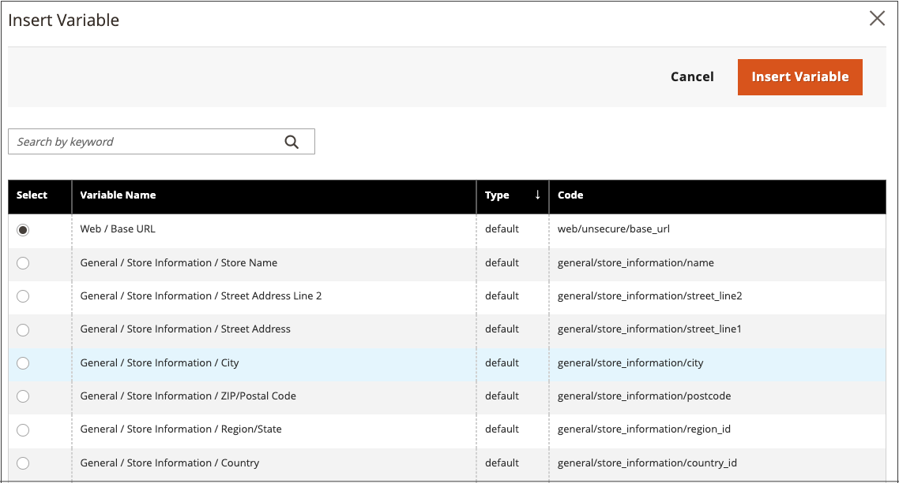

# Inserire una variabile nell’editor

Lo store include molte [variabili](../systems/variables-predefined.md) predefinite che possono essere incorporate nel contenuto della pagina e in altre comunicazioni. Inoltre, puoi includere [variabili personalizzate](../systems/variables-custom.md) che sono specifiche per le tue esigenze.

1. Apri una pagina, un blocco o un blocco dinamico in modalità di modifica.

1. Andare alla sezione _[!UICONTROL Content]_&#x200B;e fare clic su qualsiasi elemento che supporta l&#39;editor.

1. Posizionare il cursore nel punto in cui si desidera visualizzare la variabile e fare clic sull&#39;icona _Inserisci variabile_.

   {width="700" zoomable="yes"}

   Se non hai abilitato [!UICONTROL Page Builder] e preferisci lavorare con il codice HTML, fai clic su **[!UICONTROL Show / Hide Editor]**. Posizionare il punto di inserimento nel testo in cui si desidera visualizzare la variabile. Quindi fare clic su **[!UICONTROL Insert Variable]**.

1. Nell&#39;elenco delle variabili disponibili scegliere quella desiderata e fare clic su **[!UICONTROL Insert Variable]**.

   {width="600" zoomable="yes"}

1. Al termine delle modifiche apportate al contenuto, fare clic su **[!UICONTROL Save]**.
