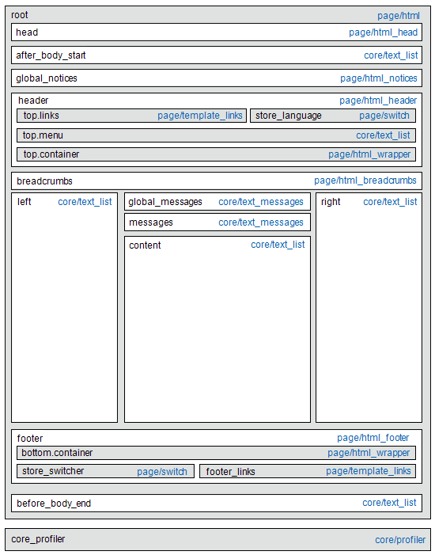

# Aggiornamenti del layout

Prima di iniziare a utilizzare gli aggiornamenti di layout personalizzati, è importante comprendere come vengono costruite le pagine del tuo archivio e la differenza tra i termini *layout* e *aggiornamento layout*. Layout si riferisce alla composizione visiva e strutturale della pagina. L&#39;aggiornamento del layout si riferisce a un insieme specifico di istruzioni XML che possono sostituire o personalizzare la modalità di costruzione della pagina.

Il layout XML dell&#39;archivio [!DNL Commerce] è una struttura gerarchica di contenitori e blocchi. Alcuni elementi vengono visualizzati in ogni pagina, altri solo in pagine specifiche. Per ulteriori informazioni su layout, contenitori e blocchi, vedere la [Panoramica dei layout](https://developer.adobe.com/commerce/frontend-core/guide/layouts/) nella _Guida per gli sviluppatori di FrontEnd_.

Lo strumento [Widget](widgets.md) consente di aggiungere facilmente un [blocco di contenuto](blocks.md) esistente al layout predefinito di una pagina. Per aggiornamenti più avanzati, è necessario salvare il codice di aggiornamento del layout XML sul server e quindi fare riferimento al file come aggiornamento del layout personalizzato dall&#39;amministratore. Per una panoramica del processo, vedere [Utilizzare gli aggiornamenti del layout](layout-updates.md#place-a-block-using-layout-updates).

Nel diagramma seguente, i nomi che fanno riferimento ai contenitori sono neri e i tipi di blocchi, o percorsi di classi di blocchi, sono blu.

{width="500" zoomable="yes"}

| Tipo di blocco | Descrizione |
|--- |--- |
| `page/html` | Il nome di questo blocco è `root` ed è uno dei pochi blocchi radice nel layout. Puoi anche creare un blocco personalizzato e denominarlo `root`, che è il nome standard per i blocchi di questo tipo. Può esistere un solo blocco di questo tipo per pagina. |
| `page/html_head` | Il nome del blocco è `head` ed è un elemento figlio del blocco radice. Può esistere un solo blocco di questo tipo per pagina e non deve essere rimosso. |
| `page/html_notices` | Il nome del blocco è `global_notices` ed è un elemento figlio del blocco radice. Se questo blocco viene rimosso dal layout, gli avvisi globali non vengono visualizzati nella pagina. Può esistere un solo blocco di questo tipo per pagina. |
| `page/html_header` | Il nome del blocco è `header` ed è un elemento figlio del blocco radice. Questo blocco corrisponde all’intestazione visiva nella parte superiore della pagina e contiene diversi blocchi standard. Può esistere un solo blocco di questo tipo per pagina e non deve essere rimosso. |
| `page/html_wrapper` | Anche se incluso nel layout predefinito, questo blocco è obsoleto ed è incluso solo per garantire la compatibilità con le versioni precedenti. Non utilizzare blocchi di questo tipo. |
| `page/html_breadcrumbs` | Il nome di questo blocco è `breadcrumbs` ed è un elemento figlio del blocco intestazione. Questo blocco visualizza le breadcrumb per la pagina corrente. Può esistere un solo blocco di questo tipo per pagina. |
| `page/html_footer` | Il nome del blocco è `footer` ed è un elemento figlio del blocco radice. Il blocco piè di pagina corrisponde al piè di pagina visivo nella parte inferiore della pagina e contiene diversi blocchi standard. Può esistere un solo blocco di questo tipo per pagina e non deve essere rimosso. |
| `page/template_links` | Nel layout standard sono presenti due blocchi di questo tipo. Il blocco `top.links` è un elemento figlio del blocco intestazione e corrisponde al menu di navigazione superiore. Il blocco `footer_links` è un elemento figlio del blocco piè di pagina e corrisponde al menu di navigazione inferiore.   **_Nota:_**&#x200B;è possibile modificare i collegamenti dei modelli, come illustrato negli esempi. |
| `page/switch` | Esistono due blocchi di questo tipo in un layout standard. Il blocco `store_language` è un elemento figlio del blocco di intestazione e corrisponde al commutatore della lingua superiore. Il blocco `store_switcher` è un elemento figlio del blocco piè di pagina e corrisponde al commutatore dell&#39;archivio inferiore. |
| core/messages | Esistono due blocchi di questo tipo in un layout standard. Il blocco `global_messages` visualizza messaggi globali. Il blocco `messages` viene utilizzato per visualizzare tutti gli altri messaggi. Se rimuovi questi blocchi, il cliente non visualizza alcun messaggio. |
| `core/text_list` | Questo tipo di blocco è ampiamente utilizzato in [!DNL Commerce] come segnaposto per il rendering dei blocchi figlio. |
| `core/profiler` | Esiste una sola istanza di questo tipo di blocco per pagina. Viene utilizzato per il profiler interno [!DNL Commerce] e non deve essere utilizzato per altri scopi. |

{style="table-layout:auto"}

## Posizionare un blocco utilizzando gli aggiornamenti del layout

[Gli aggiornamenti del layout](layout-updates.md) consentono di personalizzare il layout di una pagina. Gli aggiornamenti di layout offrono maggiore flessibilità rispetto a un [widget](widgets.md), ma richiedono l&#39;accesso al server e una conoscenza di base di XML.

Nei passaggi seguenti viene illustrato come utilizzare un aggiornamento del layout per posizionare un blocco in una pagina. Per esempi specifici e informazioni sulla sintassi, consulta [Attività comuni di personalizzazione del layout](https://developer.adobe.com/commerce/frontend-core/guide/layouts/) nella _Guida per gli sviluppatori di FrontEnd_.

### Passaggio 1: creare il blocco

1. Creare il [blocco](block-add.md) che si desidera inserire.

1. Prendere nota di `block_id`, perché viene utilizzato nelle istruzioni di aggiornamento del layout.

### Passaggio 2: creare l’aggiornamento del layout in XML

1. Componi le istruzioni di layout in XML per [fare riferimento a un blocco CMS](https://developer.adobe.com/commerce/frontend-core/guide/layouts/xml-manage/).

1. Salva le [istruzioni di layout](https://developer.adobe.com/commerce/frontend-core/guide/layouts/xml-instructions/) sul server nella cartella di layout in cui vengono salvati i file XML per il tema.

   Ad esempio:

   `<theme_dir>/<Namespace>_<Module>/layout`

   L&#39;handle di layout è il nome file che inizia con `cms_page_view_selectable_`, seguito dalla chiave URL della pagina CMS, dall&#39;opzione di aggiornamento del layout e dal suffisso file `xml`. Nell&#39;esempio seguente, `customer-service` è la chiave URL della pagina e `ChatTool` è l&#39;opzione selezionata per applicare l&#39;aggiornamento del layout alla pagina.

   `cms_page_view_selectable_`&lt;`customer-service`>`_`&lt;`ChatTool`>`.xml`

   | Elemento | Descrizione |
   |--- |--- |
   | Identificatore pagina CMS | Chiave URL della pagina con qualsiasi barra (`/`) sostituita da un carattere di sottolineatura (`_`). |
   | Nome aggiornamento layout | Opzione visualizzata per _Aggiornamento layout personalizzato_. |

   {style="table-layout:auto"}

### Passaggio 3: Includere un riferimento all’aggiornamento del layout dalla pagina

1. Nella barra laterale _Admin_, passa a **[!UICONTROL Content]** > _[!UICONTROL Elements]_>**[!UICONTROL Pages]**.

1. Individua la pagina in cui desideri inserire il blocco e aprila in modalità di modifica.

1. Scorri verso il basso ed espandi il  nella sezione **[!UICONTROL Design]**.

1. Per visualizzare tutti gli aggiornamenti di layout disponibili associati alla pagina, fare clic sul menu **[!UICONTROL Custom Layout Update]**.

   {width="400" zoomable="yes"}

1. Seleziona l’aggiornamento del layout da applicare alla pagina.

### Passaggio 4: salvare e aggiornare la cache

1. Al termine, fare clic su **[!UICONTROL Save & Close]**.

1. Nel messaggio nella parte superiore dell&#39;area di lavoro, fare clic su **[!UICONTROL Cache Management]** e aggiornare tutti gli elementi della cache non validi.
