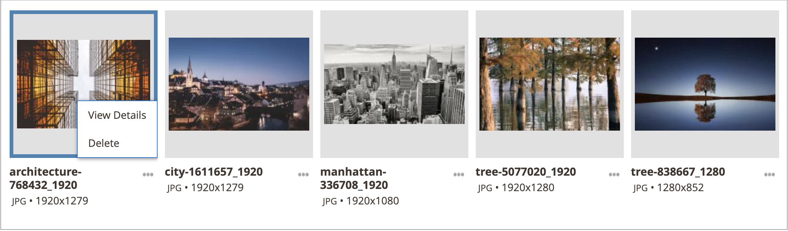
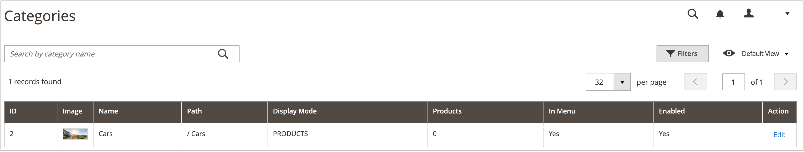

# Gestione risorse di Media Gallery

Il nuovo [Raccolta file multimediali](media-gallery.md) fornisce strumenti per la gestione dei file multimediali caricati e delle risorse acquisite tramite un [Integrazione con Adobe Stock](adobe-stock.md). Se hai salvato un’Adobe Stock [anteprima immagine](adobe-stock-save-preview.md), è inoltre possibile [licenza](adobe-stock-license-image.md) l&#39;immagine nella nuova Raccolta multimediale.

## Caricare una risorsa

1. Il giorno _Amministratore_ barra laterale, vai a **[!UICONTROL Content]** > _[!UICONTROL Media]_>**[!UICONTROL Media Gallery]**.

1. Clic **[!UICONTROL Upload Image]**.

1. Seleziona il file da caricare.

   La risorsa selezionata viene caricata automaticamente nella cartella selezionata (o nella directory principale di archiviazione, se non è selezionata alcuna cartella).

## Visualizza dettagli risorsa

1. Il giorno _Amministratore_ barra laterale, vai a **[!UICONTROL Content]** > _[!UICONTROL Media]_>**[!UICONTROL Media Gallery]**.

1. Fai clic sui tre punti sotto la risorsa ({width="10" zoomable="no"}), quindi fai clic su **[!UICONTROL View Details]**.

   {width="600" zoomable="yes"}

   I dettagli della risorsa vengono visualizzati in un pannello diapositiva. Includono le informazioni in cui la risorsa viene utilizzata:

   - **[!UICONTROL Categories]**
   - **[!UICONTROL Products]**
   - **[!UICONTROL Pages]**
   - **[!UICONTROL Blocks]**

   {width="600" zoomable="yes"}

   Per visualizzare i dettagli, fai clic su **[!UICONTROL Used In]** collegamenti . La griglia nell’esempio seguente mostra tutte le categorie in cui viene utilizzata una risorsa specifica.

   {width="600" zoomable="yes"}

   È anche possibile eliminare la risorsa da _Visualizza dettagli_ sezione.

## Modificare una risorsa

1. Il giorno _Amministratore_ barra laterale, vai a **[!UICONTROL Content]** > _[!UICONTROL Media]_>**[!UICONTROL Media Gallery]**.

1. Fai clic sui tre punti sotto la risorsa ({width="10" zoomable="no"}), quindi fai clic su **[!UICONTROL Edit]**.

   {width="600" zoomable="yes"}

1. Se necessario, modifica uno dei seguenti valori di metadati:

   - **[!UICONTROL Title]**
   - **[!UICONTROL Description]**
   - **[!UICONTROL Tags/Keywords]**

   Questi dati vengono salvati nel database e nei metadati del file stesso. Attualmente sono supportati i formati XMP e IPTC.

   Puoi scaricare l’immagine con i metadati aggiornati.

## Utilizzare una risorsa

Le risorse possono essere utilizzate ampiamente in tutta l’amministrazione, ad esempio [aggiungere o modificare una pagina](page-add.md), [creare o modificare una categoria](../catalog/category-create.md), o [inserire immagini dall’Editor contenuto](editor-insert-image.md).

1. Accedi alla nuova Media Gallery da un’area che ti consente di utilizzare le risorse multimediali.

1. Seleziona la risorsa e fai clic su **[!UICONTROL Add Selected]**.

{{$include /help/_includes/image-optimization-animated-gif-note.md}}

## Eliminare risorse

1. Il giorno _Amministratore_ barra laterale, vai a **[!UICONTROL Content]** > _[!UICONTROL Media]_>**[!UICONTROL Media Gallery]**.

1. Clic **[!UICONTROL Delete Images...]** e seleziona la casella di controllo per ogni risorsa da eliminare.

1. Nella finestra di dialogo di conferma, fai clic su **[!UICONTROL Delete Image]**.

   {width="500" zoomable="yes"}

## Cercare le risorse

1. Il giorno _Amministratore_ barra laterale, vai a **[!UICONTROL Content]** > _[!UICONTROL Media]_>**[!UICONTROL Media Gallery]**.

1. Utilizza il **[!UICONTROL Search by keywords]** input per eseguire la ricerca di immagini per parole chiave/tag.

   La ricerca nell’esempio seguente trova le risorse che contengono un tag specifico (`mountain`).

   {width="600" zoomable="yes"}

>[!NOTE]
>
>Per informazioni su come aggiornare i tag immagine, consulta _[Modificare una risorsa](#edit-an-asset)_ sezione.

## Filtrare le risorse

>[!NOTE]
>
>Il _Utilizzato in_ funzionalità richiede che [!UICONTROL Media Gallery Image Optimization] è abilitato in [impostazioni di configurazione](media-gallery-image-optimization.md).

1. Il giorno _Amministratore_ barra laterale, vai a **[!UICONTROL Content]** > _[!UICONTROL Media]_>**[!UICONTROL Media Gallery]**.

1. Fai clic su **[!UICONTROL Filters]** scheda.

   {width="600" zoomable="yes"}

1. Imposta le opzioni di filtro.

   Puoi filtrare le risorse in base all’utilizzo da parte delle entità:

   - **[!UICONTROL Used in Categories]**
   - **[!UICONTROL Used in Products]**
   - **[!UICONTROL Used in Pages]**
   - **[!UICONTROL Used in Blocks]**

   Puoi anche filtrare le risorse in base a **[!UICONTROL Store View]**, **[!UICONTROL License Status]**, e **[!UICONTROL Content Status]**. Imposta un intervallo di date per **[!UICONTROL Uploaded Date]** e/o **[!UICONTROL Modification Date]** per filtrare le risorse in base alle date dei file.

1. Clic **[!UICONTROL Apply Filters]** per visualizzare i risultati.

   Il filtro nell’esempio seguente trova le risorse utilizzate in una categoria specifica (`cars`) e sono abilitati.

   {width="600" zoomable="yes"}

## Trova duplicati immagine

1. Fai clic su **[!UICONTROL Filters]** e seleziona la scheda **[!UICONTROL Show duplicates]** casella di controllo.

1. Per visualizzare i risultati, fai clic su **[!UICONTROL Apply Filters]**.
