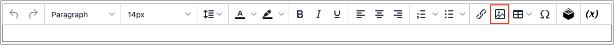

# Archiviazione di contenuti multimediali

L&#39;archiviazione multimediale consente di organizzare e accedere ai file multimediali memorizzati sul server. Il percorso dei file è determinato dalla configurazione dell&#39;[URL di base](../stores-purchase/store-urls.md). I file nell’archiviazione multimediale sono accessibili dall’editor mentre si lavora su pagine e blocchi statici. In genere, l&#39;archiviazione multimediale risiede nel file system sullo stesso server dei file di programma [!DNL Commerce].

In alternativa, è possibile gestire i file multimediali in un [database](media-storage-database.md) o in un server separato o in una [rete di distribuzione dei contenuti](media-storage-content-delivery-network.md). Il vantaggio dell&#39;utilizzo di un sistema di storage alternativo è che riduce al minimo lo sforzo necessario per sincronizzare i supporti. Le prestazioni di sincronizzazione sono particolarmente influenzate quando più istanze del sistema vengono distribuite su server diversi che richiedono l&#39;accesso alle stesse immagini, file CSS e altri file multimediali.

L&#39;editor può essere configurato per utilizzare URL statici o [URL di elementi multimediali dinamici](../catalog/catalog-urls.md#configure-catalog-media-url-format) per il contenuto del catalogo nelle descrizioni di categorie o prodotti.

![[!DNL Commerce] archiviazione multimediale](./assets/media-storage.png){width="650" zoomable="yes"}

## Aggiungere file all&#39;archivio multimediale

I primi due passaggi sono gli stessi dell&#39;inserimento di un&#39;immagine.

1. Sulla barra degli strumenti [editor](editor.md) fare clic sull&#39;icona _Inserisci immagine_.

   {width="700" zoomable="yes"}

   Questa azione apre la finestra di dialogo _[!UICONTROL Insert/edit image]_.

1. Dopo _[!UICONTROL Source]_, fare clic sull&#39;icona_ Cerca _({width="10" zoomable="no"}).

1. Nella struttura di directory a sinistra, effettuare una delle seguenti operazioni:

   - Passa alla cartella in cui desideri salvare l’immagine caricata.

   - Passare alla posizione in cui si desidera creare una cartella e fare clic su **Crea cartella**.

     Per aggiungere una cartella, immettere il nome della cartella e fare clic su **[!UICONTROL OK]**.

1. Per aggiungere uno o più file a Media Storage, puoi caricare i file dal tuo sistema o utilizzare l&#39;[Integrazione Adobe Stock](adobe-stock.md):

   Per caricare i file dal sistema, fare clic su **[!UICONTROL Choose Files]** ed effettuare le seguenti operazioni:

   - Nella directory del computer locale passare alla posizione delle immagini.

   - Seleziona ogni immagine da caricare.

   - Fare clic su **[!UICONTROL Open]**.

   Per utilizzare le risorse di Adobe Stock tramite l&#39;[integrazione](adobe-stock.md):

   - Fare clic su **[!UICONTROL Search Adobe Stock]**.

   - Aggiungi un&#39;anteprima o un&#39;immagine con licenza da Adobe Stock (vedi [Utilizzo di immagini Adobe Stock](adobe-stock-manage.md)).

Le immagini vengono caricate nella cartella Archiviazione file multimediali corrente sul server.

![[!DNL Commerce] archiviazione multimediale](./assets/media-storage.png){width="650" zoomable="yes"}

## Inserire un&#39;immagine dall&#39;archiviazione dei supporti

Apri la pagina o il blocco da modificare. Utilizzare quindi uno dei metodi seguenti per inserire un&#39;immagine dall&#39;archiviazione dei supporti:

### Metodo 1: modalità WYSIWYG

1. Sulla barra degli strumenti [editor](editor.md) fare clic sull&#39;icona _Inserisci immagine_.

1. Dopo _[!UICONTROL Source]_, fare clic sull&#39;icona_ Cerca _({width="10" zoomable="no"}).

   {width="250" zoomable="yes"}

1. Nella struttura della directory a sinistra, individua la cartella in cui è memorizzata l&#39;immagine.

1. Selezionare il riquadro dell&#39;immagine e fare clic su **[!UICONTROL Add Selected]**.

### Metodo 2: modalità HTML

1. Posizionare il cursore nel codice in cui inserire il tag ``.

1. Fare clic su **[!UICONTROL Insert Image]**.

   {width="600" zoomable="yes"}
