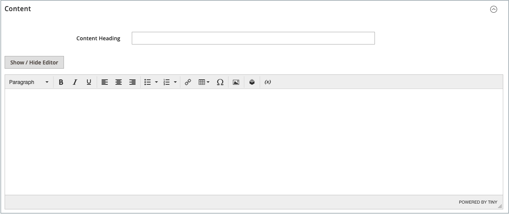

# Aggiungi e rimuovi pagine

Il processo di aggiunta di una pagina di contenuto all&#39;archivio è essenzialmente lo stesso per qualsiasi tipo di pagina che si desidera creare. Puoi includere testo, immagini, blocchi di contenuto, variabili e widget. La maggior parte delle pagine di contenuto è progettata per essere letta prima dai motori di ricerca e poi dalle persone. Tieni presente le esigenze di ciascuno di questi due diversi tipi di pubblico quando scegli il titolo della pagina, l’URL e durante la composizione dei metadati e del contenuto. Una volta completata, la pagina potrà essere aggiunta alla navigazione del Negozio, collegata ad altre pagine, collegata dal piè di pagina del Negozio o utilizzata come nuova [home page](page-home-new.md).

{width="700" zoomable="yes"}

## Aggiungi una pagina

Le istruzioni seguenti descrivono ogni passaggio per creare una pagina di base. Alcune funzioni avanzate vengono ignorate, ma sono trattate in altri argomenti.

### Passaggio 1: creare la pagina

1. Nella barra laterale _Admin_, passa a **[!UICONTROL Content]** > _[!UICONTROL Elements]_>**[!UICONTROL Pages]**.

1. Fare clic su **[!UICONTROL Add New Page]**.

   {width="600" zoomable="yes"}

1. Se non si desidera pubblicare immediatamente la pagina, impostare **[!UICONTROL Enable Page]** su `No`.

1. Immettere **[!UICONTROL Page Title]**.

   Il titolo della pagina viene visualizzato nel percorso di navigazione [breadcrumb](../catalog/navigation-breadcrumb-trail.md).

### Passaggio 2: Completare il contenuto

A seconda della [configurazione avanzata degli strumenti di contenuto](../configuration-reference/general/content-management.md), aggiungi il contenuto della pagina.

#### Utilizzare gli strumenti di contenuto di Page Builder

1. Espandere  **[!UICONTROL Content]**.

   {width="600" zoomable="yes"}

1. Nella casella **[!UICONTROL Content Heading]** immettere l&#39;intestazione che si desidera visualizzare nella parte superiore della pagina.

   Se l&#39;opzione è attivata, la fase e il pannello del [Page Builder](../page-builder/introduction.md) vengono visualizzati sotto l&#39;intestazione del contenuto. Per ulteriori informazioni, vedere [Workspace](../page-builder/workspace.md). Se _Page Builder_ non è abilitato, l&#39;editor viene aperto in modalità WYSIWYG con la barra degli strumenti nella parte superiore.

1. Completa il contenuto e formatta il testo come necessario.

#### Utilizzare la barra degli strumenti dell’editor

1. Espandere  **[!UICONTROL Content]**.

   {width="600" zoomable="yes"}

1. Nella casella **[!UICONTROL Content Heading]** immettere l&#39;intestazione che si desidera visualizzare nella parte superiore della pagina.

1. Completa il contenuto e formatta il testo come necessario.

   Puoi aggiungere [immagini](media-storage.md), [variabili](../systems/variables-predefined.md) e [widget](widgets.md) in base alle esigenze. Per ulteriori informazioni, vedere [Utilizzo dell&#39;editor](editor.md).

### Passaggio 3: Completare le informazioni SEO (Search Engine Optimization)

1. Espandere  **[!UICONTROL Search Engine Optimization]**.

   {width="600" zoomable="yes"}

1. Accettare il valore predefinito o immettere un altro **[!UICONTROL URL Key]** composto da tutti i caratteri minuscoli, con trattini invece degli spazi.

   La chiave URL predefinita è stata creata quando la pagina è stata salvata ed è basata sull’intestazione del contenuto.

1. Immettere **[!UICONTROL Meta Title]** per la pagina.

   Il metatitolo deve contenere meno di 70 caratteri e viene visualizzato nella barra del titolo e nella scheda del browser.

1. Immettere il valore massimo **[!UICONTROL Meta Keywords]** che i motori di ricerca possono utilizzare per indicizzare la pagina.

   Separa più parole con una virgola. Le parole chiave meta vengono ignorate da alcuni motori di ricerca, ma utilizzate da altri.

1. Per **[!UICONTROL Meta Description]**, immettere una breve descrizione della pagina per l&#39;elenco dei risultati di ricerca.

   Idealmente, la descrizione dovrebbe essere lunga 150-160 caratteri, con un limite massimo di 255.

1. Fare clic su **[!UICONTROL Save]**.

### Passaggio 4: specificare l’ambito della pagina

1. Espandere  **[!UICONTROL Page in Websites]**.

   {width="600" zoomable="yes"}

1. Nell&#39;elenco **[!UICONTROL Store View]** selezionare ogni visualizzazione in cui la pagina sarà disponibile.

   Se nell&#39;installazione sono presenti più siti Web, selezionare ogni sito Web e archiviare la visualizzazione in cui la pagina sarà disponibile.

### Passaggio 5: identificare la pagina padre (se applicabile)

{{ee-feature}}

1. Espandere  **[!UICONTROL Hierarchy]**.

   {width="600" zoomable="yes"}

1. Se la pagina è figlia di un&#39;altra pagina, selezionare la casella di controllo di **[!UICONTROL Parent page]**.

### Passaggio 6: inserire le modifiche di progettazione (facoltativo)

1. Per modificare il layout della pagina, espandere  **[!UICONTROL Design]**.

   {width="600" zoomable="yes"}

1. Per modificare il layout delle colonne della pagina, impostare **[!UICONTROL Layout]** su una delle seguenti opzioni:

   - `Empty`
   - `1 column`
   - `2 columns with left bar`
   - `2 columns with right bar`
   - `3 columns`
   - `Page -- Full Width` (Richiede [Page Builder](../page-builder/introduction.md))
   - `Category -- Full Width` (richiede Page Builder)
   - `Product -- Full Width` (richiede Page Builder)

1. Per applicare un **[!UICONTROL Custom Layout Update]**, scegliere il nome del file dall&#39;elenco.

   Per ulteriori informazioni, vedere [Aggiornamenti layout](layout-updates.md).

1. Per modificare il tema della pagina, impostare **[!UICONTROL New Theme]** su uno dei seguenti:

   - `Magento Black`
   - `Magento Luma`

1.  (solo Magento Open Source) Per pianificare una modifica della struttura, espandere  **[!UICONTROL Custom Design Update]** ed eseguire le operazioni seguenti:

   {width="600" zoomable="yes"}

   - Utilizzare il calendario () per scegliere le date **[!UICONTROL From]** e **[!UICONTROL To]** per rendere effettiva la modifica.

   - Per applicare un tema diverso alla pagina, selezionare il nome di **[!UICONTROL New Theme]**.

   - Per modificare il layout delle colonne della pagina, scegliere **[!UICONTROL Layout]** che si desidera applicare.

### Passaggio 7: visualizzare l’anteprima della pagina

1. Fare clic sulla freccia **[!UICONTROL Save]** e scegliere **[!UICONTROL Save & Close]** per tornare alla griglia Pagine.

1. Trovare la pagina nella griglia e selezionare **[!UICONTROL View]** nella colonna _[!UICONTROL Action]_.

1. Per tornare alla griglia, fare clic su **[!UICONTROL Back]** nell&#39;angolo superiore sinistro della finestra del browser.

### Passaggio 8: pubblicare la pagina

1. Selezionare **[!UICONTROL Edit]** nella colonna _[!UICONTROL Action]_della griglia.

1. Imposta **[!UICONTROL Enable Page]** su `Yes`.

1. Fare clic sulla freccia **[!UICONTROL Save]** e scegliere **[!UICONTROL Save & Close]**.

## Duplicare una pagina

Qualsiasi pagina di contenuto può essere utilizzata come modello e salvata come duplicato. È possibile utilizzare questa tecnica che consente di risparmiare tempo per creare una progettazione coerente per le pagine di contenuto in tutto il sito. La pagina duplicata mantiene il titolo della pagina originale, ma è necessario aggiornare i campi Chiave URL e Stato.

{width="600" zoomable="yes"}

1. Nella barra laterale _Admin_, passa a **[!UICONTROL Content]** > _[!UICONTROL Elements]_>**[!UICONTROL Pages]**.

1. Nella griglia trovare la pagina da duplicare e fare clic su **[!UICONTROL Edit]** nella colonna _[!UICONTROL Action]_.

1. Fare clic sulla freccia **[!UICONTROL Save]** e scegliere **[!UICONTROL Save & Duplicate]**.

1. Quando vengono visualizzati i messaggi che indicano che la pagina è stata salvata e duplicata, fare clic su **[!UICONTROL Back]** nella barra dei pulsanti superiore per tornare alla griglia.

1. Individuare la pagina duplicata nella griglia e prendere nota di quanto segue:

   - Il titolo della pagina è lo stesso dell’originale.
   - Viene assegnata una chiave URL univoca ma temporanea.
   - Lo stato della pagina è `Disabled`.

1. Aprire la pagina duplicata in modalità _Modifica_ ed eseguire le operazioni seguenti:

   - Per pubblicare immediatamente la pagina, impostare **[!UICONTROL Enable Page]** su `Yes`.

   - Aggiornare **[!UICONTROL Page Title]**, in base alle esigenze.

   - Espandere  nella sezione **[!UICONTROL Search Engine Optimization]** e immettere l&#39;elemento **[!UICONTROL URL Key]** univoco che si desidera utilizzare per la pagina duplicata.

     {width="600" zoomable="yes"}

   - Se necessario, aggiorna il contenuto della pagina rimanente.

1. Fare clic sulla freccia **[!UICONTROL Save]** e scegliere **[!UICONTROL Save & Close]**.

   La pagina duplicata nella griglia riflette le modifiche apportate.

## Menu Salva

| Comando | Descrizione |
|--- |--- |
| [!UICONTROL Save] | Salvare la pagina corrente e continuare a lavorare. |
| [!UICONTROL Save & New] | Salva e chiudi la pagina corrente e inizia una nuova pagina. |
| [!UICONTROL Save & Duplicate] | Salva e chiudi la pagina corrente e apri una nuova copia duplicata. |
| [!UICONTROL Save & Close] | Salvare e chiudere la pagina corrente e tornare alla griglia Pagine. |

{style="table-layout:auto"}

## Eliminare una pagina

Esistono due modi per rimuovere una pagina creata. È possibile rimuoverlo dalla griglia _[!UICONTROL Pages]_o dalla pagina_[!UICONTROL Edit]_.

### Metodo 1: rimuovere una pagina dalla griglia Pagine

1. Nella barra laterale _Admin_, passa a **[!UICONTROL Content]** > _[!UICONTROL Elements]_>**[!UICONTROL Pages]**.

1. Individua le pagine utilizzando i filtri sopra la griglia e seleziona la casella di controllo per una o più pagine da eliminare.

1. Nell&#39;angolo superiore sinistro dell&#39;elenco, impostare **[!UICONTROL Actions]** su `Delete`.

1. Per confermare l&#39;azione, fare clic su **[!UICONTROL OK]**.

### Metodo 2: rimuovere una pagina dalla pagina di modifica

1. Nella barra laterale _Admin_, passa a **[!UICONTROL Content]** > _[!UICONTROL Elements]_>**[!UICONTROL Pages]**.

1. Trova la pagina da eliminare.

1. Nella colonna _[!UICONTROL Actions]_dell&#39;entità pagina fare clic su **[!UICONTROL Select]**e scegliere **[!UICONTROL Edit]**.

1. Nella barra dei pulsanti fare clic su **[!UICONTROL Delete Page]**.

1. Per confermare l&#39;azione, fare clic su **[!UICONTROL OK]**.
