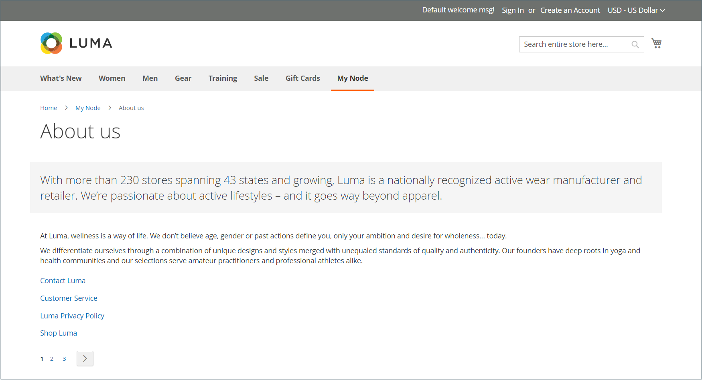
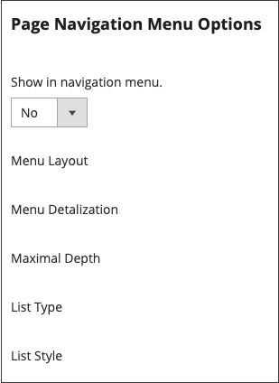

# Gerarchia delle pagine

{{ee-feature}}

Il sistema di gerarchia delle pagine dei negozi consente di organizzare le pagine di contenuto e aggiungere impaginazione, navigazione e menu. La pagina Informativa sulla privacy nei dati di esempio è un esempio di pagina con un menu a sinistra. Se pubblichi regolarmente una grande quantità di contenuti, puoi utilizzare una gerarchia di pagine per organizzare i contenuti in modo da facilitare la ricerca di articoli di tuo interesse.

Il sistema di gerarchia delle pagine utilizza i nodi per identificare parti di contenuto correlate e organizzare le pagine di contenuto in relazioni padre/figlio. Un nodo principale è simile a una cartella che potrebbe contenere nodi e pagine secondari. La posizione relativa di ciascun nodo e di ciascuna pagina nella gerarchia viene visualizzata come _albero_ struttura. Un nodo può contenere altri nodi e pagine di contenuto e una singola pagina di contenuto può essere associata a più nodi e altre pagine di contenuto in una relazione padre/figlio o adiacente.

{width="600" zoomable="yes"}

## Configurare la gerarchia delle pagine

Le impostazioni di configurazione attivano il sistema della gerarchia delle pagine e i metadati e determinano il layout predefinito del menu.

{width="600" zoomable="yes"}

1. Il giorno _Amministratore_ barra laterale, vai a **[!UICONTROL Stores]** > _[!UICONTROL Settings]_>**[!UICONTROL Configuration]**.

1. Nel pannello a sinistra sotto _[!UICONTROL General]_, scegli **[!UICONTROL Content Management]**.

1. Espandi  **[!UICONTROL CMS Page Hierarchy]**  e apporta le modifiche necessarie.

1. Al termine, fai clic su **[!UICONTROL Save Config]**.

| Campo | Descrizione |
|--- |--- |
| [!UICONTROL Enable Hierarchy Functionality] | Attiva l&#39;utilizzo della gerarchia di pagine per le pagine di contenuto. Opzioni: `Yes` / `No` |
| [!UICONTROL Enable Hierarchy Metadata] | Quando questa opzione è abilitata, puoi associare i metadati alle pagine della gerarchia. Opzioni: `Yes` / `No` |
| [!UICONTROL Default Layout for Hierarchy Menu] | Determina lo stile di menu predefinito. Opzioni: `Content` / `Left Column` / `Right Column` |

{style="table-layout:auto"}

## Aggiungere un nodo di gerarchia

L’esempio seguente mostra come creare un nodo con una semplice navigazione alle pagine di contenuto correlate. A un nodo non è associata alcuna pagina di contenuto, ma è disponibile una chiave URL a cui è possibile fare riferimento in un&#39;altra posizione del sito.

Ad esempio, puoi creare un nodo denominato _Comunicati stampa_ che consente di passare ai singoli comunicati stampa. Quindi, puoi includere il collegamento nel tuo _Chi siamo_ al nodo. Oppure potresti creare un nodo per una raccolta di problemi precedenti della newsletter.

Per collegare un nodo, utilizza [Widget](widgets.md) strumento per creare un collegamento di nodo gerarchia CMS e inserire il widget in un blocco di contenuto o in una pagina.

{width="600" zoomable="yes"}

### Passaggio 1: creare un nodo

1. Il giorno _Amministratore_ barra laterale, vai a **[!UICONTROL Content]** > _[!UICONTROL Elements]_>**[!UICONTROL Hierarchy]**.

   {width="600" zoomable="yes"}

1. Sopra la griglia, fare clic su **[!UICONTROL Add Node...]**.

1. Sotto _[!UICONTROL Page Properties]_, immetti un **[!UICONTROL Title]**per il nodo e un **[!UICONTROL URL Key]**.

   La chiave URL fornisce un indirizzo web univoco per il nodo. Devono essere tutti caratteri minuscoli, utilizzando i trattini per separare le parole, invece degli spazi.

   {width="500" zoomable="yes"}

1. Clic **[!UICONTROL Save]**.

   Il nodo viene visualizzato come cartella nella struttura ad albero a sinistra della pagina.

### Passaggio 2: aggiungere pagine al nodo

1. Nella struttura gerarchica fare clic su per selezionare il nodo.

1. Clic **[!UICONTROL Add Selected Pages(s) to Tree]**.

   Puoi scorrere verso l’alto per vedere che ogni pagina selezionata viene visualizzata nella struttura sotto la cartella dei nodi.

### Passaggio 3: definire la struttura

1. Se necessario, trascina le pagine in posizione per riflettere l’ordine di visualizzazione nel menu.

   {width="500" zoomable="yes"}

1. Fai clic sul nodo nella parte superiore della gerarchia.

   Il _[!UICONTROL Page Properties]_Questa sezione visualizza ora informazioni sul nodo.

1. Sotto **[!UICONTROL Render Metadata in HTML Head]**, eseguire le operazioni seguenti:

   {width="400" zoomable="yes"}

   - Per identificare il nodo come parte superiore della gerarchia, impostare **[!UICONTROL First]** a `Yes`.

   - Per visualizzare un controllo di impaginazione, impostare **[!UICONTROL Next/Previous]** a `Yes`.

   - Per organizzare le pagine nella gerarchia come un libro, impostare **[!UICONTROL Enable Chapter/Section]** a `Yes`.

     Se non si desidera includere il nodo come parte del registro, lasciare l&#39;impostazione predefinita `No`.

   - Per assegnare il nodo a una parte specifica del registro, impostare **[!UICONTROL Chapter/Section]** a uno dei seguenti elementi:

      - `No` - Non definisce il nodo come capitolo/sezione.
      - `Chapter` - Assegna il nodo corrente come capitolo.
      - `Section` - Assegna il nodo corrente come sezione.
      - `Both` - Assegna il nodo corrente come capitolo e sezione.

### Passaggio 4: aggiungere controlli di impaginazione

1. Sotto _Opzioni di impaginazione per le pagine nidificate_, impostato **[!UICONTROL Enable Pagination]** a `Yes`.

1. Per **[!UICONTROL Frame]**, immettere il numero di collegamenti alle pagine che si desidera includere nel controllo di impaginazione.

   Se nella gerarchia sono presenti più pagine che possono essere incluse nel controllo di impaginazione.

1. Per **[!UICONTROL Frame Skip]**, immetti il numero di pagine da saltare avanti (o indietro) per il successivo set di collegamenti di impaginazione.

### Passaggio 5: scegliere il layout del menu

Se si desidera visualizzare il nodo nel menu, effettuare le seguenti operazioni:

1. Sotto _Opzioni del menu di navigazione della pagina_, impostato **[!UICONTROL Show in navigation menu]** a `Yes`.

   Questa impostazione determina se viene generato un menu di navigazione per la gerarchia di pagine.

   {width="300" zoomable="yes"}

1. Per specificare la posizione del menu in relazione al contenuto, impostare **[!UICONTROL Menu Layout]**:

   - `Content` - Il layout del menu è nel contenuto.
   - `Use Default` - Utilizza lo stile di menu specificato nel [configurazione](../configuration-reference/general/content-management.md).
   - `Left Column` - Il menu viene visualizzato a sinistra del contenuto.
   - `Right Column` - Il menu viene visualizzato a destra del contenuto.

1. Per specificare il livello di dettaglio da includere nel menu, impostare **[!UICONTROL Menu Detalization]** a uno dei seguenti elementi:

   - `Only Children` - Include solo le pagine secondarie del menu.
   - `Neighbours and Children` : include le pagine secondarie e altre pagine che si trovano allo stesso livello nella gerarchia.

1. Per determinare la profondità del menu, immettete **[!UICONTROL Maximal Depth]** per il numero massimo di livelli da includere.

1. Per formattare il menu, scegliete un **[!UICONTROL List Type]**:

   - `Unordered` - Le opzioni di menu non sono numerate e possono essere formattate con o senza punti elenco. Opzioni per il tipo di elenco non ordinato: Predefinito / Cerchio / Disco / Quadrato
   - `Ordered` - Le opzioni del menu sono numerate e possono essere formattate come numeri numerici, alfabetici o romani in lettere maiuscole o minuscole.

1. Imposta **[!UICONTROL List Style]** a uno dei seguenti elementi:

   - `Circle`
   - `Disc`
   - `Square`

1. Se desideri che il nodo sia visibile anche nel menu di navigazione, scorri fino a _Opzioni del menu di navigazione principale_ e imposta **[!UICONTROL Show in Navigation menu]** a `Yes`.

   {width="250" zoomable="yes"}

1. Clic **[!UICONTROL Save]**.
