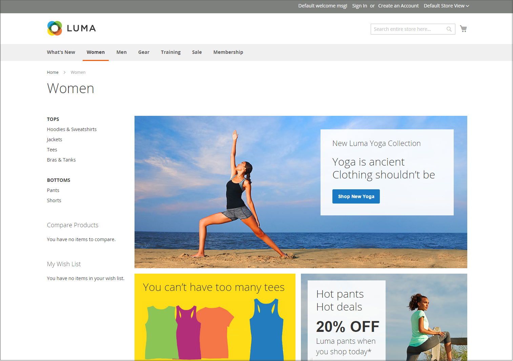

# Esempi di layout della vetrina

Le dimensioni delle colonne sono determinate dal foglio di stile del tema. Alcuni temi applicano una larghezza fissa in pixel al layout della pagina, mentre altri utilizzano percentuali per fare in modo che la pagina risponda alla larghezza della finestra o del dispositivo.

La maggior parte dei temi del desktop ha una larghezza fissa per la colonna principale e tutte le attività si svolgono all&#39;interno di questa area racchiusa. A seconda della risoluzione dello schermo, è presente uno spazio vuoto su ciascun lato della colonna principale.

## Una colonna

L’area del contenuto per un layout a una colonna si estende sull’intera larghezza della colonna principale. Questo layout viene spesso utilizzato per una home page con un banner o un cursore di grandi dimensioni oppure per pagine che non richiedono alcuna navigazione, ad esempio una pagina di accesso, una pagina iniziale, un video o un annuncio pubblicitario a pagina intera.

{width="700" zoomable="yes"}

## Due colonne con barra a sinistra

L’area del contenuto di questo layout è divisa in due colonne. La colonna del contenuto principale viene spostata a destra, mentre la barra laterale viene spostata a sinistra.

{width="700" zoomable="yes"}

## Due colonne con barra a destra

Questo layout è un&#39;immagine speculare dell&#39;altro layout a due colonne. Questa volta, la barra laterale viene spostata a destra e la colonna del contenuto principale a sinistra.

{width="700" zoomable="yes"}

## Tre colonne

Un layout a tre colonne ha un’area di contenuto principale con due colonne laterali. La barra laterale sinistra e la colonna del contenuto principale sono racchiuse insieme e fluttuano come un&#39;unità a sinistra. L&#39;altra barra laterale galleggia a destra.

{width="700" zoomable="yes"}
