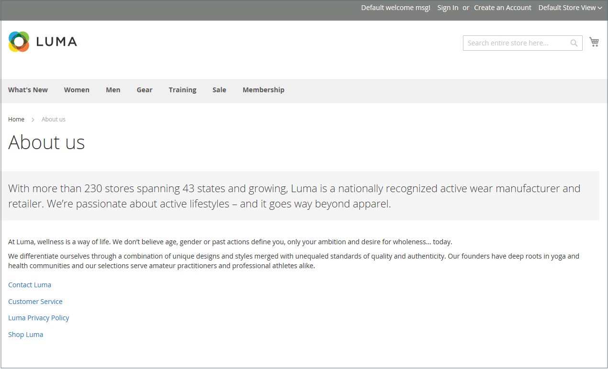

# Pagine

Il contenuto può essere visualizzato in termini di durata, come qualsiasi prodotto in un negozio. Lo sapevi che la durata utile dei contenuti sui social media è inferiore alle 24 ore? La potenziale durata dei contenuti creati può essere utile per decidere dove investire le risorse.

I contenuti con una lunga durata di conservazione sono talvolta denominati _contenuti sempreverdi_. Esempi di contenuti fissi includono storie di successo dei clienti, _istruzioni su_ e domande frequenti (FAQ). Al contrario, i contenuti che per loro natura sono deperibili includono eventi, notizie del settore e comunicati stampa.

{width="700" zoomable="yes"}

## Pagine contenuto core

Nell&#39;archivio demo [!DNL Commerce] sono presenti esempi di pagine di contenuto di base utili per iniziare. Puoi modificare tutte queste pagine in base alle tue esigenze. Guarda le pagine seguenti del tuo negozio e assicurati che il contenuto trasmetta il messaggio, la voce e il marchio.

### Home

La pagina demo [Home](../getting-started/storefront.md#home-page) include un banner, un carosello di immagini, diversi blocchi statici con collegamenti e un elenco di nuovi prodotti.

### Informativa sulla privacy

La pagina [Informativa sulla privacy](../getting-started/privacy-policy.md) dell&#39;archivio deve essere aggiornata con le tue informazioni. Come best practice, l’informativa sulla privacy deve spiegare ai clienti il tipo di informazioni raccolte dalla tua azienda e come vengono utilizzate.

### 404 Non trovato

La pagina 404 Pagina non trovata prende il nome dal codice di risposta restituito quando non è possibile trovare una pagina. I reindirizzamenti URL riducono il numero di volte in cui viene visualizzata la pagina. Tuttavia, per i momenti in cui è necessario, si potrebbe anche sfruttare l&#39;opportunità di offrire alcuni collegamenti a prodotti che il cliente potrebbe trovare interessante.

### Accesso negato

{{b2b-feature}}

La pagina [Accesso negato](../b2b/account-company-roles-permissions.md) viene visualizzata quando le autorizzazioni assegnate a un utente della società impediscono l&#39;accesso alla pagina.

### Abilita cookie

La pagina [Abilita cookie](../getting-started/compliance-cookie-law.md) viene visualizzata quando i visitatori del sito non hanno i cookie abilitati nei loro browser. La pagina fornisce istruzioni dettagliate e illustrate per abilitare i cookie per i browser più diffusi.

### Servizio non disponibile

La pagina [503 Servizio non disponibile](../configuration-reference/general/general.md) è denominata in base al codice di risposta restituito quando il server non è disponibile.

### Chi siamo

La pagina Informazioni su di noi è collegata dal piè di pagina del tuo negozio. Puoi includere immagini, video, collegamenti a comunicati stampa e annunci. La pagina di esempio ha un&#39;immagine a destra e una decorativa per indicare la fine della pagina.

### Servizio clienti

La pagina Servizio clienti è un altro nodo nella gerarchia delle pagine. Il contenuto delle due intestazioni della pagina diventa visibile solo quando il cliente fa clic sull’intestazione.

{width="700" zoomable="yes"}

## Configurare le pagine predefinite

La configurazione di _Pagine predefinite_ determina la pagina di destinazione associata all&#39;[URL di base](../stores-purchase/store-urls.md) e alla home page corrispondente. Inoltre, determina quale pagina viene visualizzata quando si verifica un errore di _Pagina non trovata_ e se nella parte superiore di ogni pagina viene visualizzato un percorso di [breadcrumb](../catalog/navigation-breadcrumb-trail.md).

1. Nella barra laterale _Admin_, passa a **[!UICONTROL Stores]** > _[!UICONTROL Settings]_>**[!UICONTROL Configuration]**.

1. Nel pannello a sinistra in _[!UICONTROL General]_, scegli **[!UICONTROL Web]**.

1. Espandere  nella sezione **[!UICONTROL Default Pages]**.

   {width="500" zoomable="yes"}

   | Campo | [Ambito](../getting-started/websites-stores-views.md#scope-settings) | Descrizione |
   |--- |--- |--- |
   | [!UICONTROL Default Web URL] | Visualizzazione store | Indica la pagina di destinazione associata all’URL di base. Per impostazione predefinita, questo campo è impostato su `cms` per indicare una pagina del sistema di gestione dei contenuti [!DNL Commerce]. Puoi anche utilizzare un tipo diverso di pagina di destinazione, ad esempio un blog. Se ad esempio nel server di `magento/blog` è installato un blog, è possibile immettere il nome della cartella `blog` come percorso relativo per la selezione delle pagine. |
   | [!UICONTROL CMS Home Page] | Visualizzazione store | Per scegliere la home page del negozio, è sufficiente selezionare la pagina CMS dall&#39;elenco. Per impostazione predefinita, la home page di CMS elenca l&#39;intera selezione di pagine CMS disponibili per lo store. |
   | [!UICONTROL Default No-route URL] | Visualizzazione store | Contiene l&#39;URL della pagina predefinita da visualizzare quando si verifica un errore `404 Page not Found`. Il valore predefinito è `cms/noroute/index`. |
   | [!UICONTROL CMS No Route Page] | Visualizzazione store | Identifica una pagina CMS specifica che si desidera visualizzare quando si verifica un errore Pagina 404 non trovata. La pagina predefinita è `404 Not Found`. |
   | [!UICONTROL CMS No Cookies Page] | Visualizzazione store | Identifica una pagina CMS specifica che viene visualizzata quando i cookie non sono abilitati per il browser. La pagina spiega perché vengono utilizzati i cookie e come abilitarli per ogni browser. La pagina predefinita è `Enable Cookies`. |
   | [!UICONTROL Show Breadcrumbs for CMS Pages] | Visualizzazione store | Determina se un percorso di breadcrumb viene visualizzato in tutte le pagine CMS del catalogo. Opzioni: `Yes` / `No` |

   {style="table-layout:auto"}

1. Per **[!UICONTROL Default Web URL]**, immettere il percorso relativo della cartella nell&#39;installazione di [!DNL Commerce] che contiene la pagina di destinazione.

   L&#39;impostazione predefinita `cms` indica una pagina del sistema di gestione dei contenuti [!DNL Commerce].

   >[!NOTE]
   >
   >Per una visualizzazione archivio specifica, deselezionare la casella di controllo **[!UICONTROL Use Default]** accanto a _[!UICONTROL Default Web URL]_&#x200B;ed eventuali altre impostazioni predefinite da modificare.

1. Impostare **[!UICONTROL CMS Home Page]** sulla pagina CMS da utilizzare come home page. Altre pagine create possono essere utilizzate come home page, ad esempio:

   - Benvenuto nel negozio online esclusivo
   - Punti premio
   - Chi siamo
   - Servizio clienti
   - Abilita cookie
   - Informativa sulla privacy
   - Società: accesso negato

1. Per **[!UICONTROL Default No-route URL]**, immettere il percorso relativo della cartella nell&#39;installazione di [!DNL Commerce] in cui la pagina viene reindirizzata quando si verifica un errore _404 Pagina non trovata_.

   Il valore predefinito è `cms/index/noRoute`.

1. Impostare **[!UICONTROL CMS No Route Page]** sulla pagina CMS visualizzata quando si verifica un errore _404 Pagina non trovata_.

1. Impostare **[!UICONTROL CMS No Cookies Page]** sulla pagina CMS visualizzata quando i cookie sono disabilitati nel browser. La pagina spiega perché vengono utilizzati i cookie e come abilitarli per ogni browser. La pagina predefinita è `Enable Cookies`.

1. Se si desidera visualizzare un percorso di breadcrumb nella parte superiore di tutte le pagine di CMS, impostare **[!UICONTROL Show Breadcrumbs for CMS Pages]** su `Yes`.

1. Al termine, fare clic su **[!UICONTROL Save Config]**.
