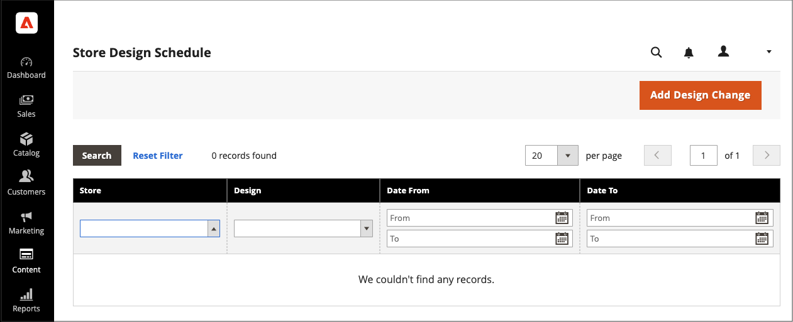

# Pianifica modifiche alla progettazione

Pianifica in anticipo le modifiche alla progettazione del tema in modo che diventino effettive in base ai cicli di business e agli eventi. Puoi utilizzare le modifiche di progettazione pianificate per modifiche stagionali, promozioni o solo per aggiungere varianti.

{width="700" zoomable="yes"}

## Aggiungi una modifica di progettazione pianificata

1. Nella barra laterale _Admin_, passa a **[!UICONTROL Content]** > _[!UICONTROL Design]_>**[!UICONTROL Schedule]**.

1. Fare clic su **[!UICONTROL Add Design Change]**.

   {width="600" zoomable="yes"}

1. Impostare **[!UICONTROL Store]** sulla visualizzazione archivio in cui si desidera applicare le modifiche.

1. Impostare **[!UICONTROL Custom Design]** sul tema o sulla variante di un tema da utilizzare.

1. Per **[!UICONTROL Date From]** e **[!UICONTROL Date To]**, fai clic sull&#39;icona _Calendario_ () per scegliere i valori iniziale e finale per il periodo in cui è in vigore la modifica.

1. Al termine, fare clic su **[!UICONTROL Save]**.

## Modifica modifica progettazione pianificata

1. Nella barra laterale _Admin_, passa a **[!UICONTROL Content]** > _[!UICONTROL Design]_>**[!UICONTROL Schedule]**.

1. Seleziona l’elemento da modificare.

1. Apporta le modifiche necessarie.

1. Al termine, fare clic su **[!UICONTROL Save]**.

## Elimina modifica di progettazione pianificata

1. Nella barra laterale _Admin_, passa a **[!UICONTROL Content]** > _[!UICONTROL Design]_>**[!UICONTROL Schedule]**.

1. Selezionare l&#39;elemento da eliminare.

1. Nella barra dei pulsanti nella parte superiore della pagina, fare clic su **[!UICONTROL Delete]**.

1. Per confermare l&#39;azione, fare clic su **[!UICONTROL OK]**.
