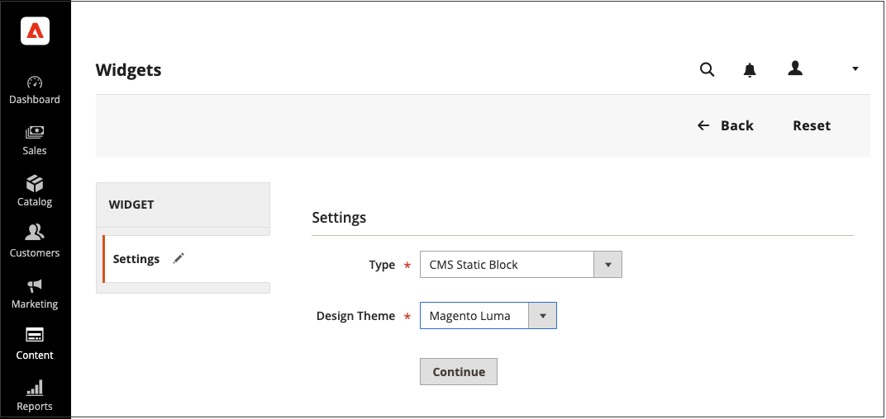

# Creare e gestire i widget

I widget sono componenti riutilizzabili. Puoi creare facilmente widget e modificare quelli esistenti per aggiornare automaticamente il contenuto nel tuo store. È inoltre possibile eliminare i widget non più in uso.

{width="700" zoomable="yes"}

## Creare un widget

Il processo di creazione di un widget è quasi lo stesso per ogni tipo di [widget](widgets.md#widget-types). È possibile seguire la prima parte delle istruzioni e quindi completare l&#39;ultima parte per il tipo specifico di widget desiderato.

### Passaggio 1: scegliere il tipo

1. Nella barra laterale _Admin_, passa a **[!UICONTROL Content]** > _[!UICONTROL Elements]_>**[!UICONTROL Widgets]**.

1. Fare clic su **[!UICONTROL Add Widget]**.

1. Nella sezione _[!UICONTROL Settings]_:

   - Impostare **[!UICONTROL Type]** sul tipo di widget da creare.

   - Verificare che **[!UICONTROL Design Theme]** sia impostato sul tema corrente.

     {width="600" zoomable="yes"}

1. Fare clic su **[!UICONTROL Continue]**.

### Passaggio 2: specificare le proprietà e il layout della vetrina

1. Nella sezione _[!UICONTROL Storefront Properties]_:

   - Per **[!UICONTROL Widget Title]**, immettere un titolo descrittivo per il widget.

     Questo titolo è visibile solo dall’amministratore.

   - Per **[!UICONTROL Assign to Store Views]**, selezionare le visualizzazioni dello store in cui si desidera rendere visibile il widget.

     È possibile selezionare una visualizzazione archivio specifica o `All Store Views`. Per selezionare più viste, tenere premuto il tasto Ctrl (PC) o Comando (Mac) e fare clic su ciascuna opzione.

   - (Facoltativo) Per **[!UICONTROL Sort Order]**, immettere un numero per determinare l&#39;ordine di visualizzazione di questo elemento con altri nella stessa parte della pagina. (`0` = primo, `1` = secondo, `3` = terzo e così via).

     {width="600" zoomable="yes"}

1. Nella sezione _[!UICONTROL Layout Updates]_, fare clic su **[!UICONTROL Add Layout Update]**.

1. Impostare **[!UICONTROL Display On]** sul tipo di pagina in cui deve essere visualizzato.

1. Nell&#39;elenco **[!UICONTROL Container]** scegliere l&#39;area del layout di pagina in cui deve essere posizionato.

   {width="600" zoomable="yes"}

1. Se il widget è un collegamento, impostare **[!UICONTROL Template]** su uno dei seguenti valori:

   - `Block Template` - Formatta il contenuto in modo che possa essere inserito come unità autonoma nella pagina.
   - `Inline Template` - Formatta il contenuto in modo che possa essere inserito all&#39;interno di altri contenuti. Ad esempio, un collegamento che si trova all&#39;interno di un paragrafo di testo.

### Passaggio 3: completare le opzioni widget

Le opzioni per ogni tipo di widget variano leggermente, ma il processo è sostanzialmente lo stesso. Nell&#39;esempio seguente viene visualizzato l&#39;elenco dei prodotti per una categoria specifica, con controlli di impaginazione.

1. Nel pannello a sinistra, scegli **[!UICONTROL Widget Options]**.

1. Fare clic su **[!UICONTROL Select Block]**.

1. Immettere un **[!UICONTROL Title]** da visualizzare sopra l&#39;elenco, ad esempio `Featured Products`.

1. Per i controlli di impaginazione, impostare **[!UICONTROL Display Page Control]** su `Yes` ed effettuare le seguenti operazioni:

   - Immettere **[!UICONTROL Number of Products per Page]**.

   - Immetti il totale **[!UICONTROL Number of Products to Display]**.

   - Impostare **[!UICONTROL Condition]** sulla categoria di prodotti da presentare.

     Il processo equivale a impostare una condizione per una [regola prezzo](../merchandising-promotions/price-rules-catalog.md).

### Passaggio 4: Salvare e verificare il risultato

1. Al termine, fare clic su **[!UICONTROL Save]**.

1. Quando richiesto, segui le istruzioni nella parte superiore dell’area di lavoro per aggiornare la cache in base alle esigenze.

1. Torna alla vetrina per verificare che il widget funzioni correttamente.

   Per spostarlo in una posizione diversa, puoi riaprire il widget e provare un riferimento a una pagina o a un blocco diverso.

## Demo sulla creazione di widget

Per informazioni sulla creazione di widget, guarda questo video:

>[!VIDEO](https://video.tv.adobe.com/v/343786?quality=12&learn=on)

## Modificare un widget

1. Nella barra laterale _Admin_, passa a **[!UICONTROL Content]** > _[!UICONTROL Elements]_>**[!UICONTROL Widgets]**.

1. Individuate il widget utilizzando i filtri sopra la griglia, quindi fate clic sul nome del widget.

1. Apporta le modifiche necessarie.

   Per informazioni sulle opzioni del widget, consultate i passaggi per la creazione di un widget.

1. Fare clic su **[!UICONTROL Save]**.

## Eliminare un widget

1. Nella barra laterale _Admin_, passa a **[!UICONTROL Content]** > _[!UICONTROL Elements]_>**[!UICONTROL Widgets]**.

1. Individuate i widget utilizzando i filtri sopra la griglia, quindi selezionate la casella di controllo dei widget da eliminare.

1. Nell&#39;angolo superiore sinistro dell&#39;elenco, impostare **[!UICONTROL Actions]** su `Delete`.

1. Al termine, fare clic su **[!UICONTROL Submit]**.

1. Per confermare l&#39;azione, fare clic su **[!UICONTROL OK]**.
