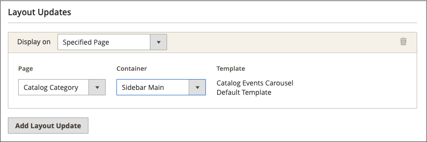

# Widget carosello eventi catalogo

{{ee-feature}}

Un widget carosello eventi catalogo visualizza un cursore dei prossimi eventi con un ticker conto alla rovescia per ogni evento. Puoi scegliere le pagine e l’area del layout di pagina in cui visualizzare il carosello e controllare la larghezza e il numero di eventi che vengono visualizzati contemporaneamente. Il risultato ottenuto dipende dal tema, dalla posizione in cui viene visualizzato nella pagina e dalle opzioni selezionate.

{width="700" zoomable="yes"}

## Passaggio 1: abilitare il widget carosello catalogo

Prima di iniziare, segui le [istruzioni](../merchandising-promotions/event-configure.md) per configurare il widget _Catalog Event_ in modo che sia abilitato per la vetrina.

{width="500" zoomable="yes"}

## Passaggio 2: creare il widget

1. Nella barra laterale _Admin_, passa a **[!UICONTROL Content]** > _[!UICONTROL Elements]_>**[!UICONTROL Widgets]**.

1. Nell&#39;angolo superiore destro fare clic su **[!UICONTROL Add Widget]**.

1. Nella sezione _[!UICONTROL Settings]_&#x200B;eseguire le operazioni seguenti:

   - Imposta **[!UICONTROL Type]** su `Catalog Events Carousel`.

   - Scegliere **[!UICONTROL Design Theme]** utilizzato dall&#39;archivio.

1. Fare clic su **[!UICONTROL Continue]**.

   {width="500" zoomable="yes"}

1. Nella sezione _[!UICONTROL Storefront Properties]_&#x200B;eseguire le operazioni seguenti:

   - Per **[!UICONTROL Widget Title]**, immettere un titolo descrittivo per il widget.

     Questo titolo è visibile solo da _Admin_.

   - Per **[!UICONTROL Assign to Store Views]**, selezionare le visualizzazioni dello store in cui si desidera rendere visibile il widget.

     È possibile selezionare una visualizzazione archivio specifica o `All Store Views`. Per selezionare più viste, tenere premuto il tasto Ctrl (PC) o Comando (Mac) e fare clic su ciascuna opzione.

   - (Facoltativo) Per **[!UICONTROL Sort Order]**, immettere un numero per determinare l&#39;ordine di visualizzazione di questo elemento con altri nella stessa parte della pagina. (`0` = primo, `1` = secondo, `3` = terzo e così via).

     {width="600" zoomable="yes"}

## Passaggio 3: scegliere la posizione

1. Nella sezione _Aggiornamenti layout_ fare clic su **[!UICONTROL Add Layout Update]**.

1. Imposta **[!UICONTROL Display On]** su `Specified Page`.

1. Imposta **[!UICONTROL Page]** su `CMS Home Page`.

1. Imposta **[!UICONTROL Container]** uno dei seguenti elementi:

   - `Main Content Area`
   - `Sidebar Additional`
   - `Sidebar Main`

   >[!NOTE]
   >
   >I risultati variano in base al tema e al layout della pagina. È inoltre necessario specificare _[!UICONTROL Catalog Events Carousel Default Template]_&#x200B;nella configurazione della categoria.

1. Se si desidera che il carosello eventi venga visualizzato in un&#39;altra posizione nella vetrina, fare clic su **[!UICONTROL Add Layout Update]** e ripetere i passaggi per tale posizione.

   {width="600" zoomable="yes"}

1. Fare clic su **[!UICONTROL Save and Continue Edit]**.

   Per il momento, puoi ignorare il messaggio per aggiornare la cache.

## Passaggio 4: configurare le opzioni

1. Nel pannello a sinistra, scegli **[!UICONTROL Widget Options]**.

1. Per **[!UICONTROL Frame Size]**, immettere il numero di eventi che si desidera elencare nel dispositivo di scorrimento contemporaneamente.

   Per visualizzare un solo evento alla volta, immettere `1`.

1. Per **[!UICONTROL Scroll]**, immettere il numero di elenchi eventi che si desidera scorrere per clic.

   Per scorrere fino all&#39;evento successivo, immettere `1`.

1. Per una larghezza personalizzata, immettere il numero di pixel per **[!UICONTROL Block Custom Width]**.

   Nella pagina di esempio seguente, la larghezza personalizzata è impostata su 250 pixel.

   {width="400" zoomable="yes"}

1. Al termine, fare clic su **[!UICONTROL Save]**.

1. Quando viene richiesto di aggiornare la cache, fai clic sul collegamento nel messaggio nella parte superiore della pagina e segui le istruzioni.
