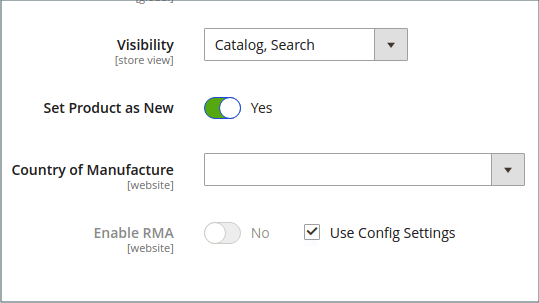

# Widget per elenco nuovi prodotti

L’elenco dei nuovi prodotti è un esempio di contenuto dinamico ed è costituito da dati live estratti dal catalogo dei prodotti. Per impostazione predefinita, l&#39;elenco _Nuovi prodotti_ include i primi otto prodotti aggiunti più di recente. Tuttavia, può anche essere configurato per includere solo prodotti all’interno di un intervallo di date specificato.

{width="700" zoomable="yes"}

## Passaggio 1: impostare ogni prodotto come nuovo

 Questo passaggio si applica solo a Magento Open Source.

 Per gli archivi Adobe Commerce, vedi [Pianificazione di un aggiornamento](content-staging-scheduled-update.md) e quindi continua con il passaggio 2 in questa pagina.

L&#39;impostazione dell&#39;intervallo di date _[!UICONTROL Set Product as New]_&#x200B;può essere configurato solo negli aggiornamenti pianificati.

Se si imposta un prodotto come nuovo, il prodotto viene aggiunto all&#39;elenco _Nuovi prodotti_. È possibile ripristinare l&#39;impostazione in qualsiasi momento se non si desidera più includerla nell&#39;elenco.

1. Nella barra laterale _Admin_, passa a **[!UICONTROL Catalog]** > **[!UICONTROL Products]**.

1. Trova ogni prodotto che desideri visualizzare e apri in modalità di modifica.

1. Per **[!UICONTROL Set Product as New]**, attiva o disattiva l&#39;opzione per impostare il prodotto come nuovo prodotto.

   {width="400" zoomable="yes"}

1. Al termine, fare clic su **[!UICONTROL Save]**.

1. Quando ti viene richiesto di reindicizzare e aggiornare la cache delle pagine, fai clic sui collegamenti nella parte superiore della pagina e segui le istruzioni.

## Passaggio 2: creare il widget

Il codice che determina il contenuto dell’elenco Nuovi prodotti e il suo posizionamento nel negozio viene generato dallo strumento Widget.

1. Nella barra laterale _Admin_, passa a **[!UICONTROL Content]** > _[!UICONTROL Elements]_>**[!UICONTROL Widgets]**.

1. Nell&#39;angolo superiore destro fare clic su **[!UICONTROL Add Widget]**.

1. Nella sezione _[!UICONTROL Settings]_&#x200B;eseguire le operazioni seguenti:

   - Imposta **[!UICONTROL Type]** su `Catalog New Products List`.

   - Scegliere **[!UICONTROL Design Theme]** utilizzato dall&#39;archivio.

1. Fare clic su **[!UICONTROL Continue]**.

   {width="600" zoomable="yes"}

1. Nella sezione _[!UICONTROL Storefront Properties]_&#x200B;eseguire le operazioni seguenti:

   - Per **[!UICONTROL Widget Title]**, immettere un titolo descrittivo per il widget. Questo titolo è visibile solo da _Admin_.

   - Per **[!UICONTROL Assign to Store Views]**, selezionare le visualizzazioni dello store in cui è visibile il widget.

     È possibile selezionare una visualizzazione archivio specifica o `All Store Views`. Per selezionare più viste, tenere premuto il tasto Ctrl (PC) o Comando (Mac) e fare clic su ciascuna opzione.

   - (Facoltativo) Per **[!UICONTROL Sort Order]**, immettere un numero per determinare l&#39;ordine di visualizzazione di questo elemento con altri nella stessa parte della pagina. (`0` = primo, `1` = secondo, `3` = terzo e così via).

   {width="600" zoomable="yes"}

## Passaggio 3: scegliere la posizione

1. Nella sezione _[!UICONTROL Layout Updates]_, fare clic su **[!UICONTROL Add Layout Update]**.

1. Imposta **[!UICONTROL Display On]** su `Specified Page.`

1. Imposta **[!UICONTROL Page]** su `CMS Home Page`.

1. Imposta **[!UICONTROL Block Reference]** su `Main Content Area`.

1. Imposta **[!UICONTROL Template]** su uno dei seguenti:

   - `New Product List Template`
   - `New Products Grid Template`

     {width="600" zoomable="yes"}

1. Fare clic su **[!UICONTROL Save and Continue Edit]**.

   Per il momento, puoi ignorare il messaggio per aggiornare la cache.

## Passaggio 4: configurare l’elenco

1. Nel pannello a sinistra, scegli **[!UICONTROL Widget Options]**.

1. Imposta **[!UICONTROL Display Products]** su uno dei seguenti:

   - `All Products` - Elenca i prodotti in sequenza, a partire dall&#39;ultimo aggiunto.
   - `New Products` - Elenca solo i prodotti identificati come _nuovi_. Un prodotto è considerato nuovo durante l&#39;intervallo di date specificato in _[!UICONTROL Set Product As New From/To]_. L’elenco è vuoto se l’intervallo di date scade senza la definizione di alcun nuovo prodotto.

1. Per fornire il controllo di spostamento per gli elenchi con più pagine, impostare **[!UICONTROL Display Page Control]** su `Yes`.

   Per **[!UICONTROL Number of Products per Page]**, immettere il numero di prodotti che si desidera visualizzare in ogni pagina.

1. Impostare l&#39;opzione **[!UICONTROL Number of Products to Display]** sul numero di nuovi prodotti da includere nell&#39;elenco.

   Impostazione predefinita: `10`.

1. Per **[!UICONTROL Cache Lifetime (Seconds)]**, scegliere la frequenza con cui si desidera aggiornare l&#39;elenco dei nuovi prodotti.

   Per impostazione predefinita, la cache è impostata su 86.400 secondi (24 ore).

   {width="600" zoomable="yes"}

1. Al termine, fare clic su **[!UICONTROL Save]**.

1. Quando viene richiesto di aggiornare la cache, fai clic sul collegamento nel messaggio nella parte superiore della pagina e segui le istruzioni.

## Passaggio 5: visualizzare l’anteprima del lavoro

1. Nella barra laterale _Admin_, passa a **[!UICONTROL Content]** > _[!UICONTROL Elements]_>**[!UICONTROL Pages]**.

1. Individuare la pagina nella griglia in cui verrà visualizzato l&#39;elenco _Nuovi prodotti_ e fare clic sul collegamento **[!UICONTROL Preview]** nella colonna _[!UICONTROL Action]_.
