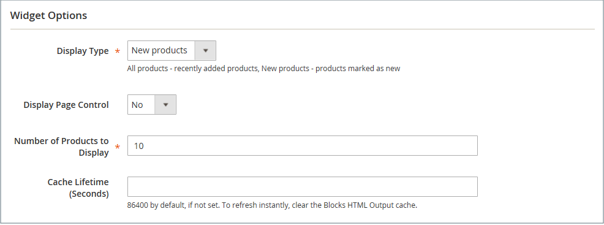

# Widget per elenco nuovi prodotti

L’elenco dei nuovi prodotti è un esempio di contenuto dinamico ed è costituito da dati live estratti dal catalogo dei prodotti. Per impostazione predefinita, il _Nuovi prodotti_ L’elenco include i primi otto prodotti aggiunti più di recente. Tuttavia, può anche essere configurato per includere solo prodotti all’interno di un intervallo di date specificato.

{width="700" zoomable="yes"}

## Passaggio 1: impostare ogni prodotto come nuovo

 Questo passaggio è valido solo per il Magento Open Source.

 Per gli store di Adobe Commerce, consulta [Pianificazione di un aggiornamento](content-staging-scheduled-update.md) quindi procedere al passaggio 2 di questa pagina.

_[!UICONTROL Set Product as New]_l’impostazione dell’intervallo di date può essere configurata solo negli aggiornamenti pianificati.

Se si imposta un prodotto come nuovo, il prodotto viene aggiunto al _Nuovi prodotti_ elenco. È possibile ripristinare l&#39;impostazione in qualsiasi momento se non si desidera più includerla nell&#39;elenco.

1. Il giorno _Amministratore_ barra laterale, vai a **[!UICONTROL Catalog]** > **[!UICONTROL Products]**.

1. Trova ogni prodotto che desideri visualizzare e apri in modalità di modifica.

1. Per **[!UICONTROL Set Product as New]**, attiva o disattiva l’opzione per impostare il prodotto come nuovo prodotto.

   {width="400" zoomable="yes"}

1. Al termine, fai clic su **[!UICONTROL Save]**.

1. Quando ti viene richiesto di reindicizzare e aggiornare la cache delle pagine, fai clic sui collegamenti nella parte superiore della pagina e segui le istruzioni.

## Passaggio 2: creare il widget

Il codice che determina il contenuto dell’elenco Nuovi prodotti e il suo posizionamento nel negozio viene generato dallo strumento Widget.

1. Il giorno _Amministratore_ barra laterale, vai a **[!UICONTROL Content]** > _[!UICONTROL Elements]_>**[!UICONTROL Widgets]**.

1. Nell’angolo superiore destro, fai clic su **[!UICONTROL Add Widget]**.

1. In _[!UICONTROL Settings]_eseguire le operazioni seguenti:

   - Imposta **[!UICONTROL Type]** a `Catalog New Products List`.

   - Scegli la **[!UICONTROL Design Theme]** che viene utilizzato dal negozio.

1. Clic **[!UICONTROL Continue]**.

   {width="600" zoomable="yes"}

1. In _[!UICONTROL Storefront Properties]_eseguire le operazioni seguenti:

   - Per **[!UICONTROL Widget Title]**, immetti un titolo descrittivo per il widget. (titolo visibile solo dal _Amministratore_.)

   - Per **[!UICONTROL Assign to Store Views]**, selezionare le visualizzazioni dello store in cui è visibile il widget.

     Puoi selezionare una visualizzazione specifica dello store, oppure `All Store Views`. Per selezionare più viste, tenere premuto il tasto Ctrl (PC) o Comando (Mac) e fare clic su ciascuna opzione.

   - (Facoltativo) Per **[!UICONTROL Sort Order]**, immettere un numero per determinare l&#39;ordine di visualizzazione di questo elemento con altri nella stessa parte della pagina. (`0` = innanzitutto, `1` = secondo, `3` = terzo e così via.)

   {width="600" zoomable="yes"}

## Passaggio 3: scegliere la posizione

1. In _[!UICONTROL Layout Updates]_, fare clic su **[!UICONTROL Add Layout Update]**.

1. Imposta **[!UICONTROL Display On]** a `Specified Page.`

1. Imposta **[!UICONTROL Page]** a `CMS Home Page`.

1. Imposta **[!UICONTROL Block Reference]** a `Main Content Area`.

1. Imposta **[!UICONTROL Template]** a uno dei seguenti elementi:

   - `New Product List Template`
   - `New Products Grid Template`

     {width="600" zoomable="yes"}

1. Clic **[!UICONTROL Save and Continue Edit]**.

   Per il momento, puoi ignorare il messaggio per aggiornare la cache.

## Passaggio 4: configurare l’elenco

1. Nel pannello a sinistra, scegli **[!UICONTROL Widget Options]**.

1. Imposta **[!UICONTROL Display Products]** a uno dei seguenti elementi:

   - `All Products` : elenca i prodotti in sequenza, a partire dall’ultimo aggiunto.
   - `New Products` - Elenca solo i prodotti identificati come _nuovo_. Un prodotto è considerato nuovo durante l’intervallo di date specificato in _[!UICONTROL Set Product As New From/To]_. L’elenco è vuoto se l’intervallo di date scade senza la definizione di alcun nuovo prodotto.

1. Per fornire il controllo di navigazione per gli elenchi con più pagine, impostare **[!UICONTROL Display Page Control]** a `Yes`.

   Per **[!UICONTROL Number of Products per Page]**, inserisci il numero di prodotti che desideri visualizzare su ogni pagina.

1. Imposta il **[!UICONTROL Number of Products to Display]** al numero di nuovi prodotti da includere nell’elenco.

   L&#39;impostazione predefinita è `10`.

1. Per **[!UICONTROL Cache Lifetime (Seconds)]**, scegli la frequenza con cui desideri aggiornare l’elenco dei nuovi prodotti.

   Per impostazione predefinita, la cache è impostata su 86.400 secondi (24 ore).

   {width="600" zoomable="yes"}

1. Al termine, fai clic su **[!UICONTROL Save]**.

1. Quando viene richiesto di aggiornare la cache, fai clic sul collegamento nel messaggio nella parte superiore della pagina e segui le istruzioni.

## Passaggio 5: visualizzare l’anteprima del lavoro

1. Il giorno _Amministratore_ barra laterale, vai a **[!UICONTROL Content]** > _[!UICONTROL Elements]_>**[!UICONTROL Pages]**.

1. Trova la pagina nella griglia in cui _Nuovi prodotti_ e fare clic sul pulsante **[!UICONTROL Preview]** collegamento in _[!UICONTROL Action]_colonna.
