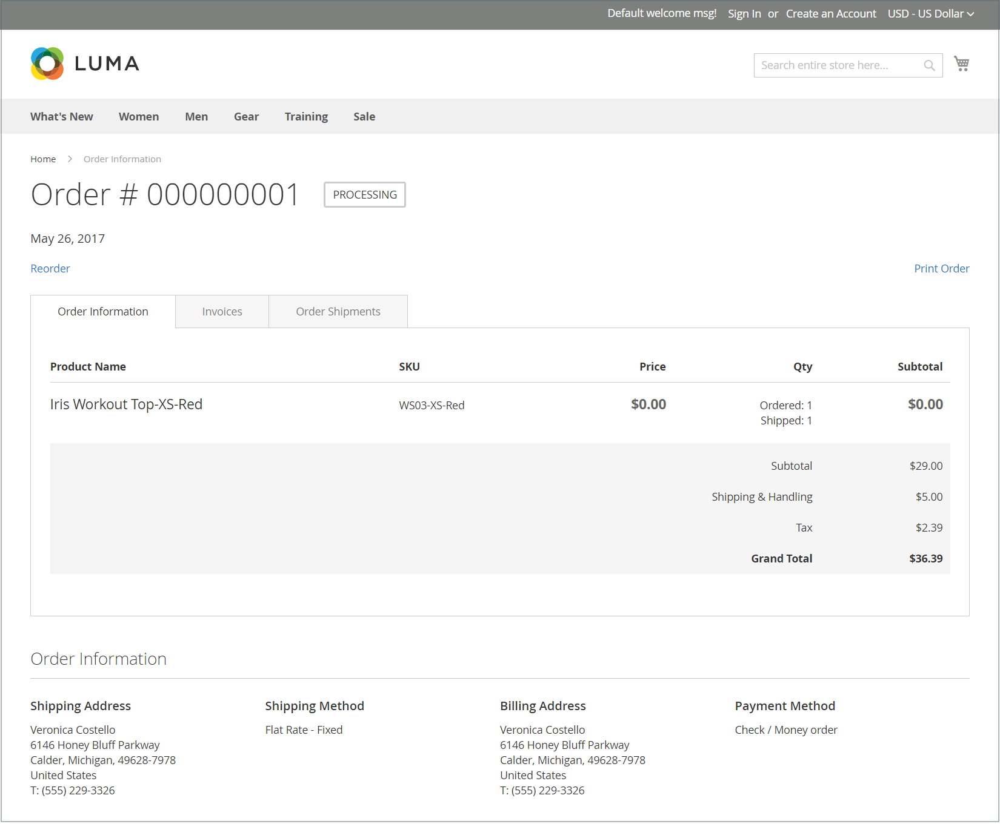

# Widget Ordini e restituzioni

Il widget _Ordini e restituzioni_ consente agli ospiti di controllare lo stato degli ordini, stampare le fatture e tenere traccia delle spedizioni. Quando il widget viene aggiunto alla vetrina, è visibile solo per gli ospiti e per i clienti che non hanno effettuato l’accesso ai loro account. Per trovare gli ordini, fornisci l’ID ordine, il Cognome fatturazione e l’Indirizzo e-mail o il CAP.

{width="600" zoomable="yes"}

## Widget ordini e restituzioni nella vetrina

1. Il cliente può utilizzare l&#39;opzione **[!UICONTROL Find Order By]** per scegliere uno dei seguenti parametri da utilizzare per trovare l&#39;ordine:

   - Indirizzo e-mail
   - Codice postale

1. Il cliente immette **[!UICONTROL Order ID]** e **[!UICONTROL Billing Last Name]**.

1. Immette la fatturazione **[!UICONTROL Email Address]** o **[!UICONTROL ZIP Code]** associata all&#39;ordine.

1. Fai clic su **[!UICONTROL Search]** per recuperare l&#39;ordine.

   {width="700" zoomable="yes"}

## Impostare il widget Ordini e restituzioni

1. Nella barra laterale _Admin_, passa a **[!UICONTROL Content]** > _[!UICONTROL Elements]_>**[!UICONTROL Widgets]**.

1. Nell&#39;angolo superiore destro fare clic su **[!UICONTROL Add Widget]**.

1. Nella sezione _[!UICONTROL Settings]_&#x200B;eseguire le operazioni seguenti:

   - Imposta **[!UICONTROL Type]** su `Orders and Returns`.

   - Scegliere **[!UICONTROL Design Theme]** utilizzato dall&#39;archivio.

1. Fare clic su **[!UICONTROL Continue]**.

1. Nella sezione _[!UICONTROL Storefront Properties]_&#x200B;eseguire le operazioni seguenti:

   - Per **[!UICONTROL Widget Title]**, immettere un titolo descrittivo per il widget.

     Questo titolo è visibile solo dall’amministratore.

   - Per **[!UICONTROL Assign to Store Views]**, selezionare le visualizzazioni dello store in cui è visibile il widget.

     È possibile selezionare una visualizzazione archivio specifica o `All Store Views`. Per selezionare più viste, tenere premuto il tasto Ctrl (PC) o Comando (Mac) e fare clic su ciascuna opzione.

   - (Facoltativo) Per **[!UICONTROL Sort Order]**, immettere un numero per determinare l&#39;ordine di visualizzazione di questo elemento con altri nella stessa parte della pagina. (`0` = primo, `1` = secondo, `3` = terzo e così via).

1. Nella sezione _[!UICONTROL Layout Updates]_, fare clic su **[!UICONTROL Add Layout Update]**&#x200B;ed eseguire le operazioni seguenti:

   - Impostare **[!UICONTROL Display On]** sul tipo di pagina in cui si desidera visualizzare il widget.

   - Per determinare la posizione di visualizzazione del widget sulla pagina, completare le altre informazioni di aggiornamento del layout.

1. Al termine, fare clic su **[!UICONTROL Save]**.

1. Quando viene richiesto di aggiornare la cache, fai clic sul collegamento nel messaggio nella parte superiore della pagina e segui le istruzioni.
