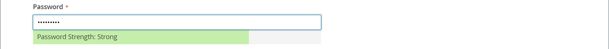

# Creazione di un singolo account cliente

I visitatori del tuo negozio possono aprire un account per gestire i loro acquisti e le loro attività. I clienti in genere creano i propri account dal tuo negozio. Tuttavia, puoi anche creare account cliente direttamente dall’amministratore, utile per aiutare i clienti telefonicamente.

Le istruzioni seguenti rappresentano la configurazione predefinita dell’account cliente. Per modificare la selezione e il comportamento di alcuni campi del modulo, vedere [Configurazione degli account cliente](../customers/customer-account-scope.md).

In qualità di amministratore dello store, puoi anche impostare [nuove opzioni account](../customers/account-options-new.md) per inviare un’e-mail di conferma ai nuovi clienti registrati, in modo da garantire la validità degli account registrati.

{{beta-updates}}

## Crea account dalla vetrina

Un cliente del negozio crea un account nella vetrina.

1. Dalla vetrina, fa clic su **[!UICONTROL Create an Account]** nell’angolo superiore destro dell’intestazione.

   {width="700" zoomable="yes"}

1. Sotto **[!UICONTROL Personal Information]**, entra nel loro **[!UICONTROL First Name]** e **[!UICONTROL Last Name]**.

   {width="600" zoomable="yes"}

1. Se desidera aggiungere il proprio nome e indirizzo e-mail all’elenco degli abbonati alla newsletter, il cliente seleziona la **[!UICONTROL Sign Up for Newsletter]** casella di controllo.

   >[!INFO]
   >
   > Questa opzione viene visualizzata anche se lo store non pubblica una newsletter.

1. Se desiderano che il personale di supporto del punto vendita [vedere ciò che vedono](../customers/login-as-customer.md) e fornire assistenza remota, il cliente seleziona il **[!UICONTROL Allow remote shopping assistance]** casella di controllo.

1. Sotto **[!UICONTROL Sign-in Information]**, entra nel loro **[!UICONTROL Email]** indirizzo.

   >[!INFO]
   >
   > Questo indirizzo e-mail diventa parte delle credenziali di accesso e non può essere associato ad alcun altro account cliente.

   {width="600" zoomable="yes"}

1. Immette un valore **[!UICONTROL Password]** che include tre dei seguenti tipi di informazioni:

   - Caratteri minuscoli
   - Caratteri maiuscoli
   - Numeri
   - Caratteri speciali

   Dopo aver premuto **[!UICONTROL Enter]**, l’intensità della password viene valutata e viene visualizzata sotto il campo. Se la password viene considerata _Debole_, prova con un altro valore finché non viene valutato come _Forte_.

   {width="600" zoomable="yes"}

1. Quindi, il cliente lo inserisce nuovamente in **[!UICONTROL Confirm Password]**.

1. Se necessario, fai clic su **[!UICONTROL Show Password]** per visualizzare la password immessa.

1. Al termine, fai clic su **Creare un account**.

Il cliente può quindi utilizzare il proprio indirizzo e-mail e la propria password per [accedi](../customers/customer-sign-in.md) sul proprio conto e inserire le informazioni relative all&#39;indirizzo.

## Creare un account dall’Amministratore

In qualità di esercente, puoi creare un account cliente dall’Amministratore.

1. Il giorno _Amministratore_ barra laterale, vai a **[!UICONTROL Customers]** > **[!UICONTROL All Customers]**.

1. Clic **[!UICONTROL Add New Customer]**.

### Passaggio 1: Completare le informazioni sull&#39;account

{width="700" zoomable="yes"}

1. In **[!UICONTROL Account Information]** eseguire le operazioni seguenti:

   - Per un&#39;installazione multisito, impostare **[!UICONTROL Associate to Website]** al sito web in cui si applica l’account del cliente.
   - Se applicabile, assegnare il cliente a un **[!UICONTROL Customer Group]**.
   - Se sta usando [Convalida ID IVA](../stores-purchase/vat.md) e vogliono **[!UICONTROL Disable Automatic Group Change Based on VAT ID]**, seleziona la casella di controllo.

1. Compila i campi obbligatori:

   - **[!UICONTROL First Name]**
   - **[!UICONTROL Last Name]**
   - **[!UICONTROL Email]**

1. Compila i campi facoltativi secondo necessità:

   - **[!UICONTROL Name Prefix]**
   - **[!UICONTROL Middle Name/Initial]**
   - **[!UICONTROL Name Suffix]**
   - **[!UICONTROL Date of Birth]**
   - **[!UICONTROL Tax/VAT Number]**
   - **[!UICONTROL Gender]**

   >[!WARNING]
   >
   >In linea con le attuali best practice in materia di sicurezza e privacy, tieni presente eventuali rischi legali e di sicurezza associati all’archiviazione della data di nascita completa (mese, giorno, anno) dei clienti con altri identificatori personali. Si consiglia di limitare la memorizzazione delle date di nascita complete dei clienti e di utilizzare l’anno di nascita del cliente come alternativa.

1. Imposta **[!UICONTROL Send Welcome Email From]** alla visualizzazione dello store da cui _Benvenuti_ l’e-mail deve essere inviata.

   >[!INFO]
   >
   > Se il negozio dispone di visualizzazioni per diversi [lingue](../stores-purchase/store-localize.md), questa impostazione determina la lingua del messaggio e-mail di benvenuto.

1. Clic **[!UICONTROL Save and Continue Edit]** nella parte superiore della pagina.

   >[!INFO]
   >
   >Una volta salvato l’account del cliente, l’intero set di opzioni viene visualizzato nel pannello a sinistra e nel menu nella parte superiore della pagina. Il _[!UICONTROL Customer View]_nella scheda viene visualizzato un riepilogo dell&#39;account.

   {width="600" zoomable="yes"}

### Passaggio 2: inserire le informazioni sull&#39;indirizzo

1. Nel pannello a sinistra, scegli **[!UICONTROL Addresses]** e fai clic su **[!UICONTROL Add New Addresses]**.

1. Se per la fatturazione e la spedizione viene utilizzato lo stesso indirizzo, attiva entrambe le opzioni.

   - **[!UICONTROL Default Billing Address]**
   - **[!UICONTROL Default Shipping Address]**

   {width="600" zoomable="yes"}

1. Scorri verso il basso e completa i campi indirizzo obbligatori nella seconda colonna.

   - **[!UICONTROL Street Address]**
   - **[!UICONTROL City]**
   - **[!UICONTROL Country]**
   - **[!UICONTROL State/Province]**
   - **[!UICONTROL ZIP/Postal Code]**

1. Inserisci il **[!UICONTROL Phone Number]** per questo indirizzo.

1. Se applicabile, inserire **[!UICONTROL VAT Number]** associato al cliente.

1. Se questo indirizzo è l&#39;unico necessario per l&#39;account, fare clic su **[!UICONTROL Save]**.

   In caso contrario, fare clic su **[!UICONTROL Save and Continue Edit]** e ripeti i passaggi precedenti per aggiungere altri indirizzi.

   Il nuovo indirizzo viene visualizzato nel [!UICONTROL Addresses] pagina con la selezionata _[!UICONTROL Default Billing]_e_[!UICONTROL Default Shipping]_ indirizzi al di sopra dell&#39;elenco completo.

   {width="600" zoomable="yes"}

### Passaggio 3: reimpostare la password

Agli account cliente creati dall’amministratore non sono inizialmente assegnate password.

1. Trovare il nuovo conto cliente nella griglia.

1. Clic **[!UICONTROL Edit]** nel _[!UICONTROL Action]_colonna.

1. Nella barra dei menu nella parte superiore della pagina, fai clic su **[!UICONTROL Reset Password]**.

1. Viene inviata una notifica al proprietario dell’account, con le istruzioni per l’impostazione della password.

## Barra dei pulsanti

Quando il profilo viene salvato per la prima volta, diventano disponibili pulsanti aggiuntivi. Per ulteriori informazioni, consulta [Aggiornare un profilo cliente](../customers/update-account.md).

| Pulsante | Descrizione |
|--- |--- |
| **[!UICONTROL Back]** | Torna a _[!UICONTROL Customers]_senza salvare le modifiche. |
| **[!UICONTROL Delete Customer]** | Elimina il cliente corrente. Gli ordini completati associati al cliente non vengono rimossi. |
| **[!UICONTROL Reset]** | Ripristina i valori precedenti delle modifiche non salvate nel modulo per il cliente. |
| **[!UICONTROL Create Order]** | Crea un ordine per il cliente. |
| **[!UICONTROL Reset Password]** | Invia un [reimpostare la password](../customers/password-reset.md) collega al cliente tramite e-mail. |
| **[!UICONTROL Force Sign-in]** | Revoca i token di accesso OAuth associati all’account cliente. Questa funzione può essere utilizzata solo con account cliente a cui sono stati assegnati token OAuth come parte di un’API web [integrazione](../systems/integrations.md). Per ulteriori informazioni, consulta [Autenticazione basata su OAuth](https://developer.adobe.com/commerce/webapi/get-started/authentication/gs-authentication-oauth/) nella documentazione per gli sviluppatori. |
| **[!UICONTROL Manage Shopping Cart]** | Consente all’amministratore di gestire il carrello per il cliente. |
| **[!UICONTROL Save and Continue Edit]** | Salva le modifiche e mantiene aperto il profilo cliente. |
| **[!UICONTROL Save Customer]** | Salva le modifiche e chiude il profilo cliente. |

{style="table-layout:auto"}

## Descrizioni dei campi

### [!UICONTROL Account Information]

| Campo | Descrizione |
|--- |--- |
| **[!UICONTROL Associate to Website]** | Identifica il sito Web associato all&#39;account del cliente. |
| **[!UICONTROL Group]** | Identifica il [gruppo di clienti](../customers/customer-groups.md) in cui il cliente è un membro. Se applicabile, selezionare la casella di controllo per disabilitare la modifica di gruppo automatica in base all&#39;IVA. |
| **[!UICONTROL Name Prefix]** | Se utilizzato, il prefisso associato al nome del cliente (ad esempio Sig., Sig.ra o Dott.). I valori del prefisso sono determinati dal [configurazione](../configuration-reference/customers/customer-configuration.md). A seconda della configurazione, il controllo di input potrebbe essere un campo di testo o un elenco di opzioni. |
| **[!UICONTROL First Name]** | Il nome del cliente. |
| **[!UICONTROL Middle Name / Initial]** | Secondo nome o iniziale del cliente. Questo campo è incluso solo se specificato nel [configurazione](../configuration-reference/customers/customer-configuration.md) argomento. |
| **[!UICONTROL Last Name]** | Cognome del cliente. |
| **[!UICONTROL Name Suffix]** | Se utilizzato, il suffisso associato al nome del cliente (ad esempio Jr., Sr. o III). I valori del suffisso sono determinati dal [configurazione](../configuration-reference/customers/customer-configuration.md). A seconda della configurazione, il controllo di input potrebbe essere un campo di testo o un elenco a discesa di opzioni. |
| **[!UICONTROL Email]** | Indirizzo e-mail del cliente. |
| **[!UICONTROL Date of Birth]** | La data di nascita del cliente. La data di nascita è inclusa se specificata nel [configurazione](../configuration-reference/customers/customer-configuration.md) argomento.   In linea con le attuali best practice in materia di sicurezza e privacy, tieni presente eventuali rischi legali e di sicurezza associati all’archiviazione della data di nascita completa (mese, giorno, anno) dei clienti con altri identificatori personali. Si consiglia di limitare la memorizzazione delle date di nascita complete dei clienti e, in alternativa, di utilizzare l’anno di nascita del cliente. |
| **[!UICONTROL Tax / VAT Number]** | Numero di imposta o di imposta sul valore aggiunto del cliente, se applicabile. |
| **[!UICONTROL Gender]** | Identifica il genere del cliente. Il sesso è incluso se specificato nel [configurazione](../configuration-reference/customers/customer-configuration.md). Opzioni: `Male` / `Female` / `Not Specified` |
| **[!UICONTROL Send Welcome Email From]** | Se sono presenti più visualizzazioni dello store, questa impostazione identifica la visualizzazione dello store da cui viene inviato il messaggio di benvenuto. Se le visualizzazioni dello store vengono utilizzate per lingue diverse, questa impostazione determina la lingua dell&#39;e-mail di benvenuto. |

### [!UICONTROL Addresses]

| Campo | Descrizione |
|--- |--- |
| **[!UICONTROL New Addresses]** | Identifica il tipo di nuovo indirizzo. Opzioni: `Default Billing Address` / `Default Shipping Address` |
| **[!UICONTROL Add New Addresses]** | Visualizza un&#39;altra sezione Nuovo indirizzo per identificare il tipo di indirizzo da immettere. |
| **[!UICONTROL Company]** | Il nome della società, se applicabile per questo indirizzo. |
| **[!UICONTROL Street Address]** | Indirizzo del cliente. È disponibile una seconda riga dell&#39;indirizzo stradale se specificato nella [configurazione](../configuration-reference/customers/customer-configuration.md) argomento. |
| **[!UICONTROL City]** | La città in cui si trova l’indirizzo del cliente. |
| **[!UICONTROL Country]** | Il paese in cui si trova l’indirizzo del cliente. |
| **[!UICONTROL State/Province]** | Stato o provincia in cui si trova l&#39;indirizzo del cliente. |
| **[!UICONTROL Zip/Postal Code]** | Il codice postale o ZIP in cui si trova l’indirizzo del cliente. |
| **[!UICONTROL Phone Number]** | Numero di telefono del cliente associato all’indirizzo. |
| **[!UICONTROL VAT Number]** | Se applicabile, la partita IVA che si applica al cliente a questo indirizzo. |
