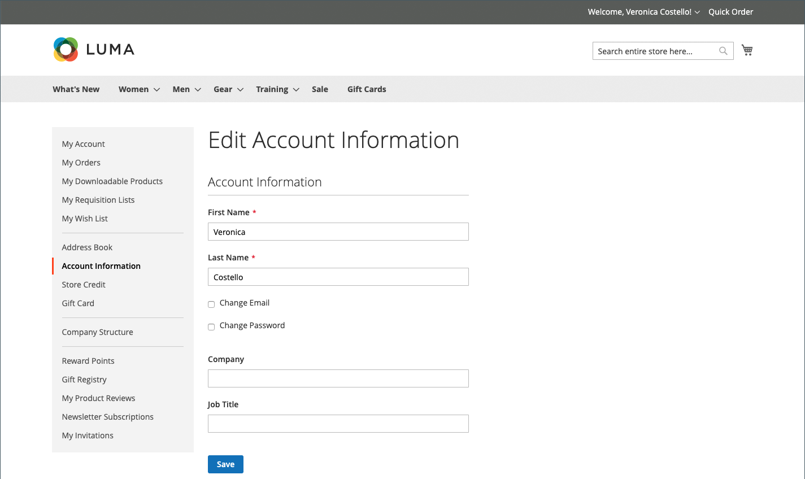

# Informazioni account cliente

Le informazioni di base sull&#39;account del cliente includono il nome e l&#39;indirizzo e-mail e la password dell&#39;utente, e possono essere gestite dalla dashboard dell&#39;account del cliente nella vetrina.

{width="700" zoomable="yes"}

Nella barra laterale del tuo account, il cliente può scegliere **[!UICONTROL Account Information]** ed effettuare una delle seguenti operazioni per aggiornare le informazioni sul proprio account.

## Aggiorna il nome dell&#39;account

Per aggiornare il nome dell&#39;account, il cliente modifica i valori nei campi **[!UICONTROL First Name]** e **[!UICONTROL Last Name]** in base alle esigenze.

>[!INFO]
>
>Campi aggiuntivi vengono visualizzati come parte del nome se la [configurazione del cliente](../configuration-reference/customers/customer-configuration.md) include un prefisso, un&#39;iniziale centrale e un suffisso.

## Cambia indirizzo e-mail

1. Il cliente seleziona la casella di controllo **[!UICONTROL Change Email]**.

1. Immette il nuovo indirizzo **[!UICONTROL Email]**.

1. Immette il proprio **[!UICONTROL Current Password]**.

   {width="700" zoomable="yes"}

1. Clic su **[!UICONTROL Save]**.

## Cambia password

1. Il cliente seleziona la casella di controllo **[!UICONTROL Change Password]**.

1. Immette il proprio **[!UICONTROL Current Password]**.

1. Immette il proprio **[!UICONTROL New Password]**.

   >[!INFO]
   >
   >La password deve contenere almeno otto caratteri e può includere una combinazione di lettere maiuscole e minuscole, numeri e simboli. L&#39;indicatore di validità della password consente al cliente di scegliere la password migliore.

   {width="700" zoomable="yes"}

1. Lo immette di nuovo per confermare.
