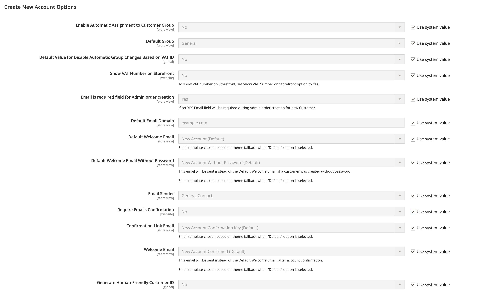

# Nuove opzioni account cliente

In _[!UICONTROL Create New Account Options]_nella sezione della configurazione, le opzioni account di base sono combinate con opzioni più avanzate che si riferiscono alla convalida dell’ID IVA e alle integrazioni personalizzate. Le istruzioni seguenti descrivono solo le opzioni utilizzate più di frequente. Per informazioni sulle assegnazioni automatiche dei gruppi di clienti, consulta [Convalida IVA](../stores-purchase/vat.md).

{width="600" zoomable="yes"}

## Impostare le opzioni di account cliente di base

1. Il giorno _Amministratore_ barra laterale, vai a **[!UICONTROL Stores]** > _[!UICONTROL Settings]_>**[!UICONTROL Configuration]**.

1. Nel pannello a sinistra, espandi **[!UICONTROL Customers]** e scegli **[!UICONTROL Customer Configuration]**.

1. Espandi **[!UICONTROL Create New Account Options]** sezione:

   {width="600" zoomable="yes"}

1. Imposta ciascuna delle opzioni in base all’esperienza del cliente che devi supportare sulla vetrina:

   - Imposta **[!UICONTROL Default Group]** al gruppo di clienti assegnato ai nuovi clienti al momento della creazione di un account.

   - Se si dispone di _Imposta sul valore aggiunto_ numero e desidera che sia visibile ai clienti, impostare **[!UICONTROL Show VAT Number on Storefront]** a `Yes`.

   - Per richiedere l’e-mail di un cliente durante la creazione dell’ordine di amministrazione per un cliente, imposta **[!UICONTROL Email is required field for Admin order creation]** a `Yes`.

   - Inserisci il **[!UICONTROL Default Email Domain]** per il negozio, ad esempio `mystore.com`

   - Imposta **[!UICONTROL Default Welcome Email]** nel modello utilizzato per l’e-mail di benvenuto inviata ai nuovi clienti.

   - Per richiedere ai clienti di confermare la richiesta di apertura di un account con il tuo store, imposta **[!UICONTROL Require Emails Confirmation]** a `Yes`. Quindi, imposta **[!UICONTROL Confirmation Link Email]** al modello utilizzato per l’e-mail di conferma.

     >[!NOTE]
     >
     >A partire dalla versione 2.4.7, i clienti devono reinserire l’e-mail e la password per accedere al proprio account dopo la conferma e-mail, indipendentemente dal browser.

   - Imposta **[!UICONTROL Welcome Email]** al modello utilizzato per il messaggio di benvenuto inviato dopo la conferma dell’account.

   - Imposta **[!UICONTROL Default Welcome Email without Password]** al modello utilizzato al momento della creazione di un account cliente che non dispone ancora di una password. Ad esempio, a un account cliente creato dall’amministratore non è ancora stata assegnata una password.

   - Imposta **[!UICONTROL Email Sender]** al contatto del negozio che viene visualizzato come mittente dell&#39;e-mail di benvenuto.

   - Per richiedere ai clienti di confermare la richiesta di apertura di un account con il tuo store, imposta **[!UICONTROL Require Emails Confirmation]** a `Yes`. Quindi, imposta **[!UICONTROL Confirmation Link Email]** al modello utilizzato per l’e-mail di conferma.

   {width="600" zoomable="yes"}

   Per informazioni dettagliate su ciascuna delle opzioni disponibili in questo set di opzioni di configurazione, vedere _Crea nuove opzioni account_ [riferimento configurazione](../configuration-reference/customers/customer-configuration.md).

1. Al termine, fai clic su **[!UICONTROL Save Config]**.
