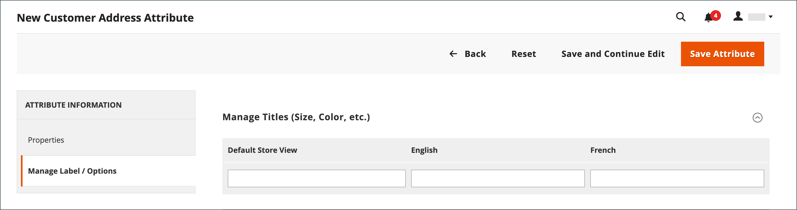

# Attributi indirizzo cliente

{{ee-feature}}

Il set di attributi Indirizzo cliente determina le proprietà degli indirizzi stradali immessi nella [rubrica](account-dashboard-address-book.md) dall&#39;account del cliente o durante l&#39;estrazione](../stores-purchase/checkout-process.md).[

Gli attributi di indirizzo personalizzati possono essere impostati per fornire informazioni aggiuntive, ad esempio un indirizzo e-mail facoltativo, un account Skype, un numero di telefono alternativo, un edificio o una provincia. L&#39;attributo personalizzato può quindi essere incorporato nel [modello di indirizzo](address-templates.md) utilizzato per produrre documenti di vendita. Il processo per creare un attributo di indirizzo personalizzato è quasi lo stesso della creazione di un [attributo cliente](attribute-properties.md).

Gli attributi dell’indirizzo del cliente vengono utilizzati nei seguenti moduli:

- [Registrazione indirizzo cliente](account-create.md)
- [Indirizzo dell’account cliente](account-dashboard-address-book.md)

{width="700" zoomable="yes"}

## Passaggio 1: completare le proprietà dell’attributo

1. Nella barra laterale _Admin_, passa a **[!UICONTROL Stores]** > _[!UICONTROL Attributes]_>**[!UICONTROL Customer Address]**.

1. Nell&#39;angolo superiore destro fare clic su **[!UICONTROL Add New Attribute]**.

   {width="600" zoomable="yes"}

1. Nella sezione **[!UICONTROL Attribute Properties]** eseguire le operazioni seguenti:

   - Immettere un **[!UICONTROL Default Label]** che identifica l&#39;attributo durante l&#39;immissione dei dati.

   - Immettere un **[!UICONTROL Attribute Code]** che identifica l&#39;attributo nel sistema.

     Il codice attributo deve iniziare con una lettera e può includere qualsiasi combinazione di lettere minuscole (a-z) e numeri (0-9). La lunghezza del codice deve essere inferiore a 30 caratteri e non può includere caratteri speciali o spazi. Il carattere di sottolineatura (_) può essere utilizzato per indicare uno spazio.

     >[!TIP]
     >
     >**_Collegamento:_** Per completare solo i campi obbligatori, scorri verso il basso fino a [!UICONTROL Storefront Properties], immetti [!UICONTROL Sort Order] e salva.

1. Per determinare il tipo di controllo di input utilizzato per l&#39;immissione dei dati, impostare **[!UICONTROL Input Type]** su uno dei seguenti valori:

   - `Text Field` - Campo di testo a riga singola.
   - `Text Area` - Area di testo su più righe.
   - `Multiple Line` - Crea più righe di testo per l&#39;attributo, in modo simile a un indirizzo stradale su più righe. Il numero di righe di immissione dati separate può essere compreso tra 2 e 20. Utilizzare `Default Value` per specificare il valore iniziale del campo.
   - `Date` - Visualizza un campo data con un calendario popup. Proprietà aggiuntive: utilizzare `Default Value` per specificare il valore iniziale del campo.  Utilizzare `Minimal Value` per specificare la data meno recente che è possibile immettere.  Utilizzare `Maximum Value` per specificare la data più recente che è possibile immettere.
   - `Dropdown` - Elenco a discesa che accetta un solo valore da selezionare.
   - `Multiple Select` - Elenco a discesa che accetta la selezione di più valori.
   - `Yes/No` - Campo che offre solo una scelta di `Yes` o `No` valori.
   - `File (attachment)` - Campo che consente di caricare un file e associarlo all&#39;attributo cliente come allegato.
   - `Image File` - Campo che consente di caricare un&#39;immagine nella raccolta e associarla all&#39;attributo cliente.

1. Se il cliente deve immettere un valore nel campo, impostare **[!UICONTROL Values Required]** su `Yes`.

1. Per assegnare un valore iniziale al campo, immettere **[!UICONTROL Default Value]**.

1. Per verificare la precisione dei dati immessi nel campo prima del salvataggio del record, impostare **[!UICONTROL Input Validation]** sul tipo di dati consentito nel campo. I valori disponibili dipendono da _[!UICONTROL Input Type]_specificato.

   - `None` - Nessuna convalida di input per il campo durante l&#39;immissione dei dati.
   - `Alphanumeric` - Accetta qualsiasi combinazione di numeri (0-9) e caratteri alfabetici (a-z, A-Z) durante l&#39;immissione dei dati. Per includere caratteri speciali, vedere [!UICONTROL Escape HTML Entities] nel passaggio successivo.
   - `Alphanumeric with Space` - Accetta qualsiasi combinazione di numeri (0-9), caratteri alfabetici (a-z, A-Z) e spazi durante l&#39;immissione dei dati.
   - `Numeric Only` - Accetta solo numeri (0-9) durante l&#39;immissione dei dati.
   - `Alpha Only` - Accetta solo caratteri alfabetici (a-z, A-Z) durante l&#39;immissione dei dati.
   - `URL` - Accetta solo un URL durante l&#39;immissione dei dati.
   - `Email` - Accetta solo un indirizzo e-mail durante l&#39;immissione dei dati.
   - `Length Only` - Convalida l&#39;input in base alla lunghezza dei dati immessi nel campo.

1. Per applicare un filtro di pre-elaborazione ai valori immessi in un campo di testo, un&#39;area di testo o un tipo di input a più righe, impostare **[!UICONTROL Input/Output Filter]** su uno dei seguenti valori:

   - `None` - Non applica un filtro al testo immesso nel campo.
   - `Strip HTML Tags` - Rimuove i tag HTML dal testo. Questo filtro può aiutare a ripulire i dati incollati in un campo da un’altra origine che include i tag HTML.
   - `Escape  HTML Entities` - Converte i caratteri speciali presenti nel testo in una sequenza di escape HTML valida, ad esempio `&;`. Le sequenze di escape sono racchiuse tra una e commerciale e un punto e virgola e vengono spesso utilizzate per le citazioni intelligenti, il copyright e i simboli di marchio tipografico. Le sequenze di escape vengono inoltre utilizzate per identificare caratteri quali i simboli minore di (`<`) e maggiore di (`>`) e il carattere e commerciale utilizzato anche nel codice. Questo filtro può aiutare a ripulire i caratteri speciali che a volte vengono incollati nei campi del database dagli elaboratori di testi.

1. Completa la griglia del cliente e le proprietà del segmento:

   - Per includere la colonna nella griglia Clienti, impostare **[!UICONTROL Add to Column Options]** su `Yes`.

   - Per filtrare la griglia Clienti in base a questo attributo, impostare **[!UICONTROL Use in Filter Options]** su `Yes`.

   - Per filtrare la griglia Clienti in base all&#39;attributo di testo con condizioni di corrispondenza filtro diverse, impostare **[!UICONTROL Grid Filter Condition Type]** su `Partial Match`, `Prefix Match` o `Full Match`. Non influisce sul campo _Ricerca per parola chiave_ per la griglia.

   - Per eseguire ricerche nella griglia Clienti in base a questo attributo, impostare **[!UICONTROL Use in Search Options]** su `Yes`.

   - Per rendere questo attributo disponibile per [segmenti cliente](customer-segments.md), impostare **[!UICONTROL Use in Customer Segment]** su `Yes`.

## Passaggio 2: completare le proprietà della vetrina

1. Scorri verso il basso fino alla sezione **[!UICONTROL Storefront Properties]**.

   {width="600" zoomable="yes"}

1. Per rendere visibile l&#39;attributo ai clienti, impostare **[!UICONTROL Show on Storefront]** su `Yes`.

1. Immettere un numero nel campo **[!UICONTROL Sort Order]**, che ne determina l&#39;ordine di visualizzazione se elencato con altri attributi.

1. Impostare **[!UICONTROL Forms to Use]** su ogni modulo che deve includere l&#39;attributo.

   Per scegliere entrambe le opzioni, tenere premuto il tasto Ctrl (PC) o il tasto Comando (Mac) mentre si fa clic su ogni modulo.

   - [Registrazione indirizzo cliente](account-create.md)
   - [Indirizzo dell&#39;account cliente](account-dashboard-address-book.md)

## Passaggio 3: completa l’etichetta e salva

1. Nel pannello a sinistra, scegli **[!UICONTROL Manage Labels/Options]**.

1. In **[!UICONTROL Manage Titles]**, immettere un&#39;etichetta per identificare l&#39;attributo per ogni [visualizzazione archivio](../getting-started/websites-stores-views.md).

1. Al termine, fare clic su **[!UICONTROL Save Attribute]**.

   {width="600" zoomable="yes"}

## Descrizioni dei campi

### [!UICONTROL Attribute Properties]

| Campo | Descrizione |
|--- |--- |
| [!UICONTROL Default Label] | L’etichetta predefinita che identifica l’attributo in Admin e storefront. |
| [!UICONTROL Attribute Code] | Codice univoco che identifica l’attributo all’interno del sistema. Il codice può contenere fino a 21 caratteri e non può includere spazi o caratteri speciali. È possibile utilizzare il simbolo di sottolineatura anziché uno spazio. |
| [!UICONTROL Input Type] | Determina il [controllo di input](../catalog/attributes-input-types.md) utilizzato per l&#39;immissione dei dati. Opzioni:  **`Text Field`**- Campo di testo a riga singola. **`Text Area`** - Area di testo su più righe.  **`Multiple Line`**- Crea più righe di testo per l&#39;attributo, in modo simile a un indirizzo stradale su più righe. Il numero di righe di immissione dati separate può essere compreso tra 2 e 20. **`Date`** - Visualizza un campo data con un calendario popup. **`Dropdown`**- Elenco a discesa che accetta un solo valore da selezionare. **`Multiple Select`** - Elenco a discesa che accetta la selezione di più valori.  **`Yes/No`**- Campo che offre solo una scelta di `Yes` o `No` valori. **`File (attachment)`** - Campo che consente di caricare un file e associarlo all&#39;attributo cliente come allegato.  **`Image File`**- Campo che consente di caricare un&#39;immagine nella raccolta e associarla all&#39;attributo cliente. |
| [!UICONTROL Values Required] | Determina se un valore deve essere immesso nel campo. Opzioni: `Yes` / `No` |
| [!UICONTROL Default Value] | Specifica il valore iniziale dell&#39;attributo. |
| [!UICONTROL Input Validation] | La selezione delle opzioni è determinata dal tipo di input. Opzioni:  **`None`**- Nessuna convalida di input per il campo durante l&#39;immissione dei dati. **`Alphanumeric`** - Accetta qualsiasi combinazione di numeri (0-9) e caratteri alfabetici (a-z, A-Z) durante l&#39;immissione dei dati.  **`Alphanumeric with Space`**- Consente agli spazi nell&#39;indirizzo stradale di rispettare i requisiti di lunghezza massima del gestore. Durante il pagamento, il cliente può immettere qualsiasi combinazione di numeri (0-9), caratteri alfabetici (a-z, A-Z) e spazi nell&#39;indirizzo stradale del destinatario e del mittente. Eventuali spazi in più vengono tagliati durante il salvataggio dell’indirizzo. **`Numeric Only`** - Accetta solo numeri (0-9) durante l&#39;immissione dei dati.  **`Alpha Only`**- Accetta solo caratteri alfabetici (a-z, A-Z) durante l&#39;immissione dei dati. ** URL **- Accetta solo un URL durante l&#39;immissione dei dati. **`Email`** - Accetta solo un indirizzo e-mail durante l&#39;immissione dei dati.  **`Length Only`**- Convalida l&#39;input in base alla lunghezza dei dati immessi nel campo. |
| [!UICONTROL Input/Output Filter] | Applica un filtro di pre-elaborazione ai valori immessi in un campo di testo, un&#39;area di testo o un tipo di input a più righe prima che il record venga salvato. Opzioni:  **`None`**- Non applica un filtro al testo immesso nel campo. **`Strip HTML Tags`** - Rimuove i tag HTML dal testo. Questo filtro può aiutare a ripulire i dati incollati in un campo da un’altra origine che include i tag HTML.  **`Escape HTML Entities`**- Converte i caratteri speciali presenti nel testo in una sequenza di escape HTML valida, ad esempio `amp;`. Le sequenze di escape sono racchiuse tra una e commerciale e un punto e virgola e vengono spesso utilizzate per le citazioni intelligenti, i simboli di copyright e i simboli di marchio tipografico. Le sequenze di escape vengono inoltre utilizzate per identificare caratteri quali i simboli minore di (`<`) e maggiore di (`>`) e il carattere e commerciale utilizzato anche nel codice. Questo filtro può aiutare a ripulire i caratteri speciali che a volte vengono incollati nei campi del database dagli elaboratori di testi. |
| [!UICONTROL Add to Column Options] | Specifica se l&#39;attributo è incluso come colonna nella griglia [Clienti](./customers-all.md). Opzioni: `Yes` / `No` |
| Usa nelle opzioni filtro | Specifica se l&#39;attributo può essere utilizzato come filtro per le operazioni di ricerca dalla griglia. Opzioni: `Yes` / `No` |
| [!UICONTROL Grid Filter Condition Type] | Specifica le condizioni di corrispondenza dei filtri per gli attributi nelle operazioni di ricerca dalla griglia. Non influisce sul campo _[!UICONTROL Search by keyword]_della griglia. Opzioni: `Partial Match` / `Prefix Match` / `Full Match` |
| [!UICONTROL Use in Search Options] | Specifica se il valore dell&#39;attributo può essere utilizzato come parola chiave nelle operazioni di ricerca. Opzioni: `Yes` / `No` |
| [!UICONTROL Use in Customer Segment] | Determina se l&#39;attributo è incluso nelle condizioni del [segmento cliente](./customer-segments.md). Opzioni: `Yes` / `No` |

### [!UICONTROL Storefront Properties]

| Campo | Descrizione |
|--- |--- |
| [!UICONTROL Show on Storefront] | Determina se l&#39;attributo viene visualizzato come campo nelle informazioni sul cliente nella vetrina. Opzioni: `Yes` / `No` |
| [!UICONTROL Sort Order] | Specifica l&#39;ordinamento di questo attributo in relazione ad altri attributi del cliente. L&#39;ordinamento determina la sequenza di attivazione dei campi durante l&#39;immissione dei dati quando si utilizza la navigazione da tastiera. |
| [!UICONTROL Forms to Use in] | Determina le pagine con i form di immissione dati in cui viene visualizzato l&#39;attributo. Opzioni:  [`Customer Address Registration`](account-create.md)  [`Customer Account Address`](account-dashboard-address-book.md) |
