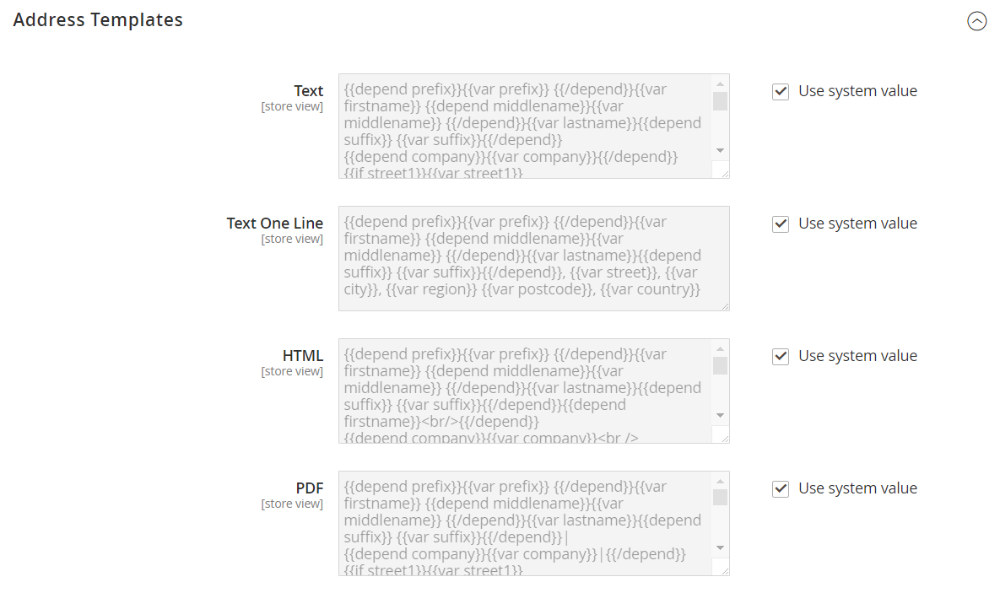

# Modelli di indirizzo del cliente

{{ee-feature}}

È possibile modificare il modello che controlla il formato degli indirizzi di fatturazione e spedizione del cliente visualizzati nelle fatture stampate, nelle spedizioni e nei rimborsi, nonché nella rubrica del conto cliente. Se desideri includere informazioni aggiuntive, puoi creare [attributi personalizzati](attribute-properties.md) associati all&#39;account cliente e [indirizzo](address-attributes.md) e incorporarli nel modello.

## Esempio 1: formato breve

Per il modello di indirizzo [!UICONTROL Text One Line]:

```text
{{depend prefix}}{{var prefix}} {{/depend}}{{var firstname}} {{depend middlename}}{{var middlename}} {{/depend}}{{var lastname}}{{depend suffix}} {{var suffix}}{{/depend}}, {{var street}}, {{var city}}, {{var region}} {{var postcode}}, {{var country}}
```

## Esempio 2: formato esteso

Per i modelli di indirizzo [!UICONTROL Text], [!UICONTROL HTML] e [!UICONTROL PDF]:

```text
{{depend prefix}}{{var prefix}} {{/depend}}{{var firstname}} {{depend middlename}}{{var middlename}} {{/depend}}{{var lastname}}{{depend suffix}} {{var suffix}}{{/depend}}{{depend company}}{{var company}}{{/depend}}{{if street1}}{{var street1}}{{/if}}{{depend street2}}{{var street2}}{{/depend}}{{depend street3}}{{var street3}}{{/depend}}{{depend street4}}{{var street4}}{{/depend}}{{if city}}{{var city}},  {{/if}}{{if region}}{{var region}}, {{/if}}{{if postcode}}{{var postcode}}{{/if}}{{var country}}{{depend telephone}}T: {{var telephone}}{{/depend}}{{depend fax}}F: {{var fax}}{{/depend}}{{depend vat_id}}VAT: {{var vat_id}}{{/depend}}
```

{width="600" zoomable="yes"}

## Modificare l&#39;ordine dei campi indirizzo

1. Nella barra laterale _Admin_, passa a **[!UICONTROL Stores]** > _[!UICONTROL Settings]_>**[!UICONTROL Configuration]**.

1. Nel pannello a sinistra, espandi **[!UICONTROL Customers]** e seleziona **[!UICONTROL Customer Configuration]**.

1. Fare clic per espandere la sezione **[!UICONTROL Address Templates]**.

   La sezione include un set separato di istruzioni di formattazione per ciascuno dei seguenti elementi:

   - [!UICONTROL Text]
   - [!UICONTROL Text One Line]
   - [!UICONTROL HTML]
   - [!UICONTROL PDF]

1. Modifica ciascun modello in base alle esigenze, utilizzando gli esempi come riferimento.

1. Al termine, fare clic su **[!UICONTROL Save Config]**.
