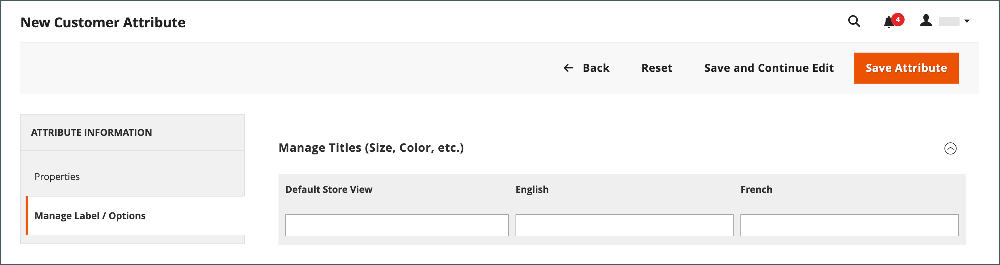

# Proprietà degli attributi del cliente

{{ee-feature}}

Gli attributi del cliente forniscono le informazioni necessarie per supportare i processi di gestione dell&#39;ordine, dell&#39;evasione e del cliente. Poiché la tua azienda è univoca, potresti aver bisogno di campi oltre agli elementi predefiniti forniti dal sistema. È possibile aggiungere attributi personalizzati alle sezioni Informazioni conto, Rubrica e Informazioni fatturazione dell&#39;account del cliente. Gli attributi dell&#39;indirizzo [del cliente](address-attributes.md) possono essere utilizzati anche nella sezione _Informazioni fatturazione_ durante l&#39;estrazione o quando gli ospiti si registrano per un account.

{width="700" zoomable="yes"}

## Passaggio 1: completare le proprietà dell’attributo

1. Nella barra laterale _Admin_, passa a **[!UICONTROL Stores]** > _[!UICONTROL Attributes]_>**[!UICONTROL Customer]**.

1. Nell&#39;angolo superiore destro fare clic su **[!UICONTROL Add New Attribute]**.

   {width="600" zoomable="yes"}

1. Nella sezione **[!UICONTROL Attribute Properties]** eseguire le operazioni seguenti:

   - Immettere un **[!UICONTROL Default Label]** che identifica l&#39;attributo durante l&#39;immissione dei dati.

   - Immettere un **[!UICONTROL Attribute Code]** che identifica l&#39;attributo nel sistema.

   Il codice attributo deve iniziare con una lettera e può includere qualsiasi combinazione di lettere minuscole (a-z) e numeri (0-9). La lunghezza del codice deve essere inferiore a 30 caratteri e non può includere caratteri speciali o spazi. Il carattere di sottolineatura (`_`) può essere utilizzato per indicare uno spazio.

   >[!TIP]
   >
   >**Collegamento:** Per completare solo i campi obbligatori, scorri verso il basso fino a _[!UICONTROL Storefront Properties]_, immetti&#x200B;_[!UICONTROL Sort Order]_ e salva.

1. Completare le proprietà di immissione dati:

   - Per determinare il tipo di controllo di input utilizzato per l&#39;immissione dei dati, impostare **[!UICONTROL Input Type]** su uno dei seguenti valori:

     | Tipo | Descrizione |
     |----|-----------|
     | `Text Field` | Campo di testo a riga singola. |
     | `Text Area` | Campo di input a più righe per l&#39;immissione di paragrafi di testo, ad esempio la descrizione di un prodotto. È possibile utilizzare l’editor di WYSIWYG per formattare il testo con i tag HTML o immettere i tag direttamente nel testo. |
     | `Multiple Line` | Crea più righe di testo per l&#39;attributo, in modo simile a un indirizzo stradale con più righe. Il numero di righe di immissione dati separate può essere compreso tra due e 20. Utilizzare `Default Value` per specificare il valore iniziale del campo. |
     | `Date` | Visualizza un valore di data nel formato di data e fuso orario preferiti. I valori di data possono essere selezionati da un elenco o da un calendario (  ).   **_Nota:_**&#x200B;a seconda della configurazione del sistema, gli utenti di_Amministrazione _possono immettere le date direttamente in un campo o selezionare una data dal calendario o dall&#39;elenco. Per informazioni su come specificare i valori di data e ora, vedere [Opzioni data e ora](../catalog/attributes-input-types.md#date-and-time-options). |
     | `Yes/No` | Visualizza un elenco a discesa con opzioni predefinite di `Yes` e `No`. |
     | `Dropdown` | Visualizza un elenco a discesa di valori che accetta una sola selezione. Il tipo di input a discesa è un componente chiave di [prodotti configurabili](../catalog/product-create-configurable.md). |
     | `Multiple Select` | Elenco a discesa che accetta più valori da selezionare. |
     | `File (attachment)` | Campo che consente di caricare un file e associarlo all’attributo cliente come allegato. |
     | `Image File` | Campo che consente di caricare un’immagine nella raccolta e associarla all’attributo cliente. |

   - Se il cliente deve immettere un valore nel campo, impostare **[!UICONTROL Values Required]** su `Yes`.

   - Per assegnare un valore iniziale al campo, immettere **[!UICONTROL Default Value]**.

   - Per verificare la precisione dei dati immessi nel campo prima del salvataggio del record, impostare **[!UICONTROL Input Validation]** sul tipo di dati consentito nel campo. I valori disponibili dipendono da [!UICONTROL Input Type] specificato.

     | Valore | Descrizione |
     |-----|-----------|
     | `None` | Il campo non dispone di alcuna convalida di input durante l&#39;immissione dei dati. |
     | `Alphanumeric` | Accetta qualsiasi combinazione di numeri (0-9) e caratteri alfabetici (a-z, A-Z) durante l&#39;immissione dei dati. Per includere caratteri speciali, vedere _Esc. entità HTML_. |
     | `Alphanumeric with Space` | Accetta qualsiasi combinazione di numeri (0-9), caratteri alfabetici (a-z, A-Z) e spazi durante l&#39;immissione dei dati. |
     | `Numeric Only` | Accetta solo numeri (0-9) durante l&#39;immissione dei dati. |
     | `Alpha Only` | Accetta solo caratteri alfabetici (a-z, A-Z) durante l&#39;immissione dei dati. |
     | `URL` | Accetta solo un URL durante l&#39;immissione dei dati. |
     | `Email` | Accetta solo un indirizzo e-mail durante l&#39;immissione dei dati. |
     | `Length Only` | Convalida l’input in base alla lunghezza dei dati immessi nel campo. |

   - Per limitare le dimensioni dei tipi di input Campo testo e Area testo, immettere **[!UICONTROL Minimum Text Length]** e **[!UICONTROL Maximum Text Length]**.

   - Per applicare un filtro di pre-elaborazione ai valori immessi in un campo di testo, un&#39;area di testo o un tipo di input a più righe, impostare **[!UICONTROL Input/Output Filter]** su uno dei seguenti valori:

     | Valore | Descrizione |
     |-----|-----------|
     | `None` | Non applica un filtro al testo immesso nel campo. |
     | `Strip HTML Tags` | Rimuove i tag HTML dal testo. Questo filtro può aiutare a ripulire i dati incollati in un campo da un’altra origine che include i tag HTML. |
     | `Escape  HTML Entities` | Converte i caratteri speciali presenti nel testo in una sequenza di escape HTML valida, ad esempio `&;`. Le sequenze di escape sono racchiuse tra una e commerciale e un punto e virgola e vengono spesso utilizzate per le citazioni intelligenti, il copyright e i simboli di marchio tipografico. Le sequenze di escape vengono inoltre utilizzate per identificare caratteri quali i simboli minore di (`<`) e maggiore di (`>`) e il carattere e commerciale utilizzato anche nel codice. Questo filtro può aiutare a ripulire i caratteri speciali che a volte vengono incollati nei campi del database dagli elaboratori di testi. |

1. Completa la griglia del cliente e le proprietà del segmento:

   - Per includere la colonna nella griglia Clienti, impostare **[!UICONTROL Add to Column Options]** su `Yes`.

   - Per filtrare la griglia Clienti in base a questo attributo, impostare **[!UICONTROL Use in Filter Options]** su `Yes`.

   - Per filtrare la griglia Clienti in base all&#39;attributo di testo con condizioni di corrispondenza filtro diverse, impostare **[!UICONTROL Grid Filter Condition Type]** su `Partial Match`, `Prefix Match` o `Full Match`. Non influisce sul campo _Ricerca per parola chiave_ per la griglia.

   - Per eseguire ricerche nella griglia Clienti in base a questo attributo, impostare **[!UICONTROL Use in Search Options]** su `Yes`.

   - Per rendere questo attributo disponibile per [segmenti cliente](customer-segments.md), impostare **[!UICONTROL Use in Customer Segment]** su `Yes`.

## Passaggio 2: completare le proprietà della vetrina

1. Scorri verso il basso fino alla sezione **[!UICONTROL Storefront Properties]**.

   {width="600" zoomable="yes"}

1. Per rendere visibile l&#39;attributo ai clienti, impostare **[!UICONTROL Show on Storefront]** su `Yes`.

1. Immettere un numero nel campo **[!UICONTROL Sort Order]**, che ne determina l&#39;ordine di visualizzazione se elencato con altri attributi.

1. Impostare **[!UICONTROL Forms to Use]** su ogni modulo che deve includere l&#39;attributo. Per scegliere più opzioni, tenere premuto il tasto Ctrl e fare clic su ogni modulo.

   - [&quot;Registrazione cliente&quot;](customer-sign-in.md)
   - [&quot;Customer Account Edit&quot;](account-create.md)
   - [&quot;Admin Checkout&quot;](../stores-purchase/checkout-process.md)

## Passaggio 3: completa l’etichetta e salva

1. Nel pannello a sinistra, scegli **[!UICONTROL Manage Labels/Options]**.

1. In **[!UICONTROL Manage Titles]**, immettere un&#39;etichetta per identificare l&#39;attributo per ogni [visualizzazione archivio](../getting-started/websites-stores-views.md).

1. Al termine, fare clic su **[!UICONTROL Save Attribute]**.

   {width="600" zoomable="yes"}

## Descrizioni dei campi

### [!UICONTROL Attribute Properties]

| Campo | Descrizione |
|--- |--- |
| [!UICONTROL Default Label] | L’etichetta predefinita che identifica l’attributo in Admin e storefront. |
| [!UICONTROL Attribute Code] | Codice univoco che identifica l’attributo all’interno del sistema. Il codice può contenere fino a 60 caratteri e non può includere spazi o caratteri speciali. È possibile utilizzare il simbolo di sottolineatura anziché uno spazio. |
| [!UICONTROL Input Type] | Determina il controllo di input utilizzato per l&#39;immissione dei dati. Opzioni:  **`Text Field`**- Campo di testo a riga singola. **`Text Area`** - Area di testo su più righe.  **`Multiple Line`**- Crea più righe di testo per l&#39;attributo, in modo simile a un indirizzo stradale su più righe. Il numero di righe di immissione dati separate può essere compreso tra 2 e 20. **`Date`** - Visualizza un campo data con un calendario popup. **`Dropdown`**- Elenco a discesa che accetta un solo valore da selezionare. **`Multiple Select`** - Elenco a discesa che accetta la selezione di più valori.  **`Yes/No`**- Campo che offre solo una scelta di `Yes` o `No` valori. **`File (attachment)`** - Campo che consente di caricare un file e associarlo all&#39;attributo cliente come allegato.  **`Image File`**- Campo che consente di caricare un&#39;immagine nella raccolta e associarla all&#39;attributo cliente. |
| [!UICONTROL Values Required] | Determina se un valore deve essere immesso nel campo. Opzioni: `Yes` / `No` |
| [!UICONTROL Default Value] | Specifica il valore iniziale dell&#39;attributo. |
| [!UICONTROL Input Validation] | La selezione delle opzioni è determinata dal tipo di input. Opzioni:  **`None`**- Nessuna convalida di input per il campo durante l&#39;immissione dei dati. **`Alphanumeric`** - Accetta qualsiasi combinazione di numeri (0-9) e caratteri alfabetici (a-z, A-Z) durante l&#39;immissione dei dati.  **`Alphanumeric with Space`**- Consente agli spazi nell&#39;indirizzo stradale di rispettare i requisiti di lunghezza massima del gestore. Durante il pagamento, il cliente può immettere qualsiasi combinazione di numeri (0-9), caratteri alfabetici (a-z, A-Z) e spazi nell&#39;indirizzo stradale del destinatario e del mittente. Eventuali spazi in più vengono tagliati durante il salvataggio dell’indirizzo. **`Numeric Only`** - Accetta solo numeri (0-9) durante l&#39;immissione dei dati.  **`Alpha Only`**- Accetta solo caratteri alfabetici (a-z, A-Z) durante l&#39;immissione dei dati. **`URL`** - Accetta solo un URL durante l&#39;immissione dei dati.  **`Email`**- Accetta solo un indirizzo e-mail durante l&#39;immissione dei dati. **`Length Only`** - Convalida l&#39;input in base alla lunghezza dei dati immessi nel campo. |
| [!UICONTROL Input/Output Filter] | Applica un filtro di pre-elaborazione ai valori immessi in un campo di testo, un&#39;area di testo o un tipo di input a più righe prima che il record venga salvato. Opzioni:  **`None`**- Non applica un filtro al testo immesso nel campo. **`Strip HTML Tags`** - Rimuove i tag HTML dal testo. Questo filtro può aiutare a ripulire i dati incollati in un campo da un’altra origine che include i tag HTML.  **`Escape HTML Entities`**- Converte i caratteri speciali presenti nel testo in una sequenza di escape HTML valida, ad esempio `amp;`. Le sequenze di escape sono racchiuse tra una e commerciale e un punto e virgola e vengono spesso utilizzate per le citazioni intelligenti, i simboli di copyright e i simboli di marchio tipografico. Le sequenze di escape vengono inoltre utilizzate per identificare caratteri quali i simboli minore di (`<`) e maggiore di (`>`) e il carattere e commerciale utilizzato anche nel codice. Questo filtro può aiutare a ripulire i caratteri speciali che a volte vengono incollati nei campi del database dagli elaboratori di testi. |
| [!UICONTROL Add to Column Options] | Specifica se l&#39;attributo è incluso come colonna nella griglia [Clienti](customers-all.md). Opzioni: `Yes` / `No` |
| [!UICONTROL Use in Filter Options] | Specifica se l&#39;attributo può essere utilizzato come filtro per le operazioni di ricerca dalla griglia. Opzioni: `Yes` / `No` |
| [!UICONTROL Grid Filter Condition Type] | Specifica le condizioni di corrispondenza dei filtri per gli attributi per le operazioni di ricerca dalla griglia. Non influisce sul campo _Ricerca per parola chiave_ per la griglia. Opzioni: `Partial Match` / `Prefix Match` / `Full Match` |
| [!UICONTROL Use in Search Options] | Specifica se il valore dell&#39;attributo può essere utilizzato come parola chiave nelle operazioni di ricerca. Opzioni: `Yes` / `No` |
| [!UICONTROL Use in Customer Segment] | Determina se l&#39;attributo è incluso nelle condizioni del [segmento cliente](customer-segments.md). Opzioni: `Yes` / `No` |

### [!UICONTROL Storefront Properties]

| Campo | Descrizione |
|--- |--- |
| [!UICONTROL Show on Storefront] | Determina se l&#39;attributo viene visualizzato come campo nelle informazioni sul cliente nella vetrina. Opzioni: `Yes` / `No` |
| [!UICONTROL Sort Order] | Specifica l&#39;ordinamento di questo attributo in relazione ad altri attributi del cliente. L&#39;ordinamento determina la sequenza di attivazione dei campi durante l&#39;immissione dei dati quando si utilizza la navigazione da tastiera. |
| [!UICONTROL Forms to Use in] | Determina le pagine con i form di immissione dati in cui viene visualizzato l&#39;attributo. Opzioni:  [`Customer Registration`](account-dashboard-account-information.md)  [`Customer Account Edit`](account-create.md)  [`Admin Checkout`](../stores-purchase/checkout-process.md) |

## Attributi cliente predefiniti

| Codice attributo | Descrizione |
| --------------- | ------------------ |
| `created_at` | Data di creazione dell&#39;account cliente. |
| `updated_at` | Data dell&#39;ultimo aggiornamento dell&#39;account cliente. |
| `website_id` | ID sito Web del sito in cui è stato creato l&#39;account del cliente. |
| `store_id` | ID store del sito in cui è stato creato l&#39;account del cliente. |
| `created_in` | La vista del negozio in cui è stato creato l’account. |
| `group_id` | ID del gruppo di clienti a cui è assegnato il cliente. |
| `disable_auto_group_change` | Determina se i gruppi di clienti possono essere assegnati in modo dinamico durante la [convalida ID IVA](../stores-purchase/vat.md#configure-vat-id-validation). |
| `prefix` | Qualsiasi prefisso utilizzato con il nome del cliente (ad esempio Sig., Sig.ra o Dott.). |
| `firstname` | Il nome del cliente. |
| `middlename` | Secondo nome o secondo nome iniziale del cliente. |
| `lastname` | Cognome del cliente. |
| `suffix` | Qualsiasi suffisso utilizzato con il nome del cliente. (come Jr., Sr. o Esquire) |
| `email` | Indirizzo e-mail del cliente. |
| `dob` | La data di nascita del cliente.    **_Importante:_**&#x200B;In linea con le attuali best practice in materia di sicurezza e privacy, tieni presente i potenziali rischi legali e di sicurezza associati all&#39;archiviazione della data di nascita completa (mese, giorno, anno) dei clienti con altri identificatori personali. Si consiglia di limitare la memorizzazione delle date di nascita complete dei clienti e, in alternativa, di utilizzare l’anno di nascita del cliente. |
| `taxvat` | ID imposta sul valore aggiunto (IVA) assegnato al cliente. L&#39;etichetta predefinita di questo attributo è `VAT Number`. Il campo Partita IVA è sempre presente in tutti gli indirizzi dei clienti di spedizione e fatturazione quando viene visualizzato dall’amministratore, ma non è un campo obbligatorio. |
| `gender` | Il genere del cliente. |

## Demo sugli attributi del cliente

Per una dimostrazione della creazione degli attributi del cliente, guarda questo video:

>[!VIDEO](https://video.tv.adobe.com/v/343661?quality=12&learn=on)
