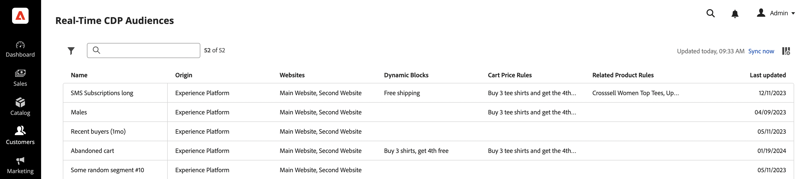

# [!DNL Audience Activation]

L&#39;estensione [!DNL Audience Activation] consente di attivare il pubblico di Real-Time CDP in Adobe Commerce per creare offerte univoche nel carrello. Queste offerte e incentivi includono tecniche comuni di merchandising per l&#39;e-commerce, come _acquistare 2 ottenere 1 gratis_, banner hero rivolti a quel cliente e prezzi dei prodotti modificati attraverso varie offerte. I tipi di pubblico generati in Real-Time CDP si basano su dati provenienti da vari sistemi aziendali, come Enterprise Resource Planning (ERP), Customer Relationship Management (CRM), punti vendita e sistemi di marketing. Poiché le informazioni sui segmenti dei clienti vengono costantemente aggiornate, i clienti possono associarsi e dissociarsi da un segmento mentre fanno acquisti nel negozio.

Puoi attivare i tipi di pubblico in una vetrina Luma o in una vetrina [headless](#headless-support). In una vetrina Luma, le informazioni sul pubblico (iscrizione al segmento) vengono memorizzate in un cookie sul lato Commerce. In una vetrina headless, le informazioni sul pubblico vengono passate nell&#39;intestazione API di GraphQL come parametro denominato: `aep-segments-membership`.

## Note sulla versione

Questa sezione contiene informazioni sugli aggiornamenti dell&#39;estensione Audience Activation e include:

 - Nuove funzionalità
 - Correzioni e miglioramenti
 - Problemi noti

Per informazioni sulle pianificazioni e sul supporto, consulta le [prossime versioni](https://experienceleague.adobe.com/docs/commerce-operations/release/planning/schedule.html?lang=it).

Per informazioni sulla compatibilità dei prodotti, consulta la documentazione per gli sviluppatori[.](https://experienceleague.adobe.com/docs/commerce-operations/release/product-availability.html?lang=it)

## Aggiornamenti dei servizi supportati

Queste note sulla versione descrivono modifiche e correzioni di funzioni relative alle estensioni utilizzate da Audience Activation.

+++Aggiornamenti dei servizi supportati

_15 agosto 2023_

 - È stata aggiornata la [dashboard Tipi di pubblico di Real-Time CDP](#real-time-cdp-audiences-dashboard) per semplificare il filtro.

_27 giugno 2023_

 - Aggiunta del supporto per PHP 8.2 nel pacchetto `magento/module-data-services-graphql`.

_30 maggio 2023_

 - È stato aggiornato il [dashboard Tipi di pubblico di Real-Time CDP](#real-time-cdp-audiences-dashboard) per includere la possibilità di ordinare, cercare e filtrare i tipi di pubblico attivi nell&#39;istanza di Adobe Commerce.

+++

### 2.4.0

[!BADGE Compatibilità]{type=Informative tooltip="Compatibilità"} Adobe Commerce versioni 2.4.4 e successive

_24 marzo 2025_

 - Aggiunto supporto PHP 8.4.

### 2.3.1.

[!BADGE Compatibilità]{type=Informative tooltip="Compatibilità"} Adobe Commerce versioni 2.4.4 e successive

_12 novembre 2024_

 - È stato risolto un problema che si verificava quando si filtravano i tipi di pubblico di Real-Time CDP disponibili tra cui scegliere.

### 2.3.0.

[!BADGE Compatibilità]{type=Informative tooltip="Compatibilità"} Adobe Commerce versioni 2.4.4 e successive

_29 luglio 2024_

 - È stata aggiunta la sintassi della riga di comando in modo da poter [verificare le credenziali](#validate-the-connection) per determinare se devono essere aggiornate per estrarre i dati del pubblico da Adobe Experience Platform.

### 2.2.0.

[!BADGE Compatibilità]{type=Informative tooltip="Compatibilità"} Adobe Commerce versioni 2.4.4 e successive

_12 giugno 2024_

 - Versione GA per [regole prodotto correlate](../merchandising-promotions/product-related-rule-create.md) informata dal pubblico.

### 2.1.1.

[!BADGE Compatibilità]{type=Informative tooltip="Compatibilità"} Adobe Commerce versioni 2.4.4 e successive

_4 aprile 2024_

 - Aggiunto supporto per PHP 8.3.

### 2.2.0-beta1

[!BADGE Compatibilità]{type=Informative tooltip="Compatibilità"} Adobe Commerce versioni 2.4.4 e successive

_16 febbraio 2024_

 - Se partecipi alla versione beta, assicurati che il tuo file `composer.json` abbia le seguenti caratteristiche a livello di radice: ` "minimum-stability": "beta"`.
 - (**Beta**) Aggiunta la possibilità di creare [regole di prodotto correlate](../merchandising-promotions/product-related-rule-create.md) informate dai tipi di pubblico.

### 2.1.0.

[!BADGE Compatibilità]{type=Informative tooltip="Compatibilità"} Adobe Commerce versioni 2.4.4 e successive

_24 gennaio 2024_

 - È stato aggiornato il [dashboard Tipi di pubblico di Real-Time CDP](#real-time-cdp-audiences-dashboard) per includere i siti Web che contengono i tipi di pubblico e specificare quali blocchi dinamici e regole di prezzo del carrello sono configurati per utilizzare tali tipi di pubblico.

### 2.0.1.

[!BADGE Compatibilità]{type=Informative tooltip="Compatibilità"} Adobe Commerce versioni 2.4.4 e successive

_16 novembre 2023_

 - Stabilità migliorata.

### 2,0,0

[!BADGE Compatibilità]{type=Informative tooltip="Compatibilità"} Adobe Commerce versioni 2.4.4 e successive

_10 ottobre 2023_

 - È stato aggiunto il supporto per OAuth 2.0 quando [configuri](#configure-the-extension) l&#39;estensione Audience Activation.
 - Stabilità migliorata.

### 1.2.0.

[!BADGE Compatibilità]{type=Informative tooltip="Compatibilità"} Adobe Commerce versioni 2.4.4 e successive

_15 agosto 2023_

 - È stata aggiornata la versione dei componenti dell&#39;interfaccia utente.

### 1.1.0.

_30 maggio 2023_

[!BADGE Compatibilità]{type=Informative tooltip="Compatibilità"} Adobe Commerce versioni 2.4.4 e successive

 - Aggiunta del supporto per [blocchi dinamici](#headless-support) in una vetrina headless.

### 1.0.1.

_11 maggio 2023_

[!BADGE Compatibilità]{type=Informative tooltip="Compatibilità"} Adobe Commerce versioni 2.4.4 e successive

 - È stato risolto un problema che impediva l&#39;applicazione di una regola di prezzo blocco dinamico o carrello alla vetrina.
 - È stato risolto un problema che causava un errore durante un&#39;installazione non configurata dell&#39;estensione Audience Activation quando un commerciante tentava di creare o aggiornare un blocco dinamico.

### 1,0,0

_31 marzo 2023_

[!BADGE Compatibilità]{type=Informative tooltip="Compatibilità"} Adobe Commerce versioni 2.4.4 e successive

 - Versione di disponibilità generale

## Implementazione

Le seguenti attività si applicano sia alle implementazioni Luma che alla vetrina headless. Per attivare i tipi di pubblico in Adobe Commerce, devi:

- Installare Adobe Commerce versione 2.4.4 o successiva
- [Attiva](https://experienceleague.adobe.com/docs/experience-platform/destinations/catalog/personalization/adobe-commerce.html?lang=it) Adobe Commerce come destinazione in Real-Time CDP
- [Installa](#install-the-extension) l&#39;estensione [!DNL Audience Activation] in Admin
- [Configura](#configure-the-extension) l&#39;estensione [!DNL Audience Activation] in Admin

### Installare l’estensione

Installa l&#39;estensione [!DNL Audience Activation] dal [marketplace](https://commercemarketplace.adobe.com/magento-audiences.html) oppure esegui il comando seguente:

```bash
composer require magento/audiences
```

### Configurare l&#39;estensione

Dopo aver installato l&#39;estensione [!DNL Audience Activation], è necessario accedere all&#39;amministratore di Commerce e completare le operazioni seguenti:

1. Nella barra laterale _Admin_, passa a **[!UICONTROL System]** > _[!UICONTROL Services]_>**[!UICONTROL Commerce Services Connector]**.

1. [Accedi](https://experienceleague.adobe.com/docs/commerce/user-guides/integration-services/saas.html?lang=it#organizationid) al tuo account Adobe e seleziona il tuo ID organizzazione.

1. Nella barra laterale _Admin_, passa a **[!UICONTROL System]** > _[!UICONTROL Services]_>**[!UICONTROL [!DNL Data Connection]]**.

1. Nel campo **[!UICONTROL Datastream ID]**, incolla l&#39;ID dello stream di dati creato quando [hai attivato](https://experienceleague.adobe.com/docs/experience-platform/destinations/catalog/personalization/adobe-commerce.html?lang=it#parameters) Adobe Commerce come destinazione in Real-Time CDP.

   Questo flusso di dati invia i dati dal sito web Commerce a Real-Time CDP per determinare se un acquirente appartiene a un pubblico. Se non hai ancora creato uno stream di dati, [creane](https://experienceleague.adobe.com/docs/experience-platform/datastreams/configure.html?lang=it#create) uno in Experience Platform, [aggiungilo](https://experienceleague.adobe.com/docs/experience-platform/destinations/catalog/personalization/adobe-commerce.html?lang=it) alla destinazione Commerce in Real-Time CDP e all&#39;estensione [[!DNL Data Connection]](https://experienceleague.adobe.com/docs/commerce/data-connection/fundamentals/connect-data.html?lang=it#data-collection) in Admin.

   >[!NOTE]
   >
   >Quando specifichi un ID dello stream di dati, [associalo a un sito Web specifico](https://experienceleague.adobe.com/docs/commerce/data-connection/fundamentals/connect-data.html?lang=it#data-collection) nell&#39;estensione [!DNL Data Connection]. Se il tuo archivio Commerce dispone di più siti Web, [crea una destinazione](https://experienceleague.adobe.com/docs/experience-platform/destinations/ui/connect-destination.html?lang=it) per ciascun sito Web in Real-Time CDP e utilizza un ID dello stream di dati diverso per ciascuno di essi.

1. Nella barra laterale _Admin_, passa a **[!UICONTROL Stores]** > _[!UICONTROL Settings]_>**[!UICONTROL Configuration]**.

1. Espandere **[!UICONTROL Services]** e selezionare **[!UICONTROL [!DNL Data Connection]]**.

1. [Aggiungi](https://experienceleague.adobe.com/docs/commerce/data-connection/fundamentals/connect-data.html?lang=it#add-service-account-and-credential-details) dettagli account del servizio e credenziali.

## Dove utilizzare i tipi di pubblico di Real-Time CDP in Commerce

Con l&#39;estensione [!DNL Audience Activation] abilitata, è possibile:

- [Crea una regola del prezzo del carrello](../merchandising-promotions/price-rules-cart-create.md#set-a-condition-using-real-time-cdp-audiences) informata dal pubblico
- [Crea un blocco dinamico](../content-design/dynamic-blocks.md#use-real-time-cdp-audiences-in-dynamic-blocks) informato dal pubblico
- [Crea una regola di prodotto correlata](../merchandising-promotions/product-related-rule-create.md) informata dal pubblico

>[!TIP]
>
>Per un caso d&#39;uso end-to-end completo su come esportare i dati di [!DNL Commerce] in Real-Time CDP, creare un pubblico e quindi attivarlo in [!DNL Commerce], vedi [Creare un pubblico in Real-Time CDP utilizzando i dati di  [!DNL Commerce] evento](https://experienceleague.adobe.com/it/docs/commerce/data-connection/use-cases/create-audience).

## Dashboard dei tipi di pubblico di Real-Time CDP

Puoi visualizzare tutti i [tipi di pubblico attivi](https://experienceleague.adobe.com/docs/experience-platform/destinations/ui/activate/activate-edge-personalization-destinations.html?lang=it) disponibili per la personalizzazione nell&#39;istanza di Adobe Commerce utilizzando la dashboard **Tipi di pubblico di Real-Time CDP**.

Per accedere al dashboard **Tipi di pubblico di Real-Time CDP**, passa alla barra laterale _Amministratore_, quindi passa a **[!UICONTROL Customers]** > **[!UICONTROL Real-time CDP Audience]**.

{width="700" zoomable="yes"}

Il dashboard contiene i campi seguenti:

| Colonna | Descrizione |
|--- |--- |
| `Hide filters` | Consente di mostrare o nascondere i filtri che è possibile applicare al dashboard. Al momento, l&#39;unico filtro applicabile è `Last updated`. Questo filtro consente di selezionare un intervallo di date per i tipi di pubblico in base a quando sono stati aggiornati l’ultima volta. |
| `Search` | Consente di cercare i tipi di pubblico attivi nell’istanza di Commerce. |
| `Name` | Nome assegnato al pubblico in Real-Time CDP. |
| `Origin` | Indica da dove proviene il pubblico, ad esempio `Experience Platform`. |
| `Websites` | Indica quali siti web sono configurati per utilizzare i tipi di pubblico. |
| `Dynamic Blocks` | Indica quali blocchi dinamici sono configurati per utilizzare i tipi di pubblico. |
| `Cart Price Rules` | Indica quali regole di prezzo del carrello sono configurate per utilizzare i tipi di pubblico. |
| `Related Product Rules` | Indica quali regole di prodotto correlate sono configurate per utilizzare i tipi di pubblico. |
| `Last updated` | Indica quando il pubblico è stato modificato in Real-Time CDP. |
| `Sync now` | Recupera il pubblico nuovo o aggiornato da Real-Time CDP. |
| `Customize table` | Consente di mostrare o nascondere le colonne `Origin`, `Websites`, `Dynamic Blocks`, `Cart Price Rules` e `Last updated`. |

{style="table-layout:auto"}

## Supporto headless

Puoi attivare i tipi di pubblico in un’istanza di Adobe Commerce headless, ad esempio AEM e PWA, per visualizzare le regole del prezzo del carrello, le regole dei prodotti correlate o i blocchi dinamici in base ai tipi di pubblico.

### Regole di prezzo del carrello e regole di prodotto correlate

Per le regole di prezzo del carrello e le regole di prodotto correlate, una vetrina headless comunica con Experience Platform tramite [Commerce integration framework (CIF)](https://experienceleague.adobe.com/docs/experience-manager-cloud-service/content/content-and-commerce/integrations/magento.html?lang=it). Il framework fornisce un’API lato server che viene implementata utilizzando GraphQL. Le informazioni sul pubblico, ad esempio il segmento di un acquirente, passano a Commerce tramite un parametro di intestazione GraphQL denominato: `aep-segments-membership`.

L’architettura generale è la seguente:

{width="700" zoomable="yes"}

Dopo aver [installato](#install-the-extension) e [configurato](#configure-the-extension) l&#39;estensione, Experience Platform Web SDK contiene le informazioni sul pubblico sotto forma di appartenenza al segmento.

Per acquisire tali appartenenze al segmento da SDK, vedi questo [frammento di codice](https://experienceleague.adobe.com/docs/experience-platform/destinations/catalog/personalization/custom-personalization.html?lang=it#example-response-for-custom-personalization-with-attributes).

Una volta recuperato, puoi passare tali segmenti a Commerce all’interno dell’intestazione di GraphQL. Ad esempio:

```bash
curl 'http://magento.config/graphql' -H 'Authorization: Bearer abc123' -H 'aep-segments-membership: urlencoded_list_of_segments' -H 'Content-Type: application/json' --data-binary '{"query":"query {\ncustomer {\nfirstname\nlastname\nemail\n}\n}"}'
```

### Blocchi dinamici

Per i blocchi dinamici, le query GraphQL `dynamicBlocks` possono contenere l&#39;attributo di input `audience_id`. Se si specificano uno o più valori `audience_id` in una query `dynamicBlocks`, verrà restituito un elenco di blocchi dinamici assegnati a tali tipi di pubblico.

#### Esempio di utilizzo

La query seguente restituisce tutti i blocchi dinamici associati a più ID di pubblico.

**Richiesta:**

```graphql
{
  dynamicBlocks(input:
  {
    type: SPECIFIED
    audience_id: {
      in: [
        "cd29a789-9be8-40ad-a1ef-640c33b3742e"
        "92c3e14d-c72b-40d0-96b7-b96801dcc135"
      ]
    }
  })
  {
    items {
      uid
      audience_id
      content {
        html
      }
    }
    page_info {
      current_page
      page_size
      total_pages
    }
    total_count
  }
}
```

**Risposta:**

```json
{
  "data": {
    "dynamicBlocks": {
      "items": [
        {
          "uid": "MQ==",
          "audience_id": [
            "cd29a789-9be8-40ad-a1ef-640c33b3742e"
          ],
          "content": {
            "html": "<h2><strong>SAVE 20%</strong></h2>\r\n<p>(some restrictions apply)</p>\r\n<p>&nbsp;</p>"
          }
        },
        {
          "uid": "Mg==",
          "audience_id": [
            "cd29a789-9be8-40ad-a1ef-640c33b3742e",
            "92c3e14d-c72b-40d0-96b7-b96801dcc135"
          ],
          "content": {
            "html": "<p></p>"
          }
        }
      ],
      "page_info": {
        "current_page": 1,
        "page_size": 20,
        "total_pages": 1
      },
      "total_count": 2
    }
  }
}
```

Ulteriori informazioni sulla query GraphQL `dynamicBlocks` nella [documentazione per gli sviluppatori](https://developer.adobe.com/commerce/webapi/graphql/schema/store/queries/dynamic-blocks/).

## Recuperare i tipi di pubblico con Adobe Experience Platform Mobile SDK

Puoi recuperare i tipi di pubblico di Real-Time CDP utilizzando Adobe Experience Platform Mobile SDK.

1. [Installa](#install-the-extension) l&#39;estensione Audience Activation.
1. [installa e configura SDK per il tuo sito Commerce per dispositivi mobili](https://experienceleague.adobe.com/docs/commerce/data-connection/fundamentals/mobile-sdk-epc.html?lang=it).

>[!IMPORTANT]
>
>Adobe Experience Platform Mobile SDK per iOS supporta iOS 11 o versione successiva.

Dopo aver completato la configurazione, utilizza le operazioni di SDK mobile per recuperare i dati sul pubblico. Ad esempio:

```swift
Edge.sendEvent(experienceEvent: experienceEvent) { (handles: [EdgeEventHandle]) in
    for handle in handles {
        if handle.type == "activation:pull" {
        let payloadItems = handle.payload ?? []
            for payloadItem in payloadItems {
                if let segments = payloadItem["segments"] as? any Sequence {
                    var segmentsArr = [Any]()
                    for segment in segments {
                        let response = segment as AnyObject?
                        segmentsArr.append(response?.object(forKey: "id")! ?? "")
                    }
                    print("Saving segments ->  \(segments)")
                    storage.set(segmentsArr, forKey: "segments")
                    print("End saving segments")
                }

                // Show segments
                let rSegments = storage.object(forKey: "segments") ?? nil;
                print("Retrieving segments -> \(rSegments)")
            }
        }
    }
}
```

Dopo il recupero dei dati, puoi utilizzarli per creare nell&#39;app Commerce [regole prezzo carrello](../merchandising-promotions/price-rules-cart-create.md#set-a-condition-using-real-time-cdp-audiences), [blocchi dinamici](../content-design/dynamic-blocks.md#use-real-time-cdp-audiences-in-dynamic-blocks) e [regole prodotto correlate](../merchandising-promotions/product-related-rule-create.md) informate sul pubblico.

## I tipi di pubblico non vengono visualizzati in Commerce

Se i tipi di pubblico di Real-Time CDP non vengono visualizzati in Commerce, la causa potrebbe essere:

- Connessione non valida
- Tipo di autenticazione non corretto selezionato nella pagina di configurazione **Connessione dati**
- Privilegi insufficienti sul token generato

Le sezioni seguenti descrivono come risolvere questi problemi.

### Convalidare la connessione

Per convalidare le credenziali e la risposta da Adobe Experience Platform, esegui il comando seguente:

```bash
bin/magento audiences:config:status
```

Questo comando restituisce lo stato della connessione. Aggiungi il flag `-v` per fornire maggiore dettaglio:

```
./bin/magento audiences:config:status -v
```

Ad esempio:

```
+----------------------------------+---------------+---------------------------------------------+---------------------------------------------------------+--------------+
| Client ID                        | Client secret | Technical account ID                        | Technical account email                                 | Sandbox name |
+----------------------------------+---------------+---------------------------------------------+---------------------------------------------------------+--------------+
| 1234bd57fac8497d8933327c535347d8 | *****         | 12341E116638D6B00A495C80@techacct.adobe.com | 12345-b95b-4894-a41c-a4130d26bd80@techacct.adobe.com | dev          |
```

### Tipo di autenticazione non corretto selezionato nella configurazione

1. Apri l’istanza di Commerce.
1. Nella barra laterale _Admin_, passa a **[!UICONTROL Stores]** > _[!UICONTROL Settings]_>**[!UICONTROL Configuration]**.
1. Espandere **[!UICONTROL Services]** e selezionare **[!UICONTROL [!DNL Data Connection]]**.
1. Verificare che il metodo di autorizzazione server-to-server specificato nel campo **[!UICONTROL Authentication Type]** sia corretto. Adobe consiglia di utilizzare **OAuth**. [JWT è stato dichiarato obsoleto](https://experienceleague.adobe.com/it/docs/experience-manager-65/content/security/jwt-credentials-deprecation-in-adobe-developer-console), con tutti i certificati correnti in scadenza entro il 1 marzo 2026.

### Privilegi insufficienti sul token generato

Questo problema può essere causato da privilegi API insufficienti per il token generato. Per verificare che il token disponga dei privilegi corretti:

1. Identifica l’amministratore di sistema per Adobe Experience Platform nella tua organizzazione.
1. Trova il progetto e le credenziali che userai.
1. Identificare l&#39;e-mail dell&#39;account tecnico, ad esempio: `fe3c9476-1234-1234-abcd-2a51a785009a@techacct.adobe.com`.
1. Chiedere all&#39;amministratore di sistema di avviare Adobe Experience Platform e passare a **[!UICONTROL Permissions]** -> **[!UICONTROL Users]** -> **[!UICONTROL API credentials]**.
1. Utilizzando l’e-mail dell’account tecnico di cui sopra, cerca le credenziali da modificare.
1. Apri le credenziali, quindi seleziona **[!UICONTROL Roles]** -> **[!UICONTROL Add roles]**.
1. Aggiungere il ruolo che contiene l&#39;autorizzazione **[!UICONTROL Manage destinations]**.
1. Fare clic su **[!UICONTROL Save]**.
1. [Rigenera](https://experienceleague.adobe.com/docs/experience-platform/landing/platform-apis/api-authentication.html?lang=it#generate-access-token) il token di accesso nella console.
1. Verificare che il token fornisca una risposta valida utilizzando l&#39;API [Target Connections](https://developer.adobe.com/experience-platform-apis/references/destinations/#tag/Target-connections/operation/getTargetConnections).
