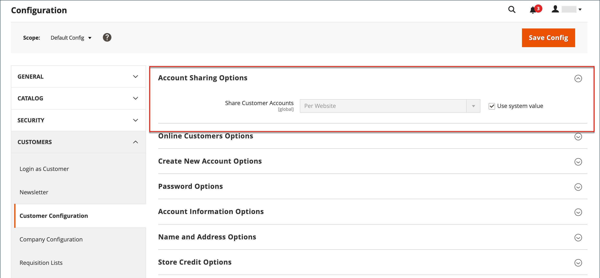

# Ambito account cliente

L&#39;intestazione di ogni pagina del tuo archivio estende un invito per gli acquirenti a _Accedi o registrati_ per un account con il tuo archivio. I clienti che aprono un account possono usufruire di una serie di vantaggi, tra cui:

* **Crea account cliente** - I visitatori possono creare un account cliente in modo da poter utilizzare la vetrina come cliente registrato.
* **Crea un account aziendale** A seconda della configurazione, un visitatore del tuo archivio può scegliere di creare un account aziendale. Per ulteriori informazioni, vedere [Adobe Commerce B2B](../b2b/introduction.md).
* **Estrazione più rapida**: i clienti registrati passano più rapidamente all&#39;estrazione perché molte delle informazioni sono già presenti nei loro account.
* **Self-service**: i clienti registrati possono aggiornare le proprie informazioni, controllare lo stato degli ordini e persino riordinare i propri account.

I clienti possono accedere al proprio account facendo clic sul collegamento **[!UICONTROL My Account]** nell&#39;intestazione dello store. Dal proprio account, i clienti possono visualizzare e modificare le informazioni, inclusi gli indirizzi passati e correnti, le preferenze di fatturazione e spedizione, gli abbonamenti alle newsletter, la lista dei desideri e altro ancora.

{width="600" zoomable="yes"}

## Imposta l&#39;ambito degli account cliente

L’ambito degli account cliente può essere limitato al sito web in cui è stato creato l’account o condiviso con tutti i siti web e i negozi nella gerarchia del negozio.

>[!NOTE]
>
>Se il sito web viene escluso dal gruppo di clienti, al cliente non è consentito accedere al sito web quando l’ambito degli account del cliente è limitato al sito web o condiviso con tutti i siti web. Per ulteriori informazioni sull&#39;esclusione di siti Web dai gruppi, vedere [Creare un gruppo di clienti](customer-groups.md#create-a-customer-group).

1. Nella barra laterale _Admin_, passa a **[!UICONTROL Stores]** > [!UICONTROL _[!UICONTROL Settings]_] > **[!UICONTROL Configuration]**.

1. Nel pannello a sinistra, espandi **[!UICONTROL Customers]** e scegli **[!UICONTROL Customer Configuration]**.

1. Espandere la sezione **[!UICONTROL Account Sharing Options]**.

   {width="600" zoomable="yes"}

1. Imposta **[!UICONTROL Share Customer Accounts]** su uno dei seguenti:

   | Opzione | Descrizione |
   | --- | --- |
   | `Global` | Condivide le informazioni sull&#39;account del cliente con ogni sito Web e negozio dell&#39;installazione. |
   | `Per Website` | Limita le informazioni sull&#39;account del cliente al sito Web in cui è stato creato l&#39;account. |

   {style="table-layout:auto"}

   >[!INFO]
   >
   > Se necessario, deselezionare la casella di controllo **[!UICONTROL User system value]** per apportare la modifica.

1. Al termine, fare clic su **[!UICONTROL Save Config]**.

   >[!NOTE]
   >
   >Quando `Global` è selezionato, le informazioni del cliente in **Il mio account** (indirizzi e informazioni sull&#39;account come i dettagli di contatto) vengono condivise.
