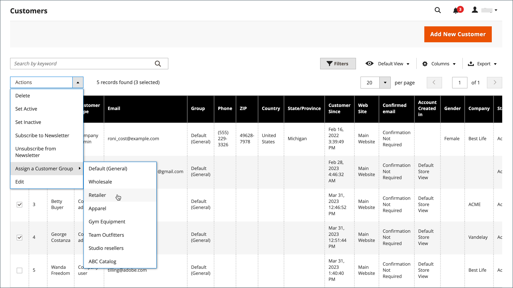

# Gruppi di clienti

I gruppi di clienti determinano gli sconti disponibili e la classe fiscale associata al gruppo. I gruppi di clienti predefiniti sono `General`, `Not Logged In` e `Wholesale`.

{width="700" zoomable="yes"}

## Filtra elenco [!UICONTROL Customer Groups]

1. Nella barra laterale _Admin_, passa a **[!UICONTROL Customers]** > **[!UICONTROL Customer Groups]**.

1. Fare clic su **[!UICONTROL Filters]**.

1. Immetti i criteri per la ricerca dei gruppi, incluso un intervallo di ID, gruppo o classe fiscale.

   {width="600" zoomable="yes"}

1. Al termine, fare clic su **[!UICONTROL Apply Filters]**.

## Creare un gruppo di clienti

>[!NOTE]
>
>Gli utenti amministratori che non hanno accesso a tutti i siti Web (a cui è assegnato un ruolo con [!UICONTROL Role Scope] personalizzato) non possono creare, modificare o eliminare gruppi di clienti.

1. Nella barra laterale _Admin_, passa a **[!UICONTROL Customers]** > **[!UICONTROL Customer Groups]**.

1. Fare clic su **[!UICONTROL Add New Customer Group]**.

1. Per [!DNL **Group Name]**, immettere un nome univoco contenente meno di 32 caratteri per identificare il gruppo.

1. Selezionare **[!UICONTROL Tax Class]** applicabile al gruppo.

   {width="600" zoomable="yes"}

1. Selezionare **[!UICONTROL Excluded Website(s)]** da escludere dal gruppo.

   >[!IMPORTANT]
   >
   >L’esclusione dei siti web può ridurre il prezzo del prodotto e il tempo di indicizzazione delle regole del catalogo, perché i siti web esclusi non sono indicizzati. Quando un gruppo di clienti viene salvato con un’aggiunta di esclusione per siti web, il prezzo del prodotto, la regola del catalogo e gli indici di ricerca del catalogo vengono invalidati. Se disponi di molti prodotti, siti web e gruppi di clienti, ti consigliamo di sospendere il processo di reindicizzazione fino a quando non avrai escluso i siti web dai gruppi di clienti.

   Per impostazione predefinita, nessun sito Web è escluso. Per selezionare più valori, tenere premuto il tasto _Ctrl_ (PC) o il tasto _Comando_ (Mac) e fare clic su ciascuna opzione.

1. Al termine, fare clic su **[!UICONTROL Save Customer Group]**.

## Modificare un gruppo di clienti

1. Nella barra laterale _Admin_, passa a **[!UICONTROL Customers]** > **[!UICONTROL Customer Groups]**.

1. Aprire il record in modalità di modifica.

1. Apporta le modifiche necessarie.

1. Al termine, fare clic su **[!UICONTROL Save Customer Group]**.

## Assegnare un cliente a un gruppo diverso

>[!NOTE]
>
>Dopo aver modificato il gruppo della società, un utente della società deve disconnettersi e accedere allo Storefront per visualizzare i nuovi prezzi nel catalogo.
>Dopo l&#39;assegnazione di un cliente a una società, il gruppo di clienti diventa di sola lettura e non può essere aggiornato da un utente amministratore.

1. Nella barra laterale _Admin_, passa a **[!UICONTROL Customers]** > **[!UICONTROL All Customers]**.

1. Individuare il cliente nell&#39;elenco e selezionare la casella di controllo nella prima colonna.

1. Impostare il controllo **Azioni** su `Assign a Customer Group` e scegliere il gruppo dal menu.

   {width="600" zoomable="yes"}

1. Quando viene richiesto di confermare, fare clic su **OK**.

## Associare un gruppo di clienti con sconti specifici

1. Nella barra laterale _Amministratore_, passa a **[!UICONTROL Marketing]** > _Promozioni_ > **[!UICONTROL Cart Price Rules]**.

1. Selezionare la regola del prezzo del carrello in cui si desidera associare un gruppo per lo sconto applicato oppure [creare una regola del prezzo](../merchandising-promotions/price-rules-catalog.md).

1. Seleziona i gruppi di clienti a cui si applica la regola.

   {width="600" zoomable="yes"}

1. Fare clic su **[!UICONTROL Save]**.

>[!NOTE]
>
> È inoltre possibile utilizzare la determinazione prezzi anticipata per applicare sconti sui prodotti ai gruppi di clienti. Vedi [Prezzi avanzati](../catalog/product-price-group.md).

## Eliminare un gruppo di clienti

1. Nella barra laterale _Admin_, passa a **[!UICONTROL Customers]** > **[!UICONTROL Customer Groups]**.

1. Aprire il record in modalità di modifica.

1. Nella barra dei pulsanti fare clic su **[!UICONTROL Delete Customer Group]**.

1. Quando viene richiesto di confermare, fare clic su **OK**.

## Demo sui gruppi di clienti

Scopri come creare gruppi di clienti guardando questa demo:

>[!VIDEO](https://video.tv.adobe.com/v/343660/?quality=12&learn=on)
