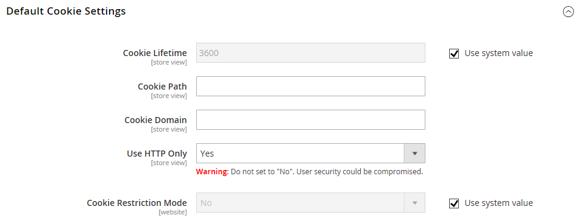

# Durata sessione cliente

La durata di una sessione di acquisto del cliente è determinata da diversi fattori, tra cui la durata della sessione del server, l&#39;utilizzo di un [carrello permanente](../stores-purchase/cart-persistent.md) e la durata delle informazioni memorizzate nel browser. Anche se sono legati alla stessa esperienza del cliente, sono processi separati con eventi di scadenza e durate diversi.

| Processo | Descrizione |
| --- | --- |
| Sessione | Informazioni memorizzate sul server, ad esempio il contenuto del carrello. Se la sessione del server scade prima della scadenza del cookie, i clienti potrebbero perdere il contenuto del carrello e ridurre i rischi per la sicurezza. |
| Cookie di sessione | Informazioni memorizzate nel browser come numero o stringa di caratteri. Se il cookie di sessione scade prima della sessione del server, il cliente viene disconnesso. Il cookie di sessione viene eliminato quando il cliente chiude la finestra del browser. Per impostazione predefinita, la durata del cookie è impostata su 3600 secondi o un’ora. Se durante tale periodo non è presente alcuna attività da tastiera, la sessione corrente termina e i clienti devono effettuare di nuovo l’accesso ai propri account per continuare a fare acquisti. |

{style="table-layout:auto"}

Se [Carrello persistente](../stores-purchase/cart-persistent.md) è abilitato, il contenuto del carrello verrà salvato per la prossima volta che i clienti accedono ai loro account. Quando utilizzi un carrello persistente, ti consigliamo di impostare la durata della sessione del server e del cookie di sessione su un periodo di tempo lungo.

Nel server, la durata della sessione è controllata dal file `php.ini` e da diverse variabili. Attualmente, Adobe Commerce non dispone di un’impostazione di configurazione amministratore che controlla la durata della sessione del server.

## Configurare la durata del cookie

1. Nella barra laterale _Admin_, vai a [!UICONTROL **Archivi**] > _[!UICONTROL Settings]_>[!UICONTROL **Configurazione**].

1. Se sono presenti più archivi, impostare il selettore **[!UICONTROL Store View]** nell&#39;angolo superiore destro sull&#39;archivio in cui si applica la configurazione.

1. Nel pannello a sinistra in **[!UICONTROL General]**, scegli **[!UICONTROL Web]**.

1. Espandere la sezione **[!UICONTROL Default Cookie Settings]**.

   {width="600" zoomable="yes"}

1. Per modificare il valore predefinito, deselezionare la casella di controllo **[!UICONTROL Use system value]** e immettere il nuovo valore in secondi.

1. Al termine, fare clic su **[!UICONTROL Save Config]**.

## Configura funzionalità _Ricorda_

Per semplificare l&#39;accesso, la funzione **[!UICONTROL Remember Me]** consente ai titolari di account utente di evitare di immettere le proprie credenziali ogni volta che accedono alla vetrina. Per motivi di sicurezza, la funzione di persistenza è disattivata per impostazione predefinita.

1. Nella barra laterale _Admin_, passa a **[!UICONTROL Stores]** > _[!UICONTROL Settings]_>**[!UICONTROL Configuration]**.

1. Nel pannello a sinistra, espandi **[!UICONTROL Customers]** e scegli **[!UICONTROL Persistent Shopping Cart]**.

1. Espandere la sezione **[!UICONTROL General Options]**.

1. Per **[!UICONTROL Enable Persistence]**, impostare su `Yes`. Deselezionare la casella di controllo **[!UICONTROL Use system value]** per consentire la modifica dell&#39;impostazione predefinita.

1. Per **[!UICONTROL Enable "Remember Me"]**, impostare su `Yes` o `No` in base alle proprie esigenze.

1. Al termine, fare clic su **[!UICONTROL Save Config]**.
