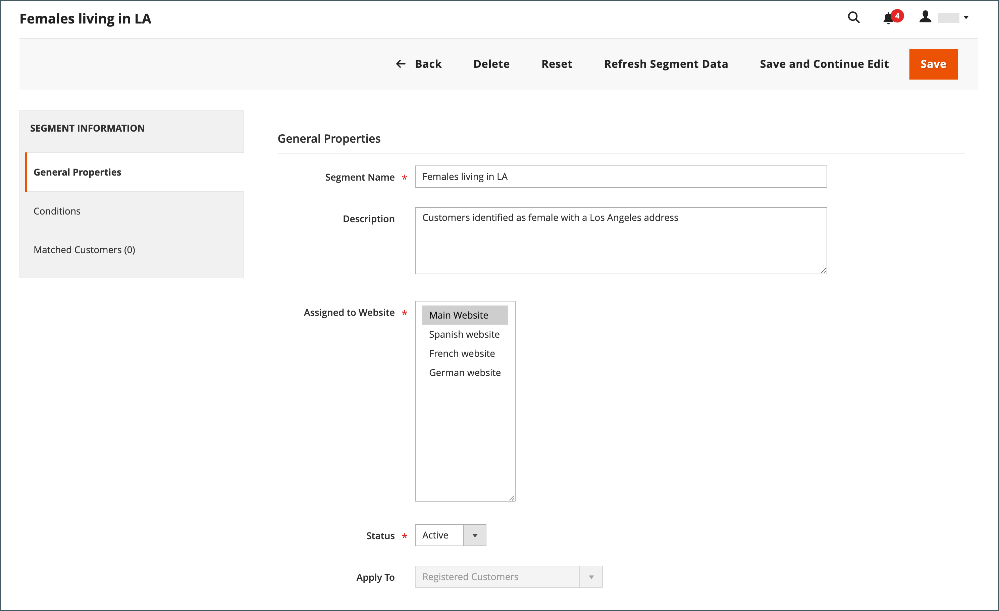

# Creare ed eliminare segmenti di clienti

{{ee-feature}}

La creazione di un segmento cliente è simile alla creazione di una [regola prezzo carrello](../merchandising-promotions/price-rules-cart.md), con la differenza che le opzioni includono [attributi specifici del segmento cliente](../customers/customer-segments.md).

{width="700" zoomable="yes"}

Griglia _**[!UICONTROL Customer Segments]**_

| Colonna | Descrizione |
|--- |--- |
| **[!UICONTROL ID]** | ID univoco del segmento del cliente. |
| **[!UICONTROL Segment]** | Il nome del segmento del cliente. |
| **[!UICONTROL Status]** | Indica se il segmento del cliente è _[!UICONTROL Active]_o_[!UICONTROL Inactive]_. |
| **[!UICONTROL Website]** | Indica il sito web a cui appartiene il segmento di clienti. |

{style="table-layout:auto"}

## Prerequisito: abilitare i segmenti dei clienti

1. Nella barra laterale _Admin_, passa a **[!UICONTROL Stores]** > _[!UICONTROL Settings]_>**[!UICONTROL Configuration]**.

1. Nel pannello a sinistra, espandi **[!UICONTROL Customers]** e scegli **[!UICONTROL Customer Configuration]**.

1. Espandere la sezione **[!UICONTROL Customer Segments]**.

1. Verificare che **[!UICONTROL Enable Customer Segment Functionality]** sia impostato su `Yes`.

   {width="600" zoomable="yes"}

1. (Facoltativo) Per disabilitare la convalida in tempo reale per i segmenti dei clienti, impostare **[!UICONTROL Real-time Check if Customer is Matched by Segment]** su `No`.

   Quando si disattiva la convalida in tempo reale, i segmenti dei clienti vengono convalidati da una singola query SQL combinata. La disattivazione di questa funzione migliora le prestazioni della convalida dei segmenti se nel sistema sono presenti molti segmenti di clienti. Tuttavia, la convalida non funziona con un database suddiviso o quando non vi sono clienti registrati.

1. Al termine, fare clic su **[!UICONTROL Save Config]**.

## Creare un segmento

I passaggi seguenti utilizzano un esempio per creare un segmento di clienti che esegue il targeting di clienti di sesso femminile a Los Angeles.

### Passaggio 1: aggiungere un segmento di cliente

1. Nella barra laterale _Admin_, passa a **[!UICONTROL Customers]** > **[!UICONTROL Segments]**.

1. Nell&#39;angolo superiore destro fare clic su **[!UICONTROL Add Segment]**.

1. Immetti un **[!UICONTROL Segment Name]** che identifica il segmento del cliente quando lavori in Admin.

1. Immetti un breve **[!UICONTROL Description]** che spieghi lo scopo del segmento.

1. Impostare **[!UICONTROL Assigned to Website]** sul sito Web in cui è possibile utilizzare il segmento di clienti.

1. Impostare **[!UICONTROL Status]** su _Attivo_ o _Inattivo_.

1. Per identificare i tipi di clienti che si desidera utilizzare per l&#39;applicazione del segmento, impostare **[!UICONTROL Apply to]** su uno dei seguenti:

   - `Visitors and Registered Customers` - Include tutti gli acquirenti, indipendentemente dal fatto che abbiano effettuato l&#39;accesso a un account.
   - `Registered Customers` - Include solo gli acquirenti che hanno effettuato l&#39;accesso a un account.
   - `Visitors` - Include solo gli acquirenti che non hanno effettuato l&#39;accesso a un account.

   >[!TIP]
   >
   >Se stai creando un segmento basato sugli attributi del cliente memorizzati in un account del cliente, è consigliabile applicare il segmento solo ai clienti registrati.

   >[!NOTE]
   >
   > Se un segmento si applica a `Visitors and Registered Customers`, [!UICONTROL Matched Customers] visualizza solo `Registered Customers`. Questo vale anche se i visitatori possono essere targetizzati in base alle condizioni che si applicano a loro. Solo per i segmenti `Visitors`, non viene visualizzata alcuna scheda `Matched Customers`.

1. Fare clic su **[!UICONTROL Save and Continue Edit]**.

   Dopo aver salvato il segmento _[!UICONTROL General Properties]_, nel pannello a sinistra diventano disponibili opzioni aggiuntive.

   {width="600" zoomable="yes"}

**_[!UICONTROL General Properties]_**

| Campo | Descrizione |
|--- |---|
| **[!UICONTROL Segment Name]** | Nome che identifica il segmento come riferimento interno. |
| **[!UICONTROL Description]** | Una breve descrizione che spiega lo scopo del segmento come riferimento interno. |
| **[!UICONTROL Assigned to Website]** | Il singolo sito web in cui è possibile utilizzare il segmento. |
| **[!UICONTROL Status]** | Attiva e disattiva il segmento. Tutte le regole di prezzo e i banner associati vengono disattivati quando il segmento è disabilitato. Opzioni: `Active` / `Inactive` |
| **[!UICONTROL Apply to]** | Definisce i tipi di clienti a cui viene applicato il segmento. La selezione influenza l’insieme di condizioni disponibili per la creazione del segmento. Non è possibile modificare l’impostazione dopo il salvataggio del segmento. |

{style="table-layout:auto"}

### Passaggio 2: definire le condizioni

>[!NOTE]
>
> Per i visitatori, sono applicabili solo le seguenti condizioni: condizioni del carrello (importo del subtotale del carrello, articoli della riga del carrello e quantità dei prodotti del carrello), regole dei prodotti (prodotti presenti nel carrello e nella cronologia dei prodotti) e combinazioni di questi articoli. Se un segmento deve essere applicato sia ai visitatori che ai clienti registrati, i visitatori vengono tracciati solo in base alle condizioni elencate.

Le condizioni possibili sono organizzate nei seguenti gruppi:

| Gruppo | Descrizione |
|--- |--- |
| **[!UICONTROL Customer]** | Condizioni basate sugli attributi del conto cliente. Disponibile solo se il segmento si applica ai clienti registrati. |
| **[!UICONTROL Shopping Cart]** | Condizioni basate sul contenuto del carrello. Queste condizioni sono disponibili per tutti i tipi di segmento. |
| **[!UICONTROL Products]** | Condizioni basate sui prodotti nel carrello o sulla cronologia di navigazione dei prodotti. Queste condizioni sono disponibili per tutti i tipi di segmento. |
| **[!UICONTROL **Sales]** | Condizioni basate sugli ordini completati. Disponibile solo se il segmento si applica ai clienti registrati. |

1. Nel riquadro sinistro fare clic su **[!UICONTROL Conditions]**.

   La condizione predefinita inizia con _[!UICONTROL If ALL of these conditions are TRUE:]_sulla pagina.

   {width="600" zoomable="yes"}

1. Creare una condizione che esegua il targeting di clienti donne:

   - Fare clic sull&#39;icona **[!UICONTROL Add]** per visualizzare l&#39;elenco delle condizioni e selezionare `Gender`.

   - Lascia l&#39;opzione di controllo condizione predefinita **is**.

   - Fare clic su **...** e selezionare `female`.

   {width="600" zoomable="yes"}

1. Crea un’altra condizione che esegue il targeting per i residenti di Los Angeles:

   - Nella riga successiva fare clic sull&#39;icona **[!UICONTROL Add]** e selezionare `Customer Address`.

     Questa azione crea una condizione padre in cui è possibile definire uno o più campi indirizzo da associare.

   - Fare clic sull&#39;icona **[!UICONTROL Add]** per visualizzare l&#39;elenco dei campi indirizzo e selezionare `City`.

   - Fare clic su **is** per visualizzare le opzioni di controllo della condizione e selezionare `contains`.

   - Fare clic su **...** e immettere `Los Angeles`.

   - Nella riga successiva fare clic sull&#39;icona **[!UICONTROL Add]** e selezionare `State/Province`.

   - Lascia l&#39;opzione di controllo condizione predefinita **is**.

   - Fare clic su **...** e selezionare `United States > California`.

   {width="600" zoomable="yes"}

1. Fare clic su **[!UICONTROL Save and Continue Edit]**.

### Passaggio 3: esaminare l’elenco dei clienti corrispondenti

1. Nel riquadro sinistro fare clic su **[!UICONTROL Matched Customers]** per visualizzare tutti i clienti che soddisfano la condizione.

   {width="600" zoomable="yes"}

1. Se l&#39;elenco dei clienti soddisfa l&#39;obiettivo, fare clic su **[!UICONTROL Save]** per completare il segmento di clienti.

1. Il segmento cliente ora può essere utilizzato per il targeting di promozioni, contenuti e comunicazioni.

Griglia _**[!UICONTROL Matched Customers]**_

| Colonna | Descrizione |
|--- |--- |
| **[!UICONTROL ID]** | L’ID cliente di un cliente registrato. |
| **[!UICONTROL Name]** | Il nome di un cliente registrato. |
| **[!UICONTROL Email]** | L’indirizzo e-mail di un cliente registrato. |
| **[!UICONTROL Group]** | Il gruppo di clienti a cui è assegnato il cliente. |
| **[!UICONTROL Phone]** | Numero di telefono del cliente. |
| **[!UICONTROL ZIP]** | Il codice postale del cliente. |
| **[!UICONTROL Country]** | Il paese in cui si trova il cliente. |
| **[!UICONTROL State / Province]** | Stato o provincia in cui si trova il cliente. |
| **[!UICONTROL Customer Since]** | Data e ora di creazione dell&#39;account cliente. |

{style="table-layout:auto"}

## Rimuovere un segmento di un cliente

1. Nella barra laterale _Admin_, passa a **[!UICONTROL Customers]** > **[!UICONTROL Segments]**.

1. Trova il segmento da eliminare e selezionalo.

1. Nella barra dei menu fare clic sul pulsante **[!UICONTROL Delete]**.

1. Per confermare l&#39;azione, fare clic su **[!UICONTROL OK]**.

## Barra dei pulsanti

| Pulsante | Descrizione |
|--- |--- |
| **[!UICONTROL Back]** | Torna alla pagina _[!UICONTROL Customer Segments]_senza salvare le modifiche. |
| **[!UICONTROL Delete]** | Elimina il segmento cliente corrente. I clienti o gli ordini completati associati al cliente nel segmento non vengono rimossi. |
| **[!UICONTROL Reset]** | Ripristina i valori precedenti delle modifiche non salvate nel modulo del segmento cliente. |
| **[!UICONTROL Refresh Segment Data]** | Aggiorna i dati del segmento ai valori salvati più di recente. Rilevante se i dati di un segmento non sono disponibili o sono obsoleti. |
| **[!UICONTROL Save and Continue Edit]** | Salva le modifiche e mantiene aperto il segmento cliente. |
| **[!UICONTROL Save]** | Salva le modifiche e chiude il segmento del cliente. |

{style="table-layout:auto"}

## Demo sui segmenti dei clienti

Guarda questo video per una dimostrazione della creazione di segmenti di clienti:

>[!VIDEO](https://video.tv.adobe.com/v/343659/?quality=12&learn=on)
