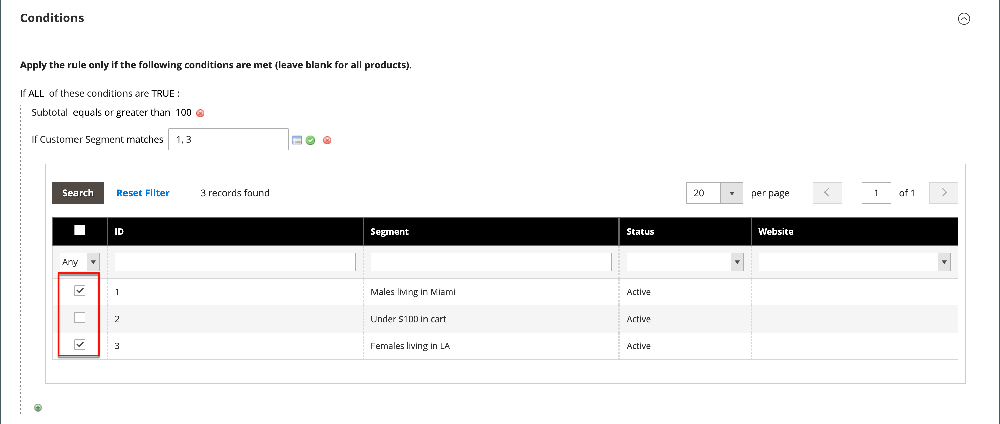

# Segmenti di clienti nelle regole di prezzo

{{ee-feature}}

Un segmento di clienti può essere utilizzato per promozioni mirate associandolo a una [regola prezzo carrello](../merchandising-promotions/price-rules-cart.md).

{width="700" zoomable="yes"}

_**Per associare un segmento a una regola prezzo carrello:**_

1. Nella barra laterale _Amministratore_, passa a **[!UICONTROL Marketing]** > _Promozioni_ > **[!UICONTROL Cart Price Rules]**.

1. Apri una regola nuova o esistente:

   * Per utilizzare una nuova regola, fare clic su **[!UICONTROL Add New Rule]** nell&#39;angolo superiore destro.
   * Per utilizzare una regola esistente, fai clic sulla regola nell’elenco per aprirla in modalità di modifica.

1. Scorri verso il basso ed espandi la sezione **[!UICONTROL Conditions]**.

1. Aggiungi la condizione.

   * Fai clic sull&#39;icona _Aggiungi_ (), che visualizza l&#39;elenco delle condizioni. Quindi, scegliere **[!UICONTROL Customer Segment]**.

   {width="600" zoomable="yes"}

   Per impostazione predefinita, la condizione è impostata per trovare una condizione corrispondente. Se necessario, fare clic sul collegamento **[!UICONTROL matches]** e modificare l&#39;operatore in uno dei seguenti modi:

   * `does not match`
   * `is one of`
   * `is not one of`

   {width="600" zoomable="yes"}

1. Per impostare come destinazione un segmento specifico, fare clic sul collegamento Altro **...** per visualizzare ulteriori opzioni. Quindi, fai clic sull&#39;icona _Selettore_ () per visualizzare l&#39;elenco dei segmenti dei clienti.

1. Nell’elenco, seleziona la casella di controllo di ciascun segmento di cui desideri eseguire il targeting con la condizione.

   {width="600" zoomable="yes"}

1. Fai clic su **[!UICONTROL Select]** per inserire i segmenti cliente selezionati nella condizione.

1. Completare il resto della regola prezzo in base alle esigenze.

1. Al termine, fare clic su **[!UICONTROL Save]**.
