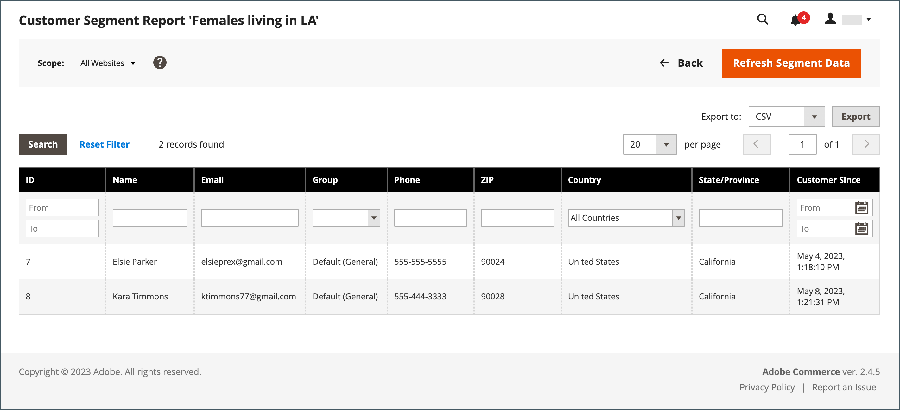

# Rapporto Segmento cliente

{{ee-feature}}

Il rapporto Segmento cliente fornisce informazioni sul numero di clienti in ciascun segmento.

{width="700" zoomable="yes"}

| Colonna | Descrizione |
|--- |--- |
| **[!UICONTROL Select]** | Seleziona la casella di controllo di ciascun segmento da sottoporre a un’azione, oppure utilizza il controllo di selezione nell’intestazione della colonna. Opzioni: `Select All` / `Deselect All` / `Select Visible` / `Unselect Visible` |
| **[!UICONTROL ID]** | Un identificatore numerico univoco assegnato a ciascun segmento |
| **[!UICONTROL Segment]** | Nome segmento |
| **[!UICONTROL Status]** | Stato del segmento. Opzioni: `Active` / `Inactive` |
| **[!UICONTROL Website]** | Sito web a cui è assegnato il segmento |
| **[!UICONTROL Customers]** | Numero di clienti assegnati a un segmento |

{style="table-layout:auto"}

Puoi espandere un elenco di clienti nel segmento ed esportare i dati.

{width="600" zoomable="yes"}

Per assicurarti di disporre dei dati più recenti, devi aggiornare i dati del segmento. Se i dati del segmento non sono disponibili o sono obsoleti, fare clic su **[!UICONTROL Refresh Segment Data]** nella barra dei pulsanti per aggiornare.

1. Per **[!UICONTROL Export to]**, scegliere un formato di esportazione:

   * CSV: file di valori separati da virgole contenente dati in testo normale.
   * XML di Excel: formato di dati per fogli di calcolo basato su XML.

1. Fare clic su **[!UICONTROL Export]**.

   | Colonna | Descrizione |
   |--- |--- |
   | **[!UICONTROL ID]** | Identificatore numerico univoco assegnato a ogni utente |
   | **[!UICONTROL Name]** | Nome cliente |
   | **[!UICONTROL Email]** | Indirizzo e-mail di un cliente registrato |
   | **[!UICONTROL Group]** | Il gruppo di clienti a cui è assegnato il cliente |
   | **[!UICONTROL Phone]** | Numero di telefono del cliente |
   | **[!UICONTROL ZIP]** | Codice postale o CAP in cui si trova il cliente |
   | **[!UICONTROL Country]** | Il paese in cui si trova il cliente |
   | **[!UICONTROL State/Province]** | Stato o provincia in cui si trova il cliente |
   | **[!UICONTROL Customer Since]** | Data e ora di creazione dell&#39;account cliente |

   {style="table-layout:auto"}

1. Il file generato viene salvato automaticamente nel computer locale.
