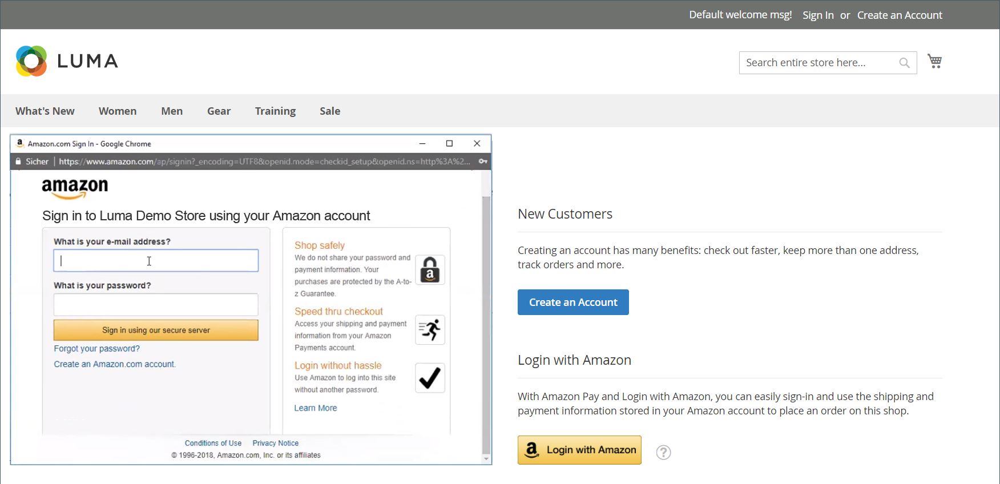

# Accesso cliente

I clienti possono accedere facilmente ai propri account da ogni pagina del tuo negozio. A seconda della [configurazione](../customers/account-options-new.md), i clienti possono essere reindirizzati al dashboard del proprio account o continuare a fare acquisti dopo aver effettuato l’accesso ai propri account.

Se [CAPTCHA](../systems/security-captcha.md) è abilitato nella configurazione, la persona deve completare correttamente un test che li verifica come esseri umani, prima di ottenere l’accesso ai propri account.

Quando i clienti dimenticano le password, viene inviato un collegamento di reimpostazione all’indirizzo e-mail associato all’account. Il [Opzioni password](../customers/password-options.md) la configurazione controlla l’esperienza del cliente per i tentativi di accesso:

- Numero di tentativi di immissione di una password da parte di un cliente
- Numero di minuti tra un tentativo e l&#39;altro
- Numero totale di tentativi prima che l’account venga bloccato
- Lunghezza del blocco

{width="700" zoomable="yes"}

## Accedi a un account cliente

1. Nell’intestazione del negozio, il cliente fa clic su **[!UICONTROL Sign in]**.

   {width="700" zoomable="yes"}

1. Inserisce il proprio **[!UICONTROL Email]** indirizzo e **[!UICONTROL Password]**.

1. Clic **[!UICONTROL Sign in]**.

   >[!IMPORTANT]
   >
   >Se non riesce a ricordare la password, il cliente può fare clic su **[!UICONTROL Forgot Your Password?]** e seguire la [istruzioni](../customers/password-reset.md) per reimpostare la password.

## Imposta il reindirizzamento al dashboard account dopo l’accesso del cliente

Puoi configurare il negozio in modo da reindirizzare i clienti al dashboard dell’account dopo che hanno effettuato l’accesso o da farli continuare a fare acquisti.

1. Il giorno _Amministratore_ barra laterale, vai a **[!UICONTROL Stores]** > _[!UICONTROL Settings]_>**[!UICONTROL Configuration]**.

1. Nel pannello a sinistra, espandi **[!UICONTROL Customers]** e scegli **[!UICONTROL Customer Configuration]**.

1. Espandi **[!UICONTROL Login Options]** sezione.

1. Imposta **[!UICONTROL Redirect Customer to Account Dashboard after Logging in]** a uno dei seguenti elementi:

   - `Yes` - La dashboard dell’account viene visualizzata quando i clienti accedono ai propri account.
   - `No` - I clienti possono continuare a fare acquisti dopo aver effettuato l’accesso al proprio account.

1. Al termine, fai clic su **[!UICONTROL Save Config]**.

## Accedi con Amazon

Per i negozi con [!DNL Amazon Pay] e [!DNL Login with Amazon] integrazione, i clienti possono accedere al proprio account buyer di Amazon.

1. Nell’intestazione del negozio, il cliente fa clic su **[!UICONTROL Sign in]**.

1. Clic **[!UICONTROL Login with Amazon]**.

   {width="700" zoomable="yes"}

1. Quando gli viene richiesto di effettuare l’accesso, il cliente immette **[!UICONTROL email address]** e **[!UICONTROL password]** per il proprio account acquirente Amazon.

   {width="700" zoomable="yes"}

1. Per concedere ad Amazon l’autorizzazione a condividere le seguenti informazioni dal proprio account con lo store durante l’elaborazione degli acquisti, fai clic su **Ok**.

   - Nome
   - Indirizzo e-mail
   - Indirizzi di spedizione

   {width="700" zoomable="yes"}

## Esci da un account cliente

1. Nell’angolo in alto a destra accanto a  _[!UICONTROL Welcome, Customer Name!]_, il cliente fa clic su **[!UICONTROL v]**selettore di menu.

1. Scegli **[!UICONTROL Sign Out]**.

Dopo la disconnessione, il cliente viene reindirizzato alla home page.
