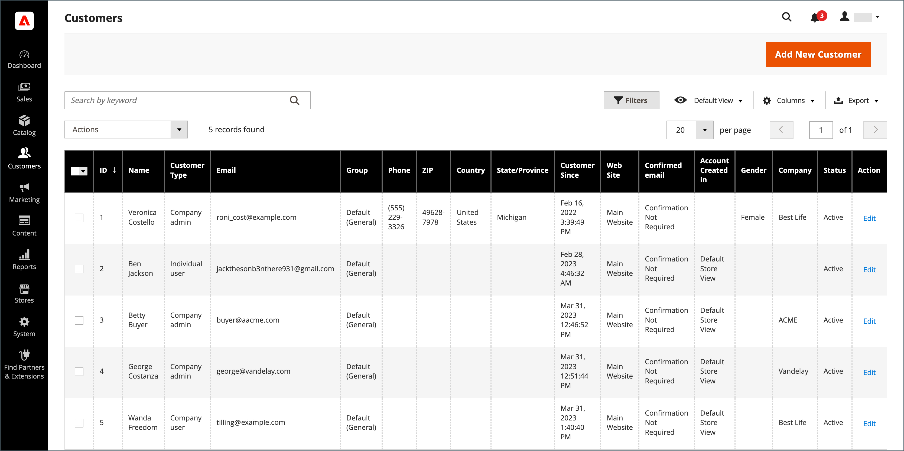

# Elenco clienti

In Admin, il [!UICONTROL Customers] grid elenca tutti i clienti che si sono registrati per un account con il tuo store o che sono stati aggiunti dall’amministratore. Utilizza lo standard [controlli griglia](../getting-started/admin-grid-controls.md) per filtrare l’elenco e regolare il layout delle colonne. Per ulteriori informazioni, consulta [Gestire gli account cliente](../customers/manage-account.md).

{width="700" zoomable="yes"}

## Aggiorna informazioni cliente

1. Il giorno _Amministratore_ barra laterale, vai a **[!UICONTROL Customers]** > **[!UICONTROL All Customers]**.

1. Trova il record del cliente e fai clic su [!UICONTROL **Modifica**] nel _[!UICONTROL Action]_colonna.

1. Nel pannello a sinistra, scegli le informazioni da modificare e apporta le modifiche necessarie.

   >[!NOTE]
   >
   >Per ulteriori informazioni, consulta [Aggiorna account cliente](../customers/update-account.md).

1. Al termine, fai clic su **[!UICONTROL Save Customer]**.

## Controlli di Workspace

| Controllo | Descrizione |
| --- | --- |
| **[!UICONTROL Add New Customer]** | Crea un account cliente. |
| **[!UICONTROL Search]** | Avvia una ricerca di clienti in base ai filtri correnti. |
| **[!UICONTROL Filters]** | Definisce un set di parametri di ricerca utilizzati per filtrare i record visualizzati nel [griglia](../getting-started/admin-grid-controls.md). |
| **[!UICONTROL Default View]** | Determina la colonna predefinita [layout](../getting-started/admin-grid-controls.md) della griglia. |
| **[!UICONTROL Columns]** | Determina la selezione di [colonne](../getting-started/admin-grid-controls.md) e i relativi account nella griglia. Il layout delle colonne può essere modificato e salvato come _visualizza_. Per impostazione predefinita, nella griglia sono incluse solo alcune colonne. |
| **[!UICONTROL Export]** | Esporta i record selezionati come file CSV o XML di Excel. |

{style="table-layout:auto"}

## Colonne

| Colonna | Descrizione |
| --- | --- |
| **[!UICONTROL Select]** | Gestisce le selezioni delle caselle di controllo per i record cliente per l&#39;applicazione di un&#39;azione. È inoltre possibile utilizzare il controllo di selezione nell&#39;intestazione di colonna per selezionare/deselezionare tutti gli elementi. |
| **[!UICONTROL ID]** | Un identificatore numerico univoco assegnato al momento della creazione dell’account del cliente. |
| **[!UICONTROL Name]** | Nome e cognome del cliente. |
| **[!UICONTROL Email]** | L’indirizzo e-mail del cliente. |
| **[!UICONTROL Group]** | Il gruppo di clienti a cui è assegnato il cliente. |
| **[!UICONTROL Phone]** | Numero di telefono del cliente. |
| **[!UICONTROL ZIP]** | Il codice postale del cliente. |
| **[!UICONTROL Country]** | Il paese in cui si trova il cliente. |
| **[!UICONTROL State/Province]** | Stato o provincia in cui si trova il cliente. |
| **[!UICONTROL Customer Since]** | Data e ora di creazione dell&#39;account cliente. |
| **[!UICONTROL Web Site]** | Sito Web nella gerarchia del punto vendita a cui è associato l&#39;account del cliente. |
| **[!UICONTROL Confirmed Email]** | Indica se è necessario un messaggio e-mail di conferma. |
| **[!UICONTROL Account Created In]** | Indica la visualizzazione del punto vendita da cui è stato creato l&#39;account cliente. |
| **[!UICONTROL Date of Birth]** | La data di nascita del cliente.   **_Importante:_**In linea con le attuali best practice in materia di sicurezza e privacy, tieni presente eventuali rischi legali e di sicurezza associati all’archiviazione della data di nascita completa (mese, giorno, anno) dei clienti con altri identificatori personali. Si consiglia di limitare la memorizzazione delle date di nascita complete dei clienti e di utilizzare l’anno di nascita del cliente come alternativa. |
| **[!UICONTROL Tax / VAT Number]** | Se applicabile, il codice fiscale o [imposta sul valore aggiunto](../stores-purchase/vat.md) numero assegnato al cliente.   Questo campo non corrisponde alla partita IVA. |
| **[!UICONTROL Gender]** | Il genere del cliente. |
| **[!UICONTROL Action]** | Modifica: apre l’account società in modalità di modifica. |

{style="table-layout:auto"}

### Colonne aggiuntive

Queste colonne sono disponibili modificando la [layout colonna](../getting-started/admin-grid-controls.md) della griglia.

| Colonna | Descrizione |
| --- | --- |
| **[!UICONTROL Company]** | Il nome aziendale del cliente. |
| **[!UICONTROL Street Address]** | Indirizzo del cliente. |
| **[!UICONTROL City]** | La città in cui si trova il cliente. |
| **[!UICONTROL Fax]** | Numero di fax del cliente, se applicabile. |
| **[!UICONTROL Billing Firstname]** | Il nome nell’indirizzo di fatturazione del cliente. |
| **[!UICONTROL Billing Lastname]** | Cognome nell’indirizzo di fatturazione del cliente. |
| **[!UICONTROL Billing Address]** | Indirizzo a cui devono essere inviate le informazioni di fatturazione. |
| **[!UICONTROL Shipping Address]** | Indirizzo dove devono essere spediti gli ordini. |
| **[!UICONTROL VAT Number]** | Numero di partita IVA associato all&#39;indirizzo del cliente. Per [beni digitali](../stores-purchase/taxes.md) venduta nell&#39;UE, l&#39;IVA si basa sull&#39;indirizzo di fatturazione del cliente.   Questo campo non corrisponde alla partita IVA/imposta. |
| **[!UICONTROL Account Lock]** | Indica lo stato dell’account. Come misura di sicurezza, i conti cliente possono essere [bloccato](../customers/password-options.md) dopo troppi tentativi di accesso. Valori: `Locked` / `Unlocked` |

{style="table-layout:auto"}
