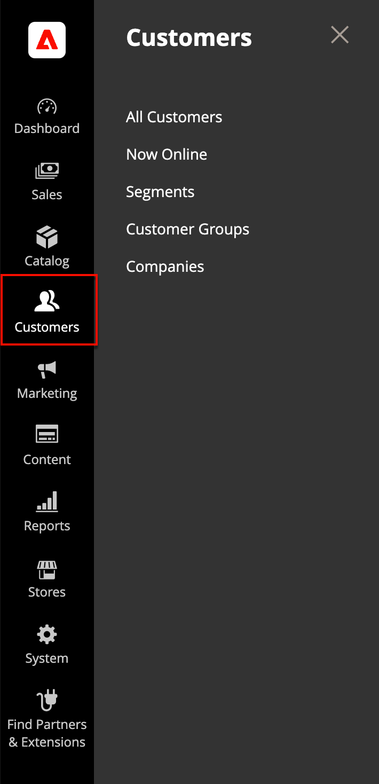

# Introduzione alla gestione dei clienti

Il _[!UICONTROL Customers]_Il menu consente di accedere agli strumenti di gestione degli account dei clienti e di vedere chi è online nel negozio.

{width="300" zoomable="yes"}

## Visualizza [!UICONTROL Customers] menu

Il giorno _Amministratore_ barra laterale, fai clic su [!UICONTROL Customers] per visualizzare le opzioni del menu:

| Campo | Descrizione |
|---|---|
| [!UICONTROL All Customers] | Elenca tutti [clienti](../customers/customers-all.md) che si sono registrati per un account con il tuo archivio o che sono stati aggiunti dall’amministratore. |
| [!UICONTROL Now Online] | Elenca tutti i clienti e i visitatori attualmente [online](../customers/now-online.md) nel tuo negozio. |
| [!UICONTROL Segments] | Elenca le [segmenti cliente](../customers/customer-segments.md) utilizzati per visualizzare in modo dinamico contenuti e promozioni a clienti specifici in base a varie proprietà. |
| [!UICONTROL Customer Groups] | Il [gruppi di clienti](../customers/customer-groups.md) determinare quali sconti sono disponibili per gli acquirenti e la classe di imposta per l’acquisto. |
| [!UICONTROL Companies] | (Richiede B2B per Adobe Commerce) Elenca tutte le attività [account società](../b2b/account-companies.md) e in attesa, indipendentemente dall’impostazione dello stato, e fornisce gli strumenti utilizzati per creare e [gestire](../b2b/account-company-manage.md) account aziendali. |

{style="table-layout:auto"}
