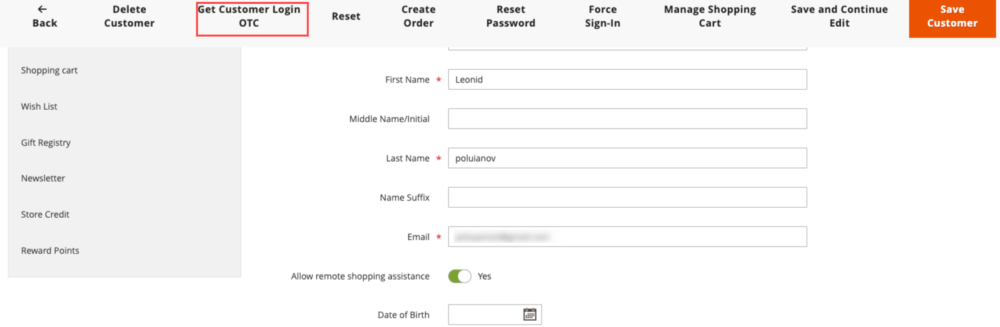

# Fornire assistenza agli acquirenti

A volte, i clienti hanno bisogno di assistenza per il loro ordine. Gli amministratori dello store possono utilizzare _Accedi come cliente_, per consentire loro di visualizzare ciò che vede il cliente e apportare aggiornamenti per assisterlo.

Tutte le azioni intraprese durante l’accesso come cliente vengono applicate all’account del cliente effettivo.

>[!BEGINTABS]

>[!TAB Adobe Commerce]

[!BADGE Solo PaaS]{type=Informative url="https://experienceleague.adobe.com/it/docs/commerce/user-guides/product-solutions" tooltip="Applicabile solo ai progetti Adobe Commerce on Cloud (infrastruttura PaaS gestita da Adobe) e ai progetti on-premise."}

Quando è abilitato per un utente _Admin_, il pulsante _[!UICONTROL Login as Customer]_&#x200B;viene visualizzato in più pagine:

* [Pagina Modifica cliente](../customers/update-account.md)
* [Pagina Vista ordine](../stores-purchase/order-processing.md)
* [Pagina Visualizzazione fattura](../stores-purchase/invoices.md)
* [Pagina Visualizzazione spedizione](../stores-purchase/shipments.md)
* [Pagina di visualizzazione nota di credito](../stores-purchase/credit-memo-create.md)

{width="600" zoomable="yes"}

>[!TAB Adobe Commerce as a Cloud Service]

[!BADGE Solo SaaS]{type=Positive url="https://experienceleague.adobe.com/it/docs/commerce/user-guides/product-solutions" tooltip="Applicabile solo ai progetti Adobe Commerce as a Cloud Service e Adobe Commerce Optimizer (infrastruttura SaaS gestita da Adobe)."}

In Adobe Commerce as a Cloud Service, la funzione Accedi come cliente utilizza un flusso di lavoro **One-Time Code (OTC)** invece di un accesso diretto. Gli amministratori generano un codice monouso di breve durata per un cliente. Questo codice può quindi essere scambiato con un token di accesso del cliente tramite GraphQL, abilitando l’accesso senza password come flussi di lavoro del cliente per scenari di acquisto assistito dal venditore.

La feature comprende i seguenti componenti:

* **Interfaccia utente amministratore** - Nella pagina di modifica del cliente, gli amministratori possono richiedere un codice monouso (OTC) invece di accedere direttamente come cliente.
* **[REST API](https://developer.adobe.com/commerce/webapi/rest/saas-integrations/login-as-customer/)** - Endpoint programmatico per la generazione OTC, utile per script di amministrazione e integrazioni di terze parti.
* **API GraphQL** - Mutazioni che scambiano un OTC con un token di accesso del cliente per flussi commerciali storefront o headless.

>[!ENDTABS]

## Abilita accesso come cliente

Per abilitare _l&#39;accesso come cliente_ è necessario abilitare la funzionalità nell&#39;istanza di Commerce e quindi l&#39;accesso per gli utenti amministratori nelle autorizzazioni del ruolo utente.

### Abilita la funzione

1. Nella barra laterale di amministrazione, vai a **[!UICONTROL Stores]** > _[!UICONTROL Settings]_>**[!UICONTROL Configuration]**.

1. Nel pannello a sinistra, espandi **[!UICONTROL Customers]** e scegli **[!UICONTROL Login as Customer]**.

   {width="600" zoomable="yes"}

1. Imposta **[!UICONTROL Enable Login as Customer]** su `Yes`.

1. _(Facoltativo)_ Imposta **[!UICONTROL Disable Page Cache for Admin User]** su `No` per abilitare la cache delle pagine quando l&#39;utente amministratore effettua l&#39;accesso come cliente.

   >[!WARNING]
   >
   > La disabilitazione della cache delle pagine (`Yes` - impostazione predefinita) garantisce che l&#39;utente che accede come cliente riceva dati aggiornati e non memorizzati nella cache.

1. _(Facoltativo)_ Impostare **[!UICONTROL Store View to Log in]** su `Manual Selection` se si dispone di una configurazione multisito e/o multisito e si desidera che l&#39;utente amministratore selezioni la visualizzazione archivio quando si effettua l&#39;accesso come cliente.

1. Al termine, fare clic su **[!UICONTROL Save Config]**.

### Abilitare l’accesso per gli utenti amministratori

1. Nella barra laterale _Admin_, vai a **[!UICONTROL System]** > _Autorizzazioni_ > **[!UICONTROL User Roles]**.

1. Fare clic sul ruolo nell&#39;elenco.

1. Nel pannello sinistro [!UICONTROL _Informazioni ruolo_], fare clic su **[!UICONTROL Role Resources]**.

1. Cambia **[!UICONTROL Role Resources]** sulla pagina in `Custom`.

   >[!INFO]
   >
   > Quando questa opzione è selezionata, nella pagina viene visualizzata la gerarchia delle risorse.

1. Scorri fino all&#39;elemento padre **[!UICONTROL Customers]** e all&#39;elemento **[!UICONTROL Login as Customer]** sottostante. Quindi, seleziona le risorse da abilitare per il ruolo:

   * **[!UICONTROL Allow Login as Customer]** - Consente all&#39;utente amministratore di utilizzare la funzionalità _Accedi come cliente_.
   * **[!UICONTROL View Login as Customer Log]** - Consente all&#39;utente amministratore di visualizzare il registro _Accedi come cliente_.

   {width="400" zoomable="yes"}

1. Fare clic su **[!UICONTROL Save Role]**.

## Autorizzazione account cliente per assistenza acquisti remoti

Per abilitare l’accesso all’account per il personale di supporto al negozio da parte dell’amministratore, un cliente deve abilitare la funzione per il proprio account:

>[!BEGINTABS]

>[!TAB Adobe Commerce]

[!BADGE Solo PaaS]{type=Informative url="https://experienceleague.adobe.com/it/docs/commerce/user-guides/product-solutions" tooltip="Applicabile solo ai progetti Adobe Commerce on Cloud (infrastruttura PaaS gestita da Adobe) e ai progetti on-premise."}

1. Il cliente passa alla pagina **[!UICONTROL Account Information]**.

1. Seleziona la casella di controllo **[!UICONTROL Allow remote shopping assistance]**.

1. Il cliente fa clic su **[!UICONTROL Save]**.

{width="700" zoomable="yes"}

>[!TAB Adobe Commerce as a Cloud Service]

[!BADGE Solo SaaS]{type=Positive url="https://experienceleague.adobe.com/it/docs/commerce/user-guides/product-solutions" tooltip="Applicabile solo ai progetti Adobe Commerce as a Cloud Service e Adobe Commerce Optimizer (infrastruttura SaaS gestita da Adobe)."}

L&#39;attributo dell&#39;estensione `login_as_customer_assistance_allowed` del cliente deve essere impostato su **2**. Questa può essere configurata nella pagina **Modifica cliente** dell&#39;amministratore o tramite GraphQL durante la creazione o la modifica di un cliente.

>[!WARNING]
>
>Senza questa autorizzazione, un utente amministratore non può accedere come questo cliente.

{width="600" zoomable="yes"}

Per impostare questa autorizzazione con GraphQL per un account cliente esistente, impostare l&#39;input `allow_remote_shopping_assistance` su `true` utilizzando le mutazioni [`updateCustomerV2`](https://developer.adobe.com/commerce/webapi/graphql/schema/customer/mutations/update-v2/) o [`createCustomerV2`](https://developer.adobe.com/commerce/webapi/graphql/schema/customer/mutations/create-v2/).

>[!ENDTABS]

## Accedi come cliente dall’Amministratore

>[!BEGINTABS]

>[!TAB Adobe Commerce]

[!BADGE Solo PaaS]{type=Informative url="https://experienceleague.adobe.com/it/docs/commerce/user-guides/product-solutions" tooltip="Applicabile solo ai progetti Adobe Commerce on Cloud (infrastruttura PaaS gestita da Adobe) e ai progetti on-premise."}

1. Nella barra laterale _Admin_, passa a **[!UICONTROL Customers]** > [!UICONTROL _Tutti i clienti_].

1. Apri un utente in modalità di modifica.

1. Nel pannello **[!UICONTROL Customer Information]** scegliere la sezione **[!UICONTROL Account Information]**.

1. Imposta **[!UICONTROL Allow remote shopping assistance]** su `Yes`.

   >[!INFO]
   >
   >L’amministratore può ora accedere come utente senza la sua autorizzazione dalla vetrina.

>[!TAB Adobe Commerce as a Cloud Service]

[!BADGE Solo SaaS]{type=Positive url="https://experienceleague.adobe.com/it/docs/commerce/user-guides/product-solutions" tooltip="Applicabile solo ai progetti Adobe Commerce as a Cloud Service e Adobe Commerce Optimizer (infrastruttura SaaS gestita da Adobe)."}

>[!NOTE]
>
>Per informazioni sull&#39;implementazione di questa funzionalità con REST, consulta la documentazione API REST [Accedi come cliente](https://developer.adobe.com/commerce/webapi/rest/saas-integrations/login-as-customer/).

### Richiedere un codice monouso (OTC) all’amministratore

1. Passare a **[!UICONTROL Customers]** e selezionare un cliente per aprire la pagina di modifica.

1. Nella pagina Modifica cliente fare clic su **[!UICONTROL Get Customer Login OTC]**.

   {width="600" zoomable="yes"}

1. Immettere un **[!UICONTROL Reason]** (obbligatorio) e fare clic su **[!UICONTROL Request]**.

   {width="600" zoomable="yes"}

   >[!NOTE]
   >
   >Il campo **Reason** è obbligatorio. Viene passato al flusso di generazione OTP ed è riservato per l’utilizzo nelle prossime funzioni di controllo e registrazione degli eventi.

1. L’OTC generato viene visualizzato nel modale. Usa questo codice con la mutazione GraphQL `generateCustomerToken` o `exchangeOtpForCustomerToken` per l&#39;autorizzazione del cliente.

   {width="300" zoomable="yes"}

>[!IMPORTANT]
>
>L’OTC del codice monouso generato è valido per 30 secondi per impostazione predefinita e viene invalidato dopo un singolo utilizzo. Il TTL può essere configurato inviando un [ticket di supporto](https://experienceleague.adobe.com/home?lang=it&support-tab=home#support).

Dopo aver generato il codice una tantum, puoi utilizzarlo accedendo alla vetrina e accedendo utilizzando le seguenti credenziali:

* **E-mail**: indirizzo e-mail del cliente
* **Password**: codice monouso (OTC) generato

>[!ENDTABS]

## Usa l&#39;accesso come cliente

>[!INFO]
>
>Per utilizzare _Accedi come cliente_, assicurati che l&#39;amministratore sia configurato come descritto in precedenza.

_Accedi come cliente_ ti consente di visualizzare il sito esattamente come il cliente, nonché di risolvere i problemi e intraprendere altre azioni per il cliente. Se ti è stato assegnato un ruolo utente con le autorizzazioni necessarie:

1. È possibile fare clic su **[!UICONTROL Login as Customer]** nelle pagine elencate nella sezione precedente.
1. Le azioni Accedi come cliente sono disponibili nel rapporto Azioni.

>[!WARNING]
>
>Tutte le azioni intraprese durante l&#39;accesso a [!UICONTROL _come cliente_] (ad esempio aggiungere/rimuovere prodotti) vengono applicate all&#39;ordine del cliente effettivo. Nella vetrina viene visualizzato un banner quando sei `logged in as customer_name` per fornire un promemoria dello stato speciale.

## Accedi come registrazione cliente

{{ee-feature}}

Adobe Commerce fornisce una registrazione per le azioni _Accedi come cliente_. Elenca tutte le sessioni in cui un utente amministratore accede alla funzione. Per accedere alle azioni registrate, passare al [Rapporto azioni amministratore](../systems/action-log-report.md).

È possibile filtrare l&#39;impostazione del report **[!UICONTROL Action Group]** su `Login As Customer` nella parte superiore della pagina e fare clic su **[!UICONTROL Search]**.

{width="700" zoomable="yes"}
