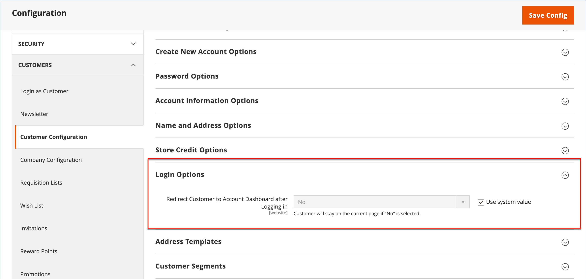

# Pagina di destinazione di accesso del cliente

Puoi configurare il negozio in modo da reindirizzare i clienti al dashboard dell’account dopo che hanno effettuato l’accesso o consentire loro di continuare a fare acquisti.

1. Nella barra laterale _Admin_, passa a **[!UICONTROL Stores]** > _[!UICONTROL Settings]_>**[!UICONTROL Configuration]**.

1. Nel pannello a sinistra, espandi **[!UICONTROL Customers]** e scegli **[!UICONTROL Customer Configuration]**.

1. Espandere la sezione **[!UICONTROL Login Options]**.

   {width="600" zoomable="yes"}

1. Imposta **[!UICONTROL Redirect Customer to Account Dashboard after Logging in]** su uno dei seguenti:

   - `Yes` - Il dashboard account viene visualizzato quando i clienti accedono ai propri account.
   - `No` - I clienti possono continuare a fare acquisti dopo aver effettuato l&#39;accesso ai loro account.

   >[!INFO]
   >
   >Se necessario, deselezionare la casella di controllo **[!UICONTROL User system value]** per apportare la modifica.

1. Al termine, fare clic su **[!UICONTROL Save Config]**.
