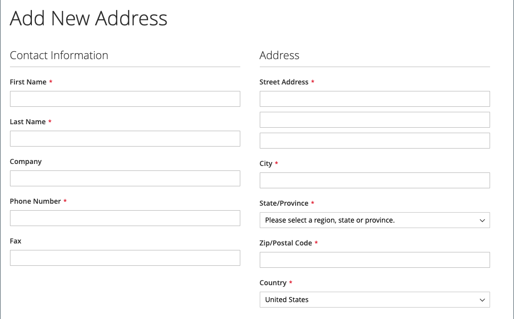
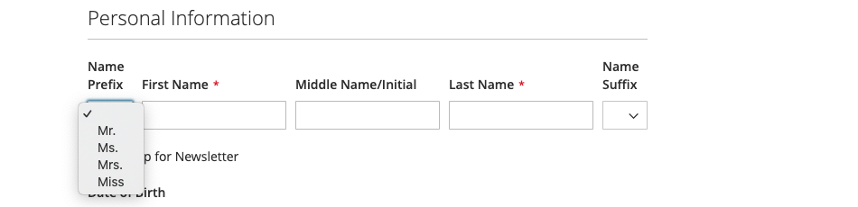

# Opzioni per nome e indirizzo cliente

Le _opzioni nome e indirizzo_ determinano quali campi sono inclusi nei moduli nome e indirizzo quando i clienti creano un [account](../customers/account-create.md) con lo store.

{width="500" zoomable="yes"}

I passaggi per configurare le opzioni di nome e indirizzo sono diversi per Adobe Commerce e Magento Open Source.

## Configurare le opzioni di nome e indirizzo per Adobe Commerce

Puoi configurare le opzioni di nome e indirizzo che vengono presentate ai clienti nella vetrina quando creano il proprio account.

### Passaggio 1: impostare l’ambito della configurazione

1. Nella barra laterale _Admin_, passa a **[!UICONTROL Stores]** > _[!UICONTROL Settings]_>**[!UICONTROL Configuration]**.

1. Nel pannello a sinistra, espandi **[!UICONTROL Customers]** e scegli **[!UICONTROL Customer Configuration]**.

1. Espandere la sezione **[!UICONTROL Name and Address Options]**.

   >[!INFO]
   >
   >Si noti che l&#39;ambito delle opzioni di nome e indirizzo si applica al livello `website`.

1. Scorri verso l’alto fino alla parte superiore della pagina e imposta l’ambito della configurazione su uno dei seguenti:

   - `Default Config`
   - `Main Website` (o sito specifico per installazioni multisito)

   >[!INFO]
   >
   >La sezione _[!UICONTROL Name and Address Options]_&#x200B;non viene visualizzata quando l&#39;ambito è impostato su `Default Store View`.

   {width="700" zoomable="yes"}

### Passaggio 2: configurare le opzioni relative a nome e indirizzo

1. Torna alla sezione [!UICONTROL _Opzioni nome e indirizzo_] della pagina Configurazione cliente.

   >[!INFO]
   >
   > Se non si utilizza l&#39;impostazione dell&#39;ambito `Default config`, è necessario deselezionare la casella di controllo `Use Default` per ogni campo prima di modificare il valore.

   {width="600" zoomable="yes"}

1. Per **[!UICONTROL Prefix Dropdown Options]**, immettere ogni prefisso che si desidera visualizzare nell&#39;elenco, separato da un punto e virgola.

   >[!IMPORTANT]
   >
   >Inserire un punto e virgola prima del primo valore per visualizzare un valore vuoto nella parte superiore dell&#39;elenco.

1. Per **[!UICONTROL Suffix Dropdown Options]**, immettere ogni suffisso che si desidera visualizzare nell&#39;elenco, separato da un punto e virgola.

1. Per includere i campi seguenti nei moduli dei clienti, impostare il valore di ciascuno su `Optional` o `Required`, in base alle esigenze.

   - **[!UICONTROL Show Telephone]**
   - **[!UICONTROL Show Company]**
   - **[!UICONTROL Show Fax]**

### Passaggio 3: salvare e aggiornare

1. Al termine, fare clic su **[!UICONTROL Save Config]**.

1. Nel messaggio nella parte superiore della pagina, fai clic su **[!UICONTROL Cache Management]** e [aggiorna](../systems/cache-management.md) ogni cache non valida.

## Configurare le opzioni di nome e indirizzo per il Magento Open Source

Configura le opzioni di nome e indirizzo presentate ai clienti nella vetrina quando creano il proprio account.

{width="500" zoomable="yes"}

### Passaggio 1: impostare l’ambito della configurazione

1. Nella barra laterale _Admin_, passa a **[!UICONTROL Stores]** > _[!UICONTROL Settings]_>**[!UICONTROL Configuration]**.

1. Nel pannello a sinistra, espandi **[!UICONTROL Customers]** e scegli **[!UICONTROL Customer Configuration]**.

1. Espandere la sezione **[!UICONTROL Name and Address Options]**.

   >[!IMPORTANT]
   >
   > Si noti che l&#39;ambito delle opzioni di nome e indirizzo si applica al livello `website`.

   {width="600" zoomable="yes"}

1. Scorri verso l’alto fino alla parte superiore della pagina e imposta l’ambito della configurazione su uno dei seguenti:

   - `Default Config`
   - `Main Website` (o sito specifico per installazioni multisito)

   >[!NOTE]
   >
   >La sezione _Opzioni nome e indirizzo_ non viene visualizzata quando l&#39;ambito è impostato su `Default Store View`.

   {width="600" zoomable="yes"}

### Passaggio 2: configurare le opzioni relative a nome e indirizzo

1. Torna alla sezione [!UICONTROL _Opzioni nome e indirizzo_] della pagina Configurazione cliente.

   >[!INFO]
   >
   >Se non si utilizza l&#39;impostazione dell&#39;ambito `Default config`, è necessario deselezionare la casella di controllo `Use Default` per ogni campo prima di modificare il valore.

1. Per **Numero di righe in un indirizzo**, immettere un numero compreso tra 1 e 4.

   >[!WARNING]
   >
   >Per impostazione predefinita, l&#39;indirizzo stradale è composto da tre righe.

1. Per includere nel nome un prefisso, ad esempio Sig o Sig.ra, impostare **Mostra prefisso** su `Yes`.

   {width="600" zoomable="yes"}

   >[!INFO]
   >
   >Per **Opzioni elenco a discesa Prefisso**, immettere ogni prefisso che si desidera visualizzare nell&#39;elenco, separato da un punto e virgola. È possibile inserire un punto e virgola prima del primo valore per visualizzare un valore vuoto nella parte superiore dell&#39;elenco.

1. Per includere un campo facoltativo per il secondo nome o l&#39;iniziale del cliente, impostare **[!UICONTROL Show Middle Name (initial)]** su `Yes`.

1. Per includere un suffisso, ad esempio Jr. o Sr.) dopo il nome del cliente, impostare **[!UICONTROL Show Suffix]** su uno dei seguenti valori:

   - `Optional`
   - `Required`

   >[!INFO]
   >
   >Per **Opzioni elenco a discesa suffisso**, immettere ogni suffisso che si desidera visualizzare nell&#39;elenco, separandolo con un punto e virgola. È possibile inserire un punto e virgola prima del primo valore per visualizzare un valore vuoto nella parte superiore dell&#39;elenco.

1. Per includere la data di nascita, impostare **[!UICONTROL Show Date of Birth]** su una delle seguenti opzioni:

   - `Optional`
   - `Required`

   >[!INFO]
   >
   >In linea con le attuali best practice in materia di sicurezza e privacy, tieni presente eventuali rischi legali e di sicurezza associati all’archiviazione della data di nascita completa (mese, giorno, anno) dei clienti con altri identificatori personali. Si consiglia di limitare la memorizzazione delle date di nascita complete dei clienti e, in alternativa, di utilizzare l’anno di nascita del cliente.

   I clienti possono utilizzare l’icona Calendario dopo il campo per scegliere la data di nascita da un calendario a comparsa.

   {width="600" zoomable="yes"}

1. Per consentire ai clienti di immettere il numero di imposta o [IVA](../stores-purchase/vat.md), impostare **[!UICONTROL Show Tax/VAT Number]** su uno dei seguenti valori:

   - `Optional`
   - `Required`

1. Per includere un campo relativo al genere nel modulo del cliente, impostare **[!UICONTROL Show Gender]** su uno dei seguenti valori:

   - `Optional`
   - `Required`

   {width="600" zoomable="yes"}

1. Per includere i campi seguenti nei moduli dei clienti, impostare il valore di ciascuno su `Optional` o `Required`, in base alle esigenze.

   - **[!UICONTROL Show Telephone]**
   - **[!UICONTROL Show Company]**
   - **[!UICONTROL Show Fax]**

### Passaggio 3: salvare e aggiornare

1. Al termine, fare clic su **[!UICONTROL Save Config]**.

1. Nel messaggio nella parte superiore della pagina, fai clic su **[!UICONTROL Cache Management]** e [aggiorna](../systems/cache-management.md) ogni cache non valida.
