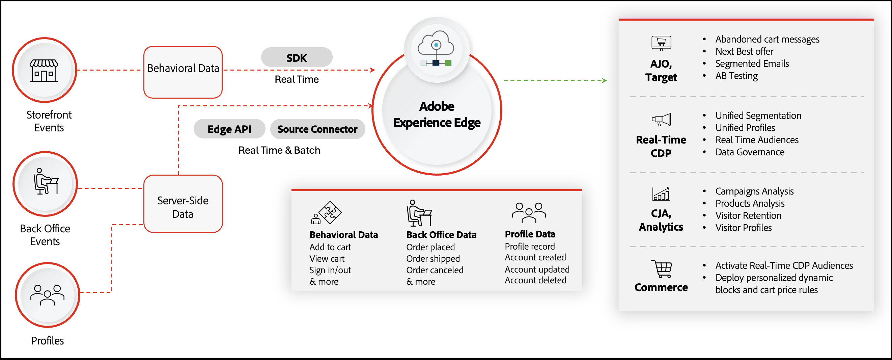

# Creare esperienze coinvolgenti e personalizzate su larga scala

L&#39;Adobe [!DNL Commerce] offre un potente toolkit per personalizzare ogni punto di contatto del cliente, aumentando il coinvolgimento, la conversione e i ricavi degli acquirenti.

In questo articolo imparerai:

- Cos’è la personalizzazione?
- Di quali dati ho bisogno per ottenere la personalizzazione?
- Come sblocca la personalizzazione con Adobe [!DNL Commerce]?
- Casi d’uso di personalizzazione disponibili

## Cos’è la personalizzazione?

Personalization significa personalizzare gli aspetti dell&#39;esperienza di acquisto di ogni cliente in base alle sue esigenze, al suo contesto e alle sue preferenze. Personalization non si limita ai contenuti sul sito o alla raccomandazione di prodotti best-fit, ma include tutti i punti di contatto del percorso di clienti, tra cui:

- **Campagne e comunicazioni** - Consegna di messaggi pertinenti e coerenti tramite campagne e comunicazioni
- **Individuazione prodotto** - Visualizzazione dei prodotti giusti ai clienti giusti nei momenti giusti
- **Promozioni e offerte** - Targeting di promozioni e offerte per indirizzare ogni cliente alla conversione
- **Esperienze di contenuto** - Personalizzazione del contenuto del sito per un livello di iper-rilevanza per ciascun cliente e il relativo percorso

{width="700" zoomable="yes"}

Anche se questo tipo di esperienze personalizzate può sembrare realizzabile per un piccolo sottoinsieme di clienti, personalizzando su larga scala per migliaia o milioni di clienti in ogni punto di contatto e canale, il tutto in tempo reale può sembrare impossibile. Nelle sezioni seguenti viene illustrato come Adobe [!DNL Commerce] e Adobe Experience Cloud possono essere utili.

## Di quali dati ho bisogno per ottenere la personalizzazione?

Una personalizzazione efficace richiede contesto o segnali che forniscano informazioni sui clienti e che possano quindi essere utilizzati per modificare la loro esperienza. Nella tabella seguente vengono illustrati i vari tipi di dati e il ruolo svolto dall&#39;Adobe [!DNL Commerce] nel supporto della raccolta e dell&#39;attivazione di tali dati.

| Tipi di dati | Dati storefront (eventi comportamentali) | Dati di back office (eventi lato server) | Profilo cliente e dati dei segmenti |
|---|---|---|---|
| **Definizione** | Clic o azioni eseguite dai clienti sul sito. | Informazioni sul ciclo di vita e dettagli di ciascun ordine (passato e corrente). | Chi sono i tuoi acquirenti e a quali segmenti si qualificano. |
| **Eventi acquisiti da Adobe Commerce** | [pageView](https://experienceleague.adobe.com/en/docs/commerce-merchant-services/data-connection/event-forwarding/events#pageview) [productPageView](https://experienceleague.adobe.com/en/docs/commerce-merchant-services/data-connection/event-forwarding/events) [searchRequestSent](https://experienceleague.adobe.com/en/docs/commerce-merchant-services/data-connection/event-forwarding/events#searchrequestsent) [searchResponseReceived](https://experienceleague.adobe.com/en/docs/commerce-merchant-services/data-connection/event-forwarding/events#searchresponsereceived) [addToCart](https://experienceleague.adobe.com/en/docs/commerce-merchant-services/data-connection/event-forwarding/events#addtocart) [openCart](https://experienceleague.adobe.com/en/docs/commerce-merchant-services/data-connection/event-forwarding/events#opencart) [signIn](https://experienceleague.adobe.com/en/docs/commerce-merchant-services/data-connection/event-forwarding/events#signin) [signOut](https://experienceleague.adobe.com/en/docs/commerce-merchant-services/data-connection/event-forwarding/events#signout) [startCheckout](https://experienceleague.adobe.com/en/docs/commerce-merchant-services/data-connection/event-forwarding/events#startcheckout) [completeCheckout](https://experienceleague.adobe.com/en/docs/commerce-merchant-services/data-connection/event-forwarding/events#completecheckout) [createRichiesteList](https://experienceleague.adobe.com/en/docs/commerce-merchant-services/data-connection/event-forwarding/events#createrequisitionlist) [addElencoRichieste](https://experienceleague.adobe.com/en/docs/commerce-merchant-services/data-connection/event-forwarding/events#addtorequisitionlist) [removeFromRichiesteList](https://experienceleague.adobe.com/en/docs/commerce-merchant-services/data-connection/event-forwarding/events#removefromrequisitionlist) | **Stato ordine**: [orderPlaced](https://experienceleague.adobe.com/en/docs/commerce-merchant-services/data-connection/event-forwarding/events-backoffice#orderplaced) [orderItemsReturnedInitiated](https://experienceleague.adobe.com/en/docs/commerce-merchant-services/data-connection/event-forwarding/events-backoffice#orderitemsreturnedinitiated) [orderItemsShipped](https://experienceleague.adobe.com/en/docs/commerce-merchant-services/data-connection/event-forwarding/events-backoffice#orderitemsshipped) [orderCanceled](https://experienceleague.adobe.com/en/docs/commerce-merchant-services/data-connection/event-forwarding/events-backoffice#ordercancelled) [**Storico ordini**](https://experienceleague.adobe.com/en/docs/commerce-merchant-services/data-connection/fundamentals/connect-data#send-historical-order-data): - SKU, Nome, Quantità prezzo, Sconto - Categoria prodotto - Importo pagamento, Tipo, Valuta - Metodo di spedizione e Importo - ID rimborso, Importo, Valuta - Motivo restituzione Condizione, Risoluzione - Indirizzo - E-Mail | [**Record profilo**](https://experienceleague.adobe.com/en/docs/commerce-merchant-services/data-connection/event-forwarding/events-profilerecord): (Nome, Genere, Indirizzo, Stato fedeltà, Numero di telefono, Indirizzo e-mail) **Stato account**: [accountCreato](https://experienceleague.adobe.com/en/docs/commerce-merchant-services/data-connection/event-forwarding/events-backoffice#accountcreated) [accountAggiornato](https://experienceleague.adobe.com/en/docs/commerce-merchant-services/data-connection/event-forwarding/events-backoffice#accountupdated) [accountEliminato](https://experienceleague.adobe.com/en/docs/commerce-merchant-services/data-connection/event-forwarding/events-backoffice#accountdeleted) |

Con tutti questi dati avanzati di prime parti [!DNL Commerce], puoi eseguire il targeting e personalizzare l&#39;esperienza di ogni acquirente. Nella sezione successiva verrà illustrato come [!DNL Commerce] e Adobe Experience Cloud consentono di creare esperienze personalizzate e i casi d&#39;uso attivabili.

## In che modo l&#39;Adobe [!DNL Commerce] abilita la personalizzazione?

Adobe [!DNL Commerce] Condivisione dati consente di raccogliere e condividere i tipi di dati della tabella precedente con altri prodotti Adobe Experience Cloud per fornire profili cliente e tipi di pubblico unificati, campagne personalizzate, analisi avanzate e informazioni approfondite.

{width="700" zoomable="yes"}

Adobe [!DNL Commerce] La condivisione dei dati include due componenti chiave:

1. [Connessione dati](https://experienceleague.adobe.com/en/docs/commerce-merchant-services/data-connection/overview): consente di condividere i dati di vetrina, back office e profilo cliente dall&#39;Adobe [!DNL Commerce] alla rete Edge di Adobe Experience Platform per l&#39;utilizzo in applicazioni Adobe Experience Cloud, tra cui:

   - [Adobe [!DNL Real-Time CDP]](https://experienceleague.adobe.com/en/docs/experience-platform/rtcdp/intro/rtcdp-intro/overview): unisci i dati del cliente da più origini (ERP, CRM, POS) in profili unificati e crea segmenti basati su regole o su IA.
   - [Adobe [!DNL Journey Optimizer]](https://experienceleague.adobe.com/en/docs/journey-optimizer/using/get-started/get-started): avvia percorsi omni-channel personalizzati, inclusi campagne e-mail, SMS, notifiche push e altro ancora.
   - [Customer Journey Analytics](https://experienceleague.adobe.com/en/docs/analytics-platform/using/cja-overview/cja-overview) e [Adobe [!DNL Analytics]](https://experienceleague.adobe.com/en/docs/analytics/analyze/admin-overview/analytics-overview): acquisisci informazioni sul cliente e sull&#39;azienda.
   - [Adobe [!DNL Target]](https://experienceleague.adobe.com/en/docs/target/using/introduction/intro): verifica e ottimizza il contenuto, i prodotti consigliati, le offerte, la navigazione e altro ancora.

1. [[!DNL Audience Activation]](https://experienceleague.adobe.com/en/docs/commerce-admin/customers/audience-activation): utilizza i tipi di pubblico di [!DNL Real-Time CDP] per personalizzare blocchi di contenuto dinamici, promozioni e regole di prodotto correlate nel tuo sito Adobe [!DNL Commerce].

### Esperienze personalizzate in vetrina su qualsiasi canale, su larga scala

L&#39;Adobe [!DNL Commerce] può avvalersi di una vetrina ad alte prestazioni, denominata [Edge Delivery Services](https://experienceleague.adobe.com/developer/commerce/storefront/), per offrire esperienze personalizzate su tutti i canali, con le funzionalità di intelligenza artificiale al centro e la velocità come base.

Con i Edge Delivery Services è possibile:

- **Contenuti personalizzati per l&#39;artigianato**: utilizza l&#39;authoring basato su documenti e la sperimentazione nativa con varianti di testo e immagine di IA generativa per personalizzare l&#39;esperienza su larga scala. Utilizza la creazione di contenuti di Assets e di intelligenza artificiale generativa per produrre immagini di prodotto e marketing su larga scala.

- **Genera varianti**: consente agli autori di contenuto di utilizzare l&#39;intelligenza artificiale generativa per creare grandi volumi di [contenuti di testo e varianti di immagini personalizzati basati sull&#39;intelligenza artificiale](https://experienceleague.adobe.com/en/docs/experience-manager-learn/sites/generative-ai/generate-variations) con Adobe Firefly.

- **Distribuisci tramite Edge Delivery Services Storefront**: contenuto nelle funzionalità di Edge e Commerce basato su componenti di destinazione, per creare esperienze acquistabili personalizzate per il tuo pubblico.

- **Commerce e Adobe Experience Manager Assets**: creazione di risorse di prodotto di IA generativa e varianti su larga scala. Creare, distribuire e monitorare la distribuzione dei contenuti su qualsiasi canale.

{width="700" zoomable="yes"}

### Personalization preconfigurato: guida introduttiva alle funzionalità native di Adobe [!DNL Commerce]

L&#39;Adobe [!DNL Commerce] offre una potente personalizzazione con le sue funzionalità native predefinite. Nella tabella seguente sono descritte le funzionalità di [!DNL Commerce] che è possibile attivare immediatamente per iniziare a utilizzare il percorso di personalizzazione.

| Categoria | Funzioni |
|---|---|
| Individuazione personalizzata del prodotto | [[!DNL Live Search]](https://experienceleague.adobe.com/en/docs/commerce-merchant-services/live-search/overview): personalizza e ottimizza i risultati della ricerca in base alle azioni comportamentali in loco di un acquirente e alle affinità con la ricerca basata sull&#39;intelligenza artificiale. [Merchandising intelligente delle categorie](https://experienceleague.adobe.com/en/docs/commerce-merchant-services/live-search/live-search-admin/category-merch): classificazione dei prodotti basata sull&#39;intelligenza artificiale nelle pagine delle categorie in base alle azioni comportamentali e alle affinità in loco di un acquirente. [Product Recommendations](https://experienceleague.adobe.com/en/docs/commerce-merchant-services/product-recommendations/guide-overview): consigli di prodotti basati sull&#39;intelligenza artificiale in base al comportamento, alle tendenze e alle affinità degli acquirenti. [Regole prodotto correlate](https://experienceleague.adobe.com/en/docs/commerce-admin/marketing/promotions/product-relationships/product-related-rules): definisci regole personalizzate per visualizzare i prodotti dal catalogo per promuovere vendite incrociate e upselling. |
| Contenuto del sito personalizzato | [Blocchi di contenuto dinamici](https://experienceleague.adobe.com/en/docs/commerce-admin/content-design/elements/dynamic-blocks/dynamic-blocks): visualizza blocchi di contenuto personalizzati, ad esempio banner, in base ai segmenti dei clienti in Adobe Commerce. |
| Offerte e promozioni personalizzate | [Regole prezzo carrello](https://experienceleague.adobe.com/en/docs/commerce-admin/marketing/promotions/cart-rules/price-rules-cart): applica sconti agli articoli nel carrello in base a una serie di condizioni, inclusi i segmenti cliente nell&#39;Adobe [!DNL Commerce]. |
| Approfondimenti e misurazione | [Adobe [!DNL Commerce] Informazioni](https://experienceleague.adobe.com/en/docs/commerce-business-intelligence/mbi/getting-started): scopri come funzionano le tue strategie di personalizzazione e come migliorano nel tempo. |

## Casi d’uso principali per la personalizzazione

Adobe [!DNL Commerce] i clienti utilizzano funzionalità predefinite e condividono dati con Adobe Experience Cloud per diversi casi d&#39;uso. Le sezioni seguenti evidenziano i casi d&#39;uso principali e descrivono come vengono implementati utilizzando solo l&#39;Adobe [!DNL Commerce] o [!DNL Commerce] più app di Experience Cloud.

### Campagne e comunicazioni personalizzate

| Caso d’uso | Soluzione |
|---|---|
| **Carrello abbandonato e navigazione** - Consegna un&#39;e-mail o una notifica di ricoinvolgimento personalizzata quando un cliente abbandona il carrello o la sessione di navigazione dopo aver dimostrato un elevato coinvolgimento | **Adobe [!DNL Commerce] Solo**: [Promemoria e-mail](https://experienceleague.adobe.com/en/docs/commerce-admin/marketing/communications/email-reminders/email-reminder-rules) **Adobe [!DNL Commerce] con dati Adobe Journey Optimizer**: [!DNL Commerce] funge da trigger per un percorso di abbandono omni-channel. Personalizza il percorso in base agli attributi del cliente, a cosa hanno abbandonato, ad altri comportamenti di acquisto e agli acquisti precedenti. Commerce con Adobe Journey Optimizer e Real-Time CDP: campagne di abbandono personalizzate basate su profili cliente unificati e tipi di pubblico gestiti a livello centrale, ad esempio per la creazione di un pubblico con un tasso di abbandono elevato. |
| **Creazione centralizzata di tipi di pubblico**: crea tipi di pubblico basati su regole o su intelligenza artificiale in base al comportamento nel sito, agli acquisti precedenti, agli attributi del profilo, alle affinità tra categorie, allo stato di fedeltà, al valore del cliente e altro ancora | **Adobe [!DNL Commerce] Solo**: Raccogli le informazioni sul profilo cliente quando [!DNL Commerce] clienti creano gli account. Crea [segmenti cliente](https://experienceleague.adobe.com/en/docs/commerce-admin/customers/segments/customer-segments) e gruppi di clienti basati su regole per personalizzare contenuti e promozioni. **Adobe [!DNL Commerce] con Adobe Real-Time CDP**:  [Profili unificati](https://experienceleague.adobe.com/en/docs/experience-platform/segmentation/home) da origini dati e canali diversi; tipi di pubblico basati su regole o basati su IA. |
| **Offerta e-mail/SMS personalizzata basata sul comportamento dell&#39;acquirente** - Invia offerte personalizzate ai clienti tramite e-mail mirata basata sugli acquisti precedenti e sul comportamento dell&#39;acquirente, ad esempio invia un&#39;offerta per prodotti o categorie visualizzati o utilizzati dai clienti. | **Adobe [!DNL Commerce] Solo**: Esporta dati da utilizzare con soluzioni di automazione marketing. **Adobe [!DNL Commerce] con Adobe Journey Optimizer e Real-Time CDP**: [!DNL Commerce] i dati fungono da trigger per le offerte e-mail o SMS e forniscono segnali (comportamenti degli acquirenti) da personalizzare in base a. Real-Time CDP non è richiesto, ma in genere queste offerte e campagne vengono create intorno ai tipi di pubblico, che verrebbero creati e gestiti all’interno di Real-Time CDP. |
| **Prodotti/marchi compatibili con cross-selling o upselling** - Se un cliente acquista un prodotto o un marchio compatibile o indica un&#39;elevata affinità verso un altro prodotto o marchio, invia una campagna (e-mail/SMS) per promuovere la conversione cross-selling. | **Adobe [!DNL Commerce] Solo**: Utilizzare l&#39;Adobe [!DNL Commerce] [Prodotto Recommendations](https://experienceleague.adobe.com/en/docs/commerce-merchant-services/product-recommendations/guide-overview) per consigliare prodotti specifici sul sito. Puoi anche utilizzare [Regole prodotto correlate](https://experienceleague.adobe.com/en/docs/commerce-admin/marketing/promotions/product-relationships/product-related-rules) per suggerire altri prodotti. **[!DNL Commerce] con [!DNL Target]**: L&#39;Adobe [!DNL Target] dispone anche di un motore di consigli di prodotto integrato con funzionalità avanzate come l&#39;affinità tra categorie. Può essere utilizzato per effettuare cross-selling o upselling. **[!DNL Commerce] con Adobe Journey Optimizer**: Utilizzare [!DNL Target] o [!DNL Commerce] per determinare i prodotti da consigliare, quindi recapitare tramite Adobe Journey Optimizer. |

### Esperienze del sito personalizzate

| Caso d’uso | Soluzione |
|---|---|
| **Contenuto del sito personalizzato** - Personalizza i banner del sito e altri contenuti della pagina in base alle azioni dell&#39;acquirente, ad esempio la navigazione del prodotto e le affinità tra categorie. Distribuisci contenuti ottimali in base ai risultati dei test A/B o agli obiettivi aziendali. | **Adobe [!DNL Commerce] Solo**: Distribuisci [blocchi di contenuto dinamici specifici del segmento](https://experienceleague.adobe.com/en/docs/commerce-admin/content-design/elements/dynamic-blocks/dynamic-blocks). **[!DNL Commerce] con Real-Time CDP **: Utilizza [Audience Activation](https://experienceleague.adobe.com/en/docs/commerce-admin/customers/audience-activation) per distribuire blocchi di contenuto dinamici specifici per il pubblico che rispondono alle azioni in tempo reale e ai dati unificati del profilo cliente, gestendo al contempo in modo centralizzato profili e tipi di pubblico in Real-Time CDP. **[!DNL Commerce] con[!DNL Target]**: Personalizza ogni parte dell&#39;esperienza del sito, inclusi il contenuto, gli elementi di navigazione, i layout a pagina intera e altro ancora utilizzando i dati di Adobe [!DNL Commerce] nell&#39;Adobe [!DNL Target]. Test A/B dei contenuti, selezione e distribuzione automatica dei contenuti vincenti per ogni cliente. **[!DNL Commerce] con AEM Assets **: Archivia tutto il contenuto in Adobe Experience Manager Assets. Accedi in modo nativo a tale contenuto da Adobe Commerce. Utilizza l’intelligenza artificiale generativa per creare varianti di contenuto da personalizzare per diversi segmenti o tipi di pubblico. |
| **Offerta personalizzata nel sito in base al comportamento**: personalizza le promozioni in base alle azioni dell&#39;acquirente, ad esempio la navigazione dei prodotti e le affinità tra categorie. Distribuisci la migliore offerta successiva in base ai risultati dei test A/B o agli obiettivi aziendali. | **Adobe [!DNL Commerce] Solo**: Distribuisci catalogo specifico per segmento e [regole prezzo carrello](https://experienceleague.adobe.com/en/docs/commerce-admin/marketing/promotions/cart-rules/price-rules-cart). **Adobe [!DNL Commerce] con Real-Time CDP**: Utilizza [Audience Activation](https://experienceleague.adobe.com/en/docs/commerce-admin/customers/audience-activation) per distribuire offerte specifiche per il pubblico, gestendo al contempo in modo centralizzato profili/tipi di pubblico in Real-Time CDP. **Commerce con[!DNL Target]**: utilizza offer decisioning per determinare quale offerta distribuire, test A/B o impostazione di obiettivi aziendali per guidare le offerte distribuite in Adobe Commerce. |

### Analytics e approfondimenti

| Caso d’uso | Soluzione |
|---|---|
| **Comportamento del cliente per canale**: scopri le sfumature del modo in cui i clienti si impegnano in ogni canale (web, di persona, app, altro) per influire sulle strategie di marketing per ogni canale; scopri il funnel cliente e i suoi punti deboli. | **Adobe [!DNL Commerce] Solo**: [Adobe [!DNL Commerce] Intelligenza](https://experienceleague.adobe.com/en/docs/commerce-business-intelligence/mbi/getting-started) fornisce analisi avanzate sul canale digitale [!DNL Commerce], ma non su canali diversi o su parti più ampie del percorso di clienti. **Adobe [!DNL Commerce] con Customer Journey Analytics**: [!DNL Commerce] dashboard di dati feed di dati per dettagli completi su tutte le fasi dell&#39;esperienza del cliente (tra canali diversi). Comprendi ogni punto di contatto e il funnel più ampio per identificare i punti deboli nel percorso di clienti in cui i clienti potrebbero cadere. |
| **Tendenze di acquisto** - Comprendi i comportamenti di acquisto in un intervallo di tempo specifico (ad esempio, analisi del carrello acquisti, analisi dei prodotti) per identificare tendenze, stagionalità e ottimizzare il marketing in base a modelli di acquisto storici. | **Adobe [!DNL Commerce] Solo**: [Adobe [!DNL Commerce] Intelligenza](https://experienceleague.adobe.com/en/docs/commerce-business-intelligence/mbi/getting-started) fornisce analisi avanzate sul canale digitale [!DNL Commerce], ma non su canali diversi o su parti più ampie del percorso di clienti. **Adobe [!DNL Commerce] con Customer Journey Analytics**: [!DNL Commerce] dashboard di dati feed di dati per dettagli completi su tutte le fasi dell&#39;esperienza del cliente (tra canali diversi). Comprendi ogni punto di contatto e il funnel più ampio per identificare i punti deboli nel percorso di clienti in cui i clienti potrebbero cadere. |

## Casi d’uso di esempio

- Scopri come utilizzare Adobe Journey Optimizer per [inviare un&#39;e-mail del carrello abbandonata](https://experienceleague.adobe.com/en/docs/commerce-merchant-services/data-connection/use-cases/using-ajo).
- Scopri come [creare un pubblico in Real-Time CDP](https://experienceleague.adobe.com/en/docs/commerce-merchant-services/data-connection/use-cases/create-audience) per informare una regola del prezzo del carrello nell&#39;Adobe [!DNL Commerce].
