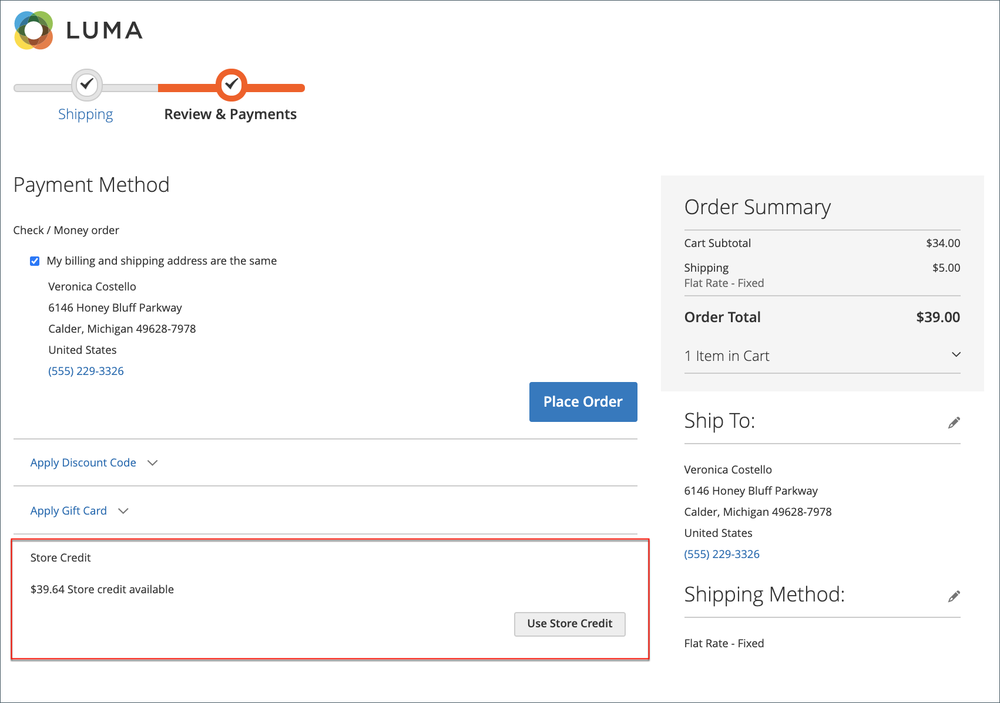

# Rimborsi nel pannello di controllo del conto cliente

{{ee-feature}}

Se è stato emesso un rimborso per un ordine, i clienti possono visualizzare le informazioni sul rimborso associate all’ordine nel dashboard del conto. Se hai abilitato la funzione [!UICONTROL _Mostra cronologia crediti del negozio ai clienti_] opzione per [Configurazione credito store](../customers/credit-configure.md), i clienti possono anche accedere ai propri [Credito store](../customers/store-credit.md) storia.

## Visualizza un rimborso sul vetrina

1. Dalla vetrina, il cliente accede al proprio account.

1. Individua l&#39;ordine utilizzando uno dei metodi seguenti:

   * Ricerca dell’ordine nell’elenco di **Ordini recenti** e clic **[!UICONTROL View]**.
   * Nel pannello a sinistra, scegli **[!UICONTROL My Orders]**. Quindi, individuando l’ordine nell’elenco e facendo clic su **[!UICONTROL View]**.

1. Il cliente fa clic su **[!UICONTROL Refunds]** per visualizzare i dettagli del rimborso.

   {width="700" zoomable="yes"}

## Visualizza il saldo del credito del negozio e la cronologia sul negozio

Metodo 1: **Dalla dashboard dell’account cliente**

1. Dalla vetrina, il cliente accede al proprio account.

1. Se il rimborso è stato applicato al credito del negozio, sceglie **[!UICONTROL Store Credit]** nel pannello a sinistra.

1. L&#39;importo rimborsato al credito del negozio viene visualizzato nell&#39;elenco con la data e l&#39;ora dell&#39;azione.

   {width="700" zoomable="yes"}

   >[!INFO]
   >
   >La pagina Credito negozio fornisce anche un collegamento per consentire al cliente di riscattare un [gift card](../stores-purchase/product-gift-card-workflow.md#check-status-and-balance-of-the-gift-card).

Metodo 2: **Dalla sezione _Revisione e pagamenti_ pagina**

1. Il cliente aggiunge un prodotto al carrello.

2. Processo verso _Pagamento_ pagina.

3. Supera il **[!UICONTROL Shipping]** passaggio.

4. Se il credito del negozio è disponibile, il cliente fa clic su **[!UICONTROL Use Store Credit]**.

   {width="700" zoomable="yes"}

5. Se il cliente cambia idea sull’utilizzo del credito del negozio, fa clic su **[!UICONTROL Remove]** nel _Riepilogo ordine_ sezione.

## Azioni di pagamento nell’amministratore

Puoi configurare le azioni di pagamento per il tuo [Metodo di pagamento](../configuration-reference/sales/payment-methods.md). Ogni metodo di pagamento prevede una serie diversa di azioni di pagamento.

| Azione di pagamento | Descrizione |
|--- |---|
| [!UICONTROL Capture Online] | Quando la fattura viene inviata, il sistema acquisisce il pagamento dal gateway di pagamento di terze parti. Un utente amministratore può quindi creare una nota di accredito e annullare la fattura. |
| [!UICONTROL Capture Offline] | Quando la fattura viene inviata, il sistema non acquisisce il pagamento. Si presume che il pagamento venga acquisito direttamente tramite il gateway e che non possa essere acquisito tramite Adobe Commerce. Un utente amministratore può quindi creare una nota di accredito, ma non può annullare la fattura. Anche se l&#39;ordine ha utilizzato un pagamento online, la fattura è essenzialmente una fattura offline. |
| [!UICONTROL Not Capture] | Quando la fattura viene inviata, il sistema non acquisisce il pagamento. Si presume che il pagamento venga acquisito tramite Adobe Commerce in un secondo momento. È presente un [!UICONTROL _Acquisizione_] nella fattura completata. Prima dell&#39;acquisizione, è possibile annullare la fattura. Dopo l&#39;acquisizione, è possibile creare una nota di credito e annullare la fattura. |

{style="table-layout:auto"}

>[!WARNING]
>
>Seleziona la [!UICONTROL _Non acquisire_] a meno che tu non sia certo di voler acquisire il pagamento tramite Adobe Commerce in un secondo momento. Non è possibile creare una nota di accredito finché il pagamento non viene acquisito utilizzando [!UICONTROL _Acquisizione_] pulsante.
