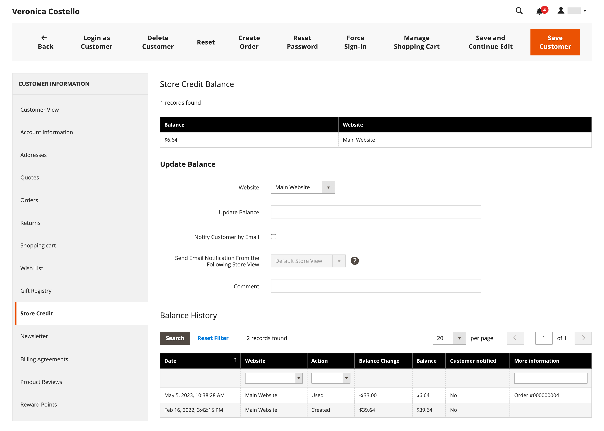
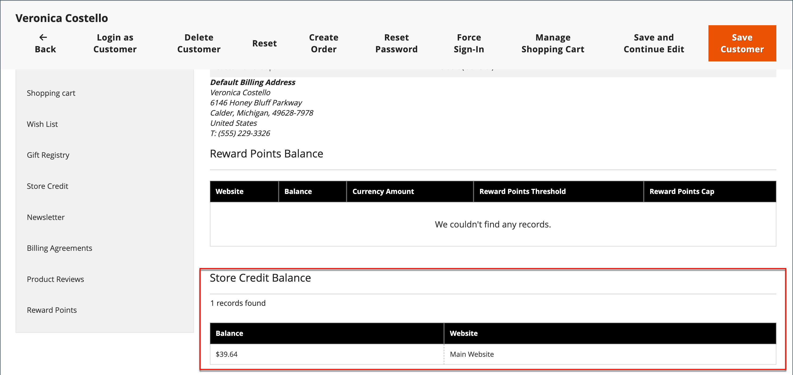

# Applica credito negozio

{{ee-feature}}

Gli amministratori del Negozio possono visualizzare il saldo e la cronologia del credito dal conto cliente e applicare il credito del Negozio a un acquisto.

{width="600" zoomable="yes"}

## Visualizza il saldo a credito

1. Nella barra laterale _Admin_, passa a **[!UICONTROL Customers]** > **[!UICONTROL All Customers]**.

1. Individuare il cliente nella griglia.

1. Nella colonna _Azione_ fare clic su **[!UICONTROL Edit]**.

1. Scorrere la pagina _[!UICONTROL Customer View]_&#x200B;e visualizzare **[!UICONTROL Store Credit Balance]**&#x200B;nella parte inferiore.

{width="600" zoomable="yes"}

## Aggiorna saldo credito negozio

1. Nella barra laterale _Admin_, vai a **[!UICONTROL Customers]** > _Operazioni_ > **[!UICONTROL All Customers]**.

1. Individuare il cliente nella griglia.

1. Nella colonna _Azione_ fare clic su **[!UICONTROL Edit]**.

1. Nel pannello a sinistra, scegli **[!UICONTROL Store Credit]**.

1. Scegliere il sito Web (vetrina) che si desidera associare al saldo.

1. Per **[!UICONTROL Update Balance]**, immettere il nuovo valore.

1. Per notificare al cliente l&#39;aggiornamento del saldo, selezionare la casella di controllo **[!UICONTROL Notify Customer by Email]** e scegliere la visualizzazione dello store da **[!UICONTROL Send Email Notification From the Following Store View]**.

1. Immetti **[!UICONTROL Comment]** sulla modifica.

1. Al termine degli aggiornamenti, fare clic su **[!UICONTROL Save and Continue Edit]** o **[!UICONTROL Save Customer]**.

Il saldo aggiornato dovrebbe essere visualizzato in **[!UICONTROL Balance History]**.

## Applicare un saldo a credito a un ordine come amministratore del negozio

In qualità di amministratore del negozio, puoi eseguire varie operazioni per conto di un cliente, incluso l’invio di ordini. Quando [crei un ordine](../stores-purchase/customer-account-create-order.md), puoi applicare un saldo a credito del negozio dovuto al cliente. Il saldo disponibile viene visualizzato nella sezione _Informazioni su pagamento e spedizione_. Selezionare la casella di controllo **[!UICONTROL Use Store Credit]** per applicare il saldo o una parte del saldo se il totale dell&#39;ordine è inferiore.

{width="500" zoomable="yes"}

## Applica credito del negozio durante l&#39;acquisto

Se è presente un saldo a credito per la sede, il cliente può applicare il credito del negozio al saldo dell&#39;ordine prima di inserire l&#39;ordine nella vetrina.

1. Il cliente visualizza l&#39;importo del credito del negozio disponibile.

   Durante il passaggio _Verifica e pagamenti_, l&#39;importo disponibile viene visualizzato in _[!UICONTROL Store Credit]_.

1. Per applicare l&#39;importo all&#39;ordine, fare clic su **[!UICONTROL Use Store Credit]**.

   >[!INFO]
   >
   >Il totale dell&#39;ordine viene ricalcolato e l&#39;importo del credito dell&#39;archivio applicato viene visualizzato in _[!UICONTROL Order Summary]_.

   {width="700" zoomable="yes"}

1. Quando è pronto, fa clic su **[!UICONTROL Place Order]**.
